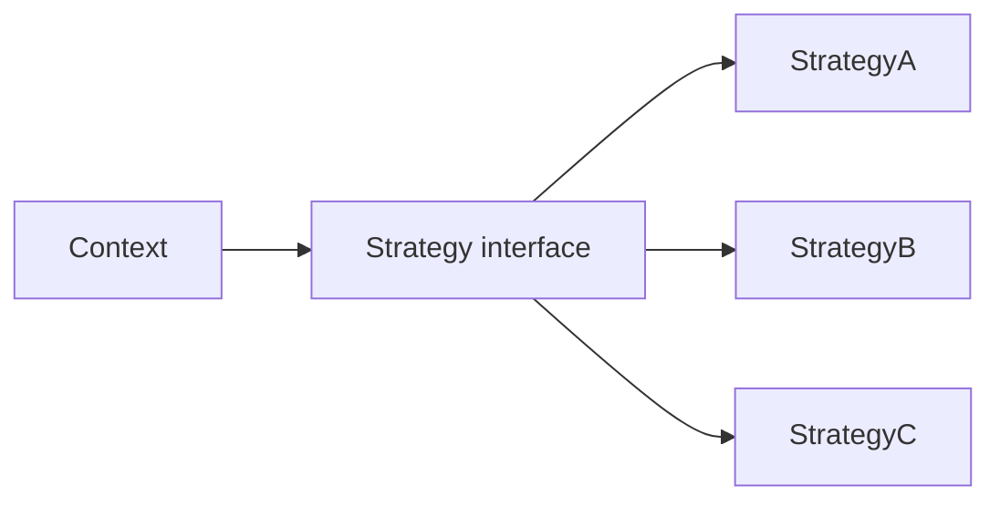

# Strategy 패턴

> Design Patterns 101 시리즈 (5/10)

<!-- a-grade-intro:begin -->

**핵심 질문**: 같은 일을 *다른 방법*으로 처리해야 할 때, 코드는 어떻게 생겨야 할까요?

> 알고리즘을 객체(혹은 함수)로 만들어 컨텍스트에 *주입*합니다. 그것이 Strategy입니다.

<!-- a-grade-intro:end -->

## 이 글에서 배울 것

- Strategy가 푸는 문제 (분기 폭발)
- OCP와 Strategy의 관계
- 클래스 Strategy vs 함수 Strategy
- 런타임 교체와 테스트
- 언제 Strategy가 과한가

## 왜 중요한가

알고리즘을 if/elif로 분기하면 새 옵션이 생길 때마다 기존 코드를 건드려야 합니다. Strategy는 그 분기를 *교체 가능한 객체*로 바꿔, 추가에 열려 있고 변경에 닫힙니다 (OCP).

> Strategy는 OCP를 코드 모양으로 보여 줍니다.

## 개념 한눈에 보기



Context는 인터페이스만 알고, 구체 알고리즘은 갈아 끼웁니다.

## 핵심 용어 정리

- **Context**: Strategy를 사용하는 쪽.
- **Strategy interface**: 알고리즘 약속.
- **Concrete Strategy**: 약속을 구현한 알고리즘.
- **Injection point**: Strategy를 주입하는 자리(생성자, 메서드 인자).
- **Default strategy**: 가장 일반적인 동작의 기본값.

## Before/After

**Before**

```python
def price(kind, base):
    if kind == "vip":
        return base * 0.7
    elif kind == "member":
        return base * 0.9
    elif kind == "guest":
        return base
    raise ValueError(kind)
```

**After**

```python
class Pricing:
    def apply(self, base): return base

class Vip(Pricing):
    def apply(self, base): return base * 0.7

class Member(Pricing):
    def apply(self, base): return base * 0.9
```

`price`는 더는 알고리즘을 알지 않습니다.

## 실습: Strategy를 익히는 5단계

### 1단계 — 인터페이스 정의

```python
# 1_iface.py
from typing import Protocol

class ShipCost(Protocol):
    def for_weight(self, kg: float) -> int: ...
```

Python에서는 ABC 대신 `Protocol`로 *구조적* 인터페이스를 자주 씁니다.

### 2단계 — 구체 전략

```python
# 2_strategies.py
class StandardShip:
    def for_weight(self, kg): return int(3000 + 500 * kg)

class ExpressShip:
    def for_weight(self, kg): return int(6000 + 800 * kg)
```

상속 없이도 Protocol 약속을 만족합니다 (덕 타이핑).

### 3단계 — 주입

```python
# 3_inject.py
class Order:
    def __init__(self, ship: ShipCost): self.ship = ship
    def total(self, items, kg):
        return sum(items) + self.ship.for_weight(kg)
```

생성자 주입이 가장 흔한 형태입니다.

### 4단계 — 함수 Strategy

```python
# 4_func.py
def standard(kg): return int(3000 + 500 * kg)
def express(kg):  return int(6000 + 800 * kg)

class Order2:
    def __init__(self, ship): self.ship = ship
    def total(self, items, kg): return sum(items) + self.ship(kg)

o = Order2(standard)
```

Python에서는 함수 그 자체가 가장 자연스러운 Strategy입니다.

### 5단계 — 런타임 교체와 테스트

```python
# 5_runtime.py
order = Order2(standard)
print(order.total([10000], 2))
order.ship = express
print(order.total([10000], 2))
```

테스트에서는 결정론적 Strategy를 주입해 외부 의존을 끊습니다.

## 이 코드에서 주목할 점

- Context는 Strategy의 *내부*를 모릅니다.
- 새 알고리즘 추가가 *수정*이 아닌 *추가*입니다.
- 테스트가 쉬워집니다 — 가짜 Strategy를 주입하면 끝.

## 자주 하는 실수 5가지

1. **간단한 두 줄짜리에 Strategy.** 과한 일반화.
2. **Strategy 안에 Context 상태 직접 변경.** 책임 누수.
3. **클래스 Strategy 폭발.** 함수면 충분한 경우가 많다.
4. **Default strategy 누락.** 호출자가 매번 결정해야 함.
5. **Strategy가 서로의 내부를 알게 됨.** Strategy 끼리 결합.

## 실무에서는 이렇게 쓰입니다

`sorted(key=...)`의 key, `pandas.apply(func)`의 func, 결제 시스템의 PG 어댑터 선택, 알림 채널(이메일/SMS/Slack) 선택 — 모두 Strategy의 모양입니다.

## 시니어 엔지니어는 이렇게 생각합니다

- "또 분기를 늘리고 있다"는 신호가 오면 Strategy를 의심.
- 우선 함수로 시도, 안 되면 클래스로.
- Default를 두어 단순한 호출자의 부담을 낮춘다.
- Strategy는 *상태가 적을수록* 좋다.
- 이름은 동작이 아니라 *역할*로 — `Vip`보다는 `LoyaltyDiscount`.

## 체크리스트

- [ ] Context가 알고리즘 내부를 모르는가?
- [ ] 새 알고리즘 추가가 *추가*만으로 끝나는가?
- [ ] Strategy가 Context의 상태를 바꾸지 않는가?
- [ ] Default strategy가 합리적인가?
- [ ] 함수로 충분한 곳에 클래스를 쓰지 않았는가?

## 연습 문제

1. 결제 수단(카드/계좌이체/포인트) 분기를 Strategy로 정리.
2. 정렬 비교자(comparator)를 함수 Strategy로 표현.
3. 알림 채널 선택을 Strategy + Default로 구현.

## 정리 및 다음 단계

Strategy는 OCP를 코드 모양으로 만든 패턴입니다. 다음 글은 외부 인터페이스 호환을 다루는 — Adapter 패턴 — 을 깊게 봅니다.

- [디자인 패턴이란 무엇인가?](./01-what-are-design-patterns.md)
- [Creational 패턴](./02-creational-patterns.md)
- [Structural 패턴](./03-structural-patterns.md)
- [Behavioral 패턴](./04-behavioral-patterns.md)
- **Strategy 패턴 (현재 글)**
- Adapter 패턴 (예정)
- Observer 패턴 (예정)
- Factory와 의존성 주입 (예정)
- 패턴을 남용하지 않는 법 (예정)
- Python에 어울리는 패턴 (예정)
## 참고 자료

- [Strategy Pattern (refactoring.guru)](https://refactoring.guru/design-patterns/strategy)
- [Open/Closed Principle (Wikipedia)](https://en.wikipedia.org/wiki/Open%E2%80%93closed_principle)
- [PEP 544 — Protocols](https://peps.python.org/pep-0544/)
- [sorted(key=...) (Python docs)](https://docs.python.org/3/howto/sorting.html)

Tags: Computer Science, DesignPatterns, Strategy, Polymorphism, Behavioral, OCP

---

© 2026 영선북스. 이 글의 저작권은 저자에게 있습니다.
