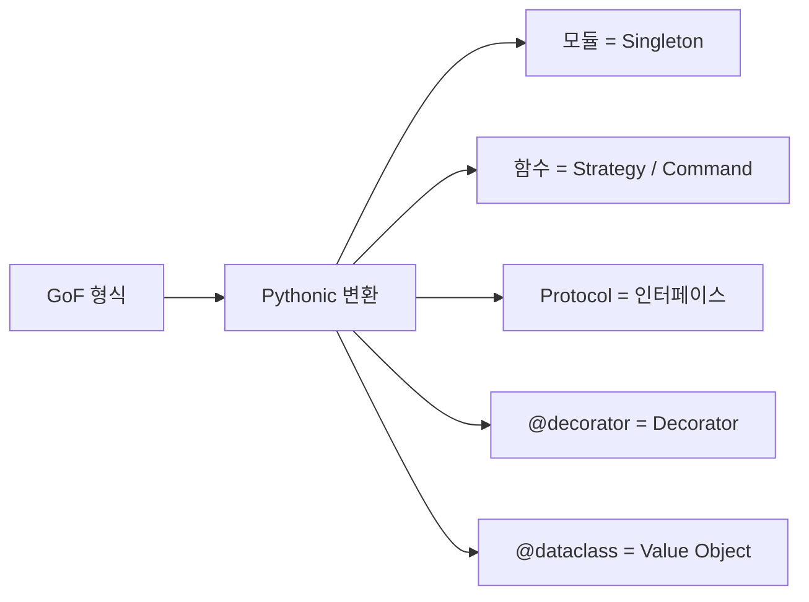

# Python에 어울리는 패턴

> Design Patterns 101 시리즈 (10/10)

<!-- a-grade-intro:begin -->

**핵심 질문**: GoF 패턴들을 *그대로* 옮기는 게 항상 옳은가요?

> Python에서는 일급 함수, 모듈, Protocol, 데코레이터가 GoF의 많은 패턴을 *더 가볍게* 풀어 줍니다.

<!-- a-grade-intro:end -->

## 이 글에서 배울 것

- 모듈이 곧 Singleton인 이유
- 함수로 표현하는 Strategy/Command
- Protocol로 표현하는 인터페이스
- `@dataclass`와 Value Object
- 데코레이터로 표현하는 Decorator

## 왜 중요한가

Python의 기본 도구 — 모듈, 함수, Protocol — 가 이미 많은 패턴의 *런타임 지원*입니다. 같은 문제를 *더 적은 코드*로 풀 수 있습니다.

> 언어가 주는 도구를 먼저 본 다음, 그래도 부족하면 패턴을 꺼낸다.

## 개념 한눈에 보기



같은 패턴, 더 가벼운 표현.

## 핵심 용어 정리

- **Module-as-singleton**: 모듈은 한 번만 로드되어 Singleton처럼 동작.
- **First-class function**: 함수가 인자/반환값/저장 가능한 값.
- **Protocol**: 구조적 타입(덕 타이핑의 정적 검증).
- **Decorator (`@`)**: 함수/클래스를 감싸 책임을 추가.
- **dataclass**: 동등성/표현/불변성을 제공하는 값 객체.

## Before/After

**Before (GoF 그대로)**

```python
class SingletonConfig:
    _inst = None
    def __new__(cls):
        if cls._inst is None:
            cls._inst = super().__new__(cls)
        return cls._inst
```

**After (Pythonic)**

```python
# config.py
DEBUG = True
DB_URL = "postgres://..."
# 어디서든 from config import DEBUG, DB_URL
```

모듈이 이미 Singleton입니다.

## 실습: Pythonic 패턴 5단계

### 1단계 — 모듈 = Singleton

```python
# 1_module_singleton.py
# settings.py
import os
ENV = os.getenv("ENV", "dev")
SECRET = os.getenv("SECRET", "x")
```

import 하면 어디서나 같은 값.

### 2단계 — 함수 = Strategy / Command

```python
# 2_function_strategy.py
def asc(d): return sorted(d)
def desc(d): return sorted(d, reverse=True)

def run(strategy, data): return strategy(data)
print(run(desc, [3, 1, 2]))
```

클래스 없이도 충분히 명료합니다.

### 3단계 — Protocol = 인터페이스

```python
# 3_protocol.py
from typing import Protocol

class Mailer(Protocol):
    def send(self, to: str, body: str) -> None: ...

class SmtpMailer:
    def send(self, to, body): ...   # ABC 상속 없이 만족
```

덕 타이핑 + 정적 검사의 균형.

### 4단계 — `@dataclass` = Value Object

```python
# 4_dataclass.py
from dataclasses import dataclass

@dataclass(frozen=True)
class Money:
    amount: int
    currency: str
```

동등성, 표현, 불변성이 한 줄로.

### 5단계 — 데코레이터 = Decorator 패턴

```python
# 5_decorator.py
import time, functools

def timed(fn):
    @functools.wraps(fn)
    def wrap(*a, **k):
        t = time.time()
        try: return fn(*a, **k)
        finally: print(fn.__name__, time.time()-t)
    return wrap

@timed
def work(): time.sleep(0.1)
```

`@`로 자연스럽게 책임을 *덧씌웁니다*.

## 이 코드에서 주목할 점

- 클래스 계층이 거의 없습니다.
- 표준 도구만으로 패턴이 *드러납니다*.
- 같은 의도를 더 *적은 줄* 로 표현.

## 자주 하는 실수 5가지

1. **자바식 GoF를 그대로 이식.** Python에 어울리지 않는 무게.
2. **모듈 대신 Singleton 클래스.** 두 번째 인스턴스가 가능해 위험.
3. **ABC 강요.** Protocol이면 충분한 경우가 많다.
4. **데코레이터 남용으로 호출 흐름 불명확.** `functools.wraps` 누락도 흔함.
5. **dataclass 대신 손-말이 클래스.** `__eq__`/`__repr__` 빠진 채 사용.

## 실무에서는 이렇게 쓰입니다

`logging` = 모듈 Singleton, `sorted(key=...)` = 함수 Strategy, `typing.Protocol` = 인터페이스, `@app.route(...)` = Decorator. 표준 라이브러리와 인기 프레임워크가 이미 Pythonic 패턴을 *살아 있는 예제* 로 보여 줍니다.

## 시니어 엔지니어는 이렇게 생각합니다

- 먼저 *언어*가 주는 도구를 떠올린다.
- ABC보다 Protocol을, Singleton 클래스보다 모듈을.
- 함수로 충분하면 함수로.
- 데코레이터는 `functools.wraps`와 함께.
- 패턴은 결국 *가독성*에 봉사한다.

## 체크리스트

- [ ] 모듈로 풀 수 있는 자리에 Singleton을 만들지 않았는가?
- [ ] 함수로 풀 수 있는 자리에 Strategy 클래스를 만들지 않았는가?
- [ ] Protocol로 충분한 자리에 ABC를 강요하지 않았는가?
- [ ] 값 객체에 dataclass를 썼는가?
- [ ] 데코레이터에 `functools.wraps`를 빠뜨리지 않았는가?

## 연습 문제

1. 자기 코드의 Singleton 클래스를 모듈로 접어 보세요.
2. Strategy 클래스 한 곳을 함수로 단순화해 보세요.
3. ABC 인터페이스를 Protocol로 바꾸고 mypy를 통과시켜 보세요.

## 정리 및 다음 단계

GoF는 *어휘집*이지 *교본*이 아닙니다. Python의 도구를 먼저 보고, 부족한 곳에서만 패턴 이름을 꺼내 쓰세요. 디자인 패턴 101 시리즈는 여기서 마칩니다 — 도구가 아니라 *생각의 단위*로 이 어휘들을 사용하시기 바랍니다.

- [디자인 패턴이란 무엇인가?](./01-what-are-design-patterns.md)
- [Creational 패턴](./02-creational-patterns.md)
- [Structural 패턴](./03-structural-patterns.md)
- [Behavioral 패턴](./04-behavioral-patterns.md)
- [Strategy 패턴](./05-strategy-pattern.md)
- [Adapter 패턴](./06-adapter-pattern.md)
- [Observer 패턴](./07-observer-pattern.md)
- [Factory와 의존성 주입](./08-factory-and-di.md)
- [패턴을 남용하지 않는 법](./09-avoiding-pattern-overuse.md)
- **Python에 어울리는 패턴 (현재 글)**
## 참고 자료

- [PEP 544 — Protocols](https://peps.python.org/pep-0544/)
- [dataclasses (Python docs)](https://docs.python.org/3/library/dataclasses.html)
- [functools.wraps (Python docs)](https://docs.python.org/3/library/functools.html#functools.wraps)
- [Python 3 Patterns, Recipes and Idioms (Bruce Eckel)](https://python-3-patterns-idioms-test.readthedocs.io/)

Tags: Computer Science, DesignPatterns, Python, Idioms, Protocols, Decorators

---

© 2026 영선북스. 이 글의 저작권은 저자에게 있습니다.
