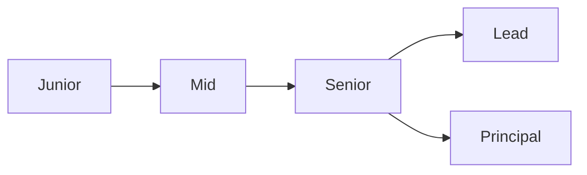

# 개발자 커리어란 무엇인가

> Developer Career 101 시리즈 (1/10)

<!-- a-grade-intro:begin -->

**핵심 질문**: *개발자 커리어* 는 *시간 순서* 의 *직책* *목록* 인가요?

> *역할*, *역량*, *영향력* 이 *함께* *자라는* *과정* 입니다.

<!-- a-grade-intro:end -->

## 이 글에서 배울 것

- 커리어의 *세 축*
- *단계별* *기대치*
- *T 자형* 인재
- *영향력* 의 *반경*
- *기록* 의 *중요성*

## 왜 중요한가

*방향* 이 *없으면* *5년* 후 *제자리* 입니다.

## 개념 한눈에 보기



## 핵심 용어 정리

- **junior**: *지시 기반*.
- **mid**: *자기 주도*.
- **senior**: *문제 정의*.
- **lead**: *팀 결과*.
- **principal**: *조직 방향*.

## Before/After

**Before**: "*승진* 만 *보고* 일한다."

**After**: "*역량 곡선* 을 *그리며* *영향력* 을 *키운다*."

## 실습: 커리어 좌표 그리기

### 1단계 — 현재 단계

```text
junior / mid / senior 중 하나
```

### 2단계 — 핵심 역량

```text
- 기술
- 협업
- 도메인
```

### 3단계 — 영향 반경

```text
- 본인
- 팀
- 조직
- 산업
```

### 4단계 — 6개월 목표

```markdown
- 한 가지 기술 깊이
- 한 가지 새 도메인
- 한 번의 발표
```

### 5단계 — 분기별 회고

```markdown
## Q2 회고
- 잘한 것
- 부족한 것
- 다음 분기 한 가지
```

## 이 코드에서 주목할 점

- *단계* 는 *연속*.
- *축* 은 *복수*.
- *회고* 가 *방향*.

## 자주 하는 실수 5가지

1. ***직책* 만 *목표* 로 *삼는다*.**
2. ***기술* 만 *깊이* *판다*.**
3. ***영향력* 측정을 *생략* 한다.**
4. ***회고* 가 *없다*.**
5. ***기록* 이 *없다*.**

## 실무에서는 이렇게 쓰입니다

기업의 *career ladder* 는 *역할*, *영향*, *책임* 의 *다축* 을 *명시* 합니다.

## 시니어 엔지니어는 이렇게 생각합니다

- *커리어* 는 *마라톤*.
- *역량* 은 *복리*.
- *영향력* 은 *기록* 으로 *증명*.
- *T 자형* 이 *유연*.
- *피드백* 이 *연료*.

## 체크리스트

- [ ] *현재 단계* 정의.
- [ ] *6개월 목표* 작성.
- [ ] *분기 회고* 일정.
- [ ] *기록* 시작.

## 연습 문제

1. *T 자형* 인재 한 줄 정의.
2. *영향 반경* 의 *예* 한 줄.
3. *분기 회고* 의 *목적* 한 줄.

## 정리 및 다음 단계

다음 글은 *직무 이해하기* 입니다.

- **개발자 커리어란 무엇인가 (현재 글)**
- 직무 이해하기 (예정)
- 학습 계획 세우기 (예정)
- 이력서와 포트폴리오 (예정)
- 코딩 인터뷰 준비 (예정)
- 시스템 디자인 인터뷰 (예정)
- 첫 직장 적응 (예정)
- 사이드 프로젝트와 학습 (예정)
- 멘토링과 네트워킹 (예정)
- 시니어로 가는 길 (예정)
## 참고 자료

- [Career Ladders for Software Engineers](https://www.progression.fyi/)
- [Dropbox Engineering Career Framework](https://dropbox.github.io/dbx-career-framework/)
- [Staff Engineer's Path](https://noidea.dog/staff)
- [Developer roadmap](https://roadmap.sh/)

Tags: Career, Developer, Growth, Junior, Beginner

---

© 2026 영선북스. 이 글의 저작권은 저자에게 있습니다.
