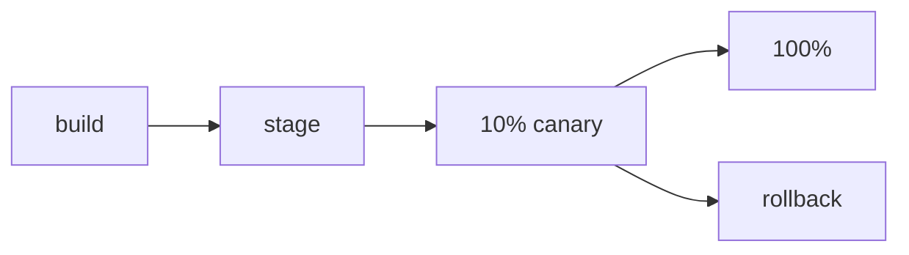

# CD와 배포 전략

> DevOps 101 시리즈 (3/10)

<!-- a-grade-intro:begin -->

**핵심 질문**: 배포가 *무서운 이유* 는 *되돌릴 수 없기* 때문 아닐까요?

> 좋은 배포 전략은 *되돌릴 수 있는 작은 변경* 으로 만듭니다.

<!-- a-grade-intro:end -->

## 이 글에서 배울 것

- *CD* 의 정의와 *CI* 와의 관계
- *Rolling, Blue-Green, Canary* 전략 비교
- *Feature flag* 로 *코드 배포* 와 *기능 활성화* 분리
- *Rollback* 전략
- 흔한 함정 5가지

## 왜 중요한가

배포는 *가장 위험한 순간* 입니다. 좋은 전략은 *영향 범위* 를 줄이고 *되돌리기* 를 *쉽게* 만듭니다.

> *배포 가능성* 과 *기능 활성화* 는 *분리* 되어야 합니다.

## 개념 한눈에 보기



## 핵심 용어 정리

- **CD**: *Continuous Delivery/Deployment*. *자동 배포*.
- **Rolling**: *서버를 순차적* 으로 새 버전으로 교체.
- **Blue-Green**: *두 환경* 을 두고 *트래픽만 전환*.
- **Canary**: *일부 트래픽* 만 새 버전으로 보냄.
- **Feature flag**: *코드는 배포* 하되 *기능은 토글*.

## Before/After

**Before (Big bang 배포)**

```text
- 모든 서버를 *동시에* 새 버전으로
- 문제 발견 시 *전체 다운*
- Rollback에 *30분* 이상
```

**After (Canary + flag)**

```text
- 새 버전을 *10%* 트래픽에 노출
- 5분 모니터링 후 *50% → 100%*
- 문제 시 *플래그 OFF* 로 *즉시* 차단
```

## 실습: 안전한 배포 5단계

### 1단계 — 스테이징 자동 배포

```yaml
deploy-stage:
  if: github.ref == 'refs/heads/main'
  runs-on: ubuntu-latest
  steps:
    - run: ./deploy.sh stage
```

### 2단계 — 스모크 테스트

```bash
curl -f https://stage.example.com/health || exit 1
pytest tests/smoke/ --base-url=https://stage.example.com
```

### 3단계 — Canary (10%)

```bash
kubectl set image deploy/api api=myapp:v2 --record
kubectl scale deploy/api-v2 --replicas=1   # 10%
```

### 4단계 — 모니터링 5분

```text
- 에러율 < 0.1%
- p95 latency < 200ms
- 5xx 카운트 정상
```

### 5단계 — 100% 또는 롤백

```bash
# OK
kubectl scale deploy/api-v2 --replicas=10

# NG
kubectl rollout undo deploy/api
```

## 이 코드에서 주목할 점

- *스테이징* 은 *프로덕션과 동일 환경* 이어야 합니다.
- Canary의 *기준 지표* 는 *사전 정의* 합니다.
- *Rollback 명령어* 는 *runbook* 에 박아둡니다.

## 자주 하는 실수 5가지

1. **CI는 자동, *CD는 수동*.** 사람이 끼면 *실수* 가 끼어듭니다.
2. **스테이징과 프로덕션이 *다른 환경*.** *재현 불가* 한 버그가 발생.
3. **Canary 후 *지표 안 보고* 100%.** Canary의 의미가 사라집니다.
4. **Feature flag 정리 안 함.** 6개월 후 *어떤 플래그가 살아있는지* 모릅니다.
5. **Rollback 연습 없음.** 진짜 장애 때 *처음 해봄*.

## 실무에서는 이렇게 쓰입니다

대규모 서비스는 *Canary 자동 분석(CAA)* 도구로 *지표 비교* 까지 자동화합니다. Spinnaker, Argo Rollouts가 대표적입니다.

## 시니어 엔지니어는 이렇게 생각합니다

- *모든 배포* 는 *되돌릴 수 있어야* 한다.
- *기능 출시* 는 *플래그* 로 한다. 배포와 분리한다.
- *Canary 지표* 는 *팀 합의* 로 정한다.
- *DB 마이그레이션* 은 *backward compatible* 로 한다.
- *배포 빈도* 가 *높을수록 안전* 해진다.

## 체크리스트

- [ ] *자동 스테이징 배포* 가 있다.
- [ ] *스모크 테스트* 가 자동화되어 있다.
- [ ] *Rollback 명령* 이 *문서화* 되어 있다.
- [ ] *Feature flag* 시스템이 있다.

## 연습 문제

1. 본인 서비스의 *배포 단계* 를 *그림* 으로 그려보세요.
2. *Rollback 명령* 을 *runbook* 에 추가하세요.
3. *Canary 지표* 3가지를 *팀과 합의* 하세요.

## 정리 및 다음 단계

CD는 *되돌릴 수 있는 작은 변경의 흐름* 입니다. 다음 글에서는 환경별 *설정 관리* 를 다룹니다.

- [DevOps란 무엇인가?](./01-what-is-devops.md)
- [CI 파이프라인](./02-ci-pipeline.md)
- **CD와 배포 전략 (현재 글)**
- 환경 분리와 설정 관리 (예정)
- Infrastructure as Code (예정)
- 컨테이너와 빌드 (예정)
- 모니터링과 알림 (예정)
- 로그 수집과 분석 (예정)
- 장애 대응과 on-call (예정)
- 운영 가능한 DevOps 흐름 (예정)
## 참고 자료

- [Martin Fowler — Continuous Delivery](https://martinfowler.com/bliki/ContinuousDelivery.html)
- [Argo Rollouts](https://argoproj.github.io/rollouts/)
- [LaunchDarkly — Feature Flags](https://launchdarkly.com/blog/what-are-feature-flags/)
- [Spinnaker](https://spinnaker.io/)

Tags: DevOps, CD, Deployment, BlueGreen, Canary

---

© 2026 영선북스. 이 글의 저작권은 저자에게 있습니다.
