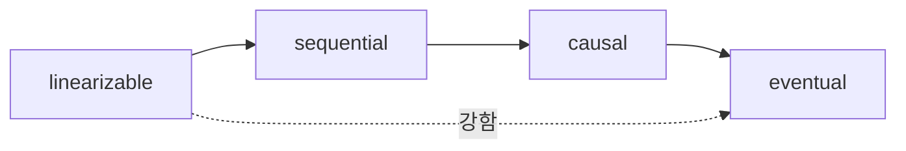

# consistency와 CAP

> Distributed Systems 101 시리즈 (4/10)

<!-- a-grade-intro:begin -->

**핵심 질문**: 데이터를 여러 곳에 두는 순간, "마지막 값이 무엇인가"의 답은 왜 갑자기 어려워질까요?

> CAP는 partition이 일어나면 consistency와 availability 중 하나를 양보해야 한다는 정리입니다. 그 양보의 모양이 곧 우리가 고르는 consistency model입니다.

<!-- a-grade-intro:end -->

## 이 글에서 배울 것

- consistency의 다양한 의미 (transaction의 C와 다름)
- linearizability, sequential, causal, eventual의 스펙트럼
- CAP 정리와 자주 하는 오해
- PACELC가 CAP에 더한 것
- 실제 데이터베이스가 위치한 지점

## 왜 중요한가

"DB가 강하게 일관적이다/eventual하다"라는 한 줄 차이가 시스템 전체 설계를 바꿉니다. 사용자에게 보일 화면, retry 정책, 장애 시 동작이 모두 여기서 정해집니다. CAP를 모르면 docs의 단어를 읽을 수 없습니다.

> consistency model은 데이터의 사회 계약입니다.

## 개념 한눈에 보기



왼쪽일수록 사용자가 보기에 직관적이지만 비쌉니다. 오른쪽일수록 싸고 가용성이 좋지만 직관과 멀어집니다.

## 핵심 용어 정리

- **Linearizability**: 모든 노드가 single timeline을 본 것처럼 동작.
- **Sequential consistency**: 모든 노드가 같은 순서로 보지만 실시간성은 보장 안 함.
- **Causal consistency**: 인과 관계가 있는 작업의 순서만 보장.
- **Eventual consistency**: 충분한 시간이 지나면 같은 값으로 수렴.
- **CAP**: partition이 있을 때 C와 A 중 하나를 골라야 한다는 정리.

## Before/After

**Before — "DB가 알아서"**

```text
잘 모르고 default를 쓴 결과 race, stale read 발생
```

**After — 명시적 model 선택**

```text
주문/결제 → linearizable, 피드/추천 → eventual
```

화면별로 적절한 model을 골라 비용을 분배합니다.

## 실습: model의 차이를 코드로

### 1단계 — single node (linearizable의 기준)

```python
# 1_single.py
from collections import deque
log = []
def write(x): log.append(x)
def read(): return log[-1] if log else None
```

한 노드 안에선 모든 read가 마지막 write를 봅니다. 이 직관이 우리가 비교할 기준입니다.

### 2단계 — async replica (eventual)

```python
# 2_eventual.py
import threading, time
primary = []
replica = []
def write(x):
    primary.append(x)
    threading.Thread(target=lambda: (time.sleep(0.5), replica.append(x))).start()
def read_primary(): return primary[-1] if primary else None
def read_replica(): return replica[-1] if replica else None
```

방금 쓴 값이 replica에서는 0.5초 동안 안 보입니다. 이게 eventual의 정체입니다.

### 3단계 — read-your-writes 흉내

```python
# 3_ryw.py
session_writes = {}
def write(uid, x):
    primary.append(x); session_writes[uid] = x
def read(uid):
    if uid in session_writes:
        return session_writes[uid]   # 자기 write는 즉시 보장
    return read_replica()
```

session 단위 보장으로 약한 consistency 위에 강한 보장을 얹는 흔한 패턴입니다.

### 4단계 — partition 시뮬레이션 (CAP 선택)

```python
# 4_partition.py (의사코드)
def write(x):
    if not majority_alive():
        # CP 선택: 거부
        raise Exception("no majority")
        # 또는 AP 선택: 자기 노드에만 쓰고 나중에 merge
```

같은 코드 두 줄 차이가 CP와 AP를 가릅니다.

### 5단계 — causal 흉내 (vector clock 한 줄)

```python
# 5_vector.py
clock = {"A":0, "B":0}
def tick(node): clock[node] += 1
def happens_before(a, b):
    return all(a[k] <= b[k] for k in a) and any(a[k] < b[k] for k in a)
```

causal model은 happens-before만 보존하면 됩니다. 동시에 일어난 일은 임의 순서를 허용합니다.

## 이 코드에서 주목할 점

- consistency는 binary가 아니라 spectrum입니다.
- 같은 시스템 안에서도 화면별로 다른 model을 고를 수 있습니다.
- read-your-writes는 약한 model 위에서 사용자 경험을 살리는 핵심 트릭입니다.
- partition 시 CP/AP는 정책 결정입니다, 자동이 아닙니다.

## 자주 하는 실수 5가지

1. **CAP의 C를 transaction의 C와 헷갈린다.** 둘은 다른 개념입니다.
2. **"우리는 CP다"라고 단정한다.** 동일 시스템도 호출별로 다를 수 있습니다.
3. **eventual을 "결국 빠르게 일관됨"으로 본다.** 보장은 시간 상한 없습니다.
4. **read-your-writes를 자동으로 가정한다.** 명시적으로 구현해야 합니다.
5. **partition을 무시한 채 강한 consistency를 약속한다.** 약속을 못 지킵니다.

## 실무에서는 이렇게 쓰입니다

Spanner, etcd, ZooKeeper는 linearizable에 가깝게 동작합니다 (CP). DynamoDB, Cassandra, Redis Cluster는 기본이 eventual에 가깝습니다 (AP). 같은 회사 안에서도 결제 DB는 CP, 추천 캐시는 AP로 분리합니다. PACELC는 partition 없을 때(latency vs consistency)까지 보게 해 줍니다.

## 시니어 엔지니어는 이렇게 생각합니다

- model을 화면 단위로 매핑합니다.
- read-your-writes는 명시적으로 보장합니다 (sticky session 등).
- partition 시 정책을 운영 책임으로 둡니다.
- "강한 consistency는 비싸다"를 SLO로 측정합니다.
- docs가 model을 말하지 않으면 신뢰하지 않습니다.

## 체크리스트

- [ ] linearizable과 eventual의 차이를 한 줄로 말할 수 있는가?
- [ ] CAP가 partition 없는 평소엔 어떤 의미인지 답할 수 있는가?
- [ ] 우리 시스템의 화면별 model을 매핑할 수 있는가?
- [ ] read-your-writes를 어떻게 구현할지 답할 수 있는가?
- [ ] PACELC의 ELC가 무엇인지 아는가?

## 연습 문제

1. 우리 서비스의 주요 데이터 3가지에 적정 model(linearizable/causal/eventual)을 매핑해 보세요.
2. eventual 시스템에서 사용자에게 "방금 쓴 값"을 보장하기 위한 구현을 설계해 보세요.
3. partition 발생 시 CP/AP 중 무엇을 고를지와 그 이유를 적어 보세요.

## 정리 및 다음 단계

consistency model은 데이터를 분산할 때 가장 중요한 트레이드오프 축입니다. 다음 글에서는 이 model 선택의 직접적 원인 — replication 의 종류와 동기/비동기 — 를 다룹니다.

- [분산 시스템이란 무엇인가?](./01-what-is-a-distributed-system.md)
- [failure model](./02-failure-model.md)
- [RPC와 message passing](./03-rpc-and-message-passing.md)
- **consistency와 CAP (현재 글)**
- replication (예정)
- consensus와 Raft (예정)
- leader election (예정)
- message queue와 event sourcing (예정)
- distributed transaction (예정)
- 운영 가능한 분산 시스템 패턴 (예정)
## 참고 자료

- [CAP theorem (Wikipedia)](https://en.wikipedia.org/wiki/CAP_theorem)
- [Consistency model (Wikipedia)](https://en.wikipedia.org/wiki/Consistency_model)
- [PACELC theorem (Wikipedia)](https://en.wikipedia.org/wiki/PACELC_theorem)
- [Designing Data-Intensive Applications — chapter 9](https://dataintensive.net/)

Tags: Computer Science, Distributed Systems, Consistency, CAP, Linearizability, Eventual Consistency

---

© 2026 영선북스. 이 글의 저작권은 저자에게 있습니다.
