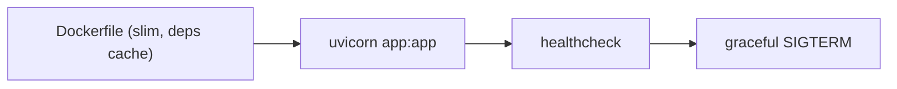

# Python 앱 컨테이너화

> Docker 101 시리즈 (7/10)

<!-- a-grade-intro:begin -->

**핵심 질문**: *FastAPI 앱* 을 *프로덕션 수준* 으로 컨테이너화하려면 *무엇을 챙겨야* 합니까?

> *Python 컨테이너화는 *PID 1, signal, healthcheck, non-root* 를 다루는 순간 *진짜 컨테이너* 가 됩니다.*

<!-- a-grade-intro:end -->

## 이 글에서 배울 것

- *FastAPI + uvicorn* 컨테이너화
- *PID 1 신호 처리* (SIGTERM)
- *healthcheck* 추가
- *non-root user* 와 권한
- 흔한 함정 5가지

## 왜 중요한가

*컨테이너 안의 Python* 은 종종 *SIGTERM 을 못 받아* *graceful shutdown* 에 실패합니다. 이는 *배포 사고* 의 흔한 원인입니다.

> *컨테이너의 PID 1 은 *작은 init* 이거나 *정확한 signal 처리* 를 해야 합니다.*

## 개념 한눈에 보기



## 핵심 용어 정리

- **PID 1**: 컨테이너의 *최초 프로세스*.
- **SIGTERM**: 종료 *부드러운 신호*.
- **Graceful shutdown**: *진행 중 요청* 처리 후 종료.
- **Healthcheck**: 컨테이너 *건강 상태* 보고.
- **Tini**: 작은 *init 프로세스*.

## Before/After

**Before**: `python app.py` 직접 실행. SIGTERM 무시되어 *강제 종료*.

**After**: `uvicorn` + `tini` 로 *graceful shutdown*. healthcheck 가 *준비 상태* 를 보고.

## 실습: Python 컨테이너 5단계

### 1단계 — 앱 코드 (`app.py`)

```python
from fastapi import FastAPI

app = FastAPI()

@app.get("/healthz")
def healthz() -> dict[str, str]:
    return {"status": "ok"}

@app.get("/")
def root() -> dict[str, str]:
    return {"hello": "world"}
```

### 2단계 — Dockerfile

```dockerfile
FROM python:3.12-slim

ENV PYTHONDONTWRITEBYTECODE=1 \
    PYTHONUNBUFFERED=1

WORKDIR /app

# deps layer
COPY requirements.txt .
RUN pip install --no-cache-dir -r requirements.txt

# app layer
COPY . .

RUN useradd -m -u 1000 appuser
USER appuser

EXPOSE 8000
HEALTHCHECK --interval=10s --timeout=3s --retries=3 \
  CMD python -c "import urllib.request; urllib.request.urlopen('http://127.0.0.1:8000/healthz').read()" || exit 1

# tini 가 PID 1 로 SIGTERM 전달
ENTRYPOINT ["tini", "--"]
CMD ["uvicorn", "app:app", "--host", "0.0.0.0", "--port", "8000"]
```

### 3단계 — `requirements.txt`

```text
fastapi==0.115.*
uvicorn[standard]==0.30.*
```

### 4단계 — 빌드와 실행

```bash
docker build -t myapi:1.0 .
docker run -d --name api -p 8000:8000 myapi:1.0
curl http://localhost:8000/healthz
```

### 5단계 — Graceful shutdown 확인

```bash
docker stop api    # SIGTERM 전송, uvicorn 이 진행 요청 마감
docker logs api | tail
```

## 이 코드에서 주목할 점

- *deps -> code* 순서로 *캐시 효율*.
- *tini* 가 *signal* 을 *정확히 전달*.
- *healthcheck* 가 *오케스트레이터* 와 협력.

## 자주 하는 실수 5가지

1. **`python app.py` 로 *직접 실행*.** SIGTERM *무시*.
2. **`workers` 를 *코어 수의 4배* 로.** *메모리 폭발*.
3. **`pip install` 을 *코드 변경마다*.** 빌드 *분 단위 손해*.
4. ***root* 로 실행.** 보안 사고.
5. **healthcheck 가 *DB 까지 검사*.** *false negative* 폭증.

## 실무에서는 이렇게 쓰입니다

운영에서는 *Gunicorn + Uvicorn worker*, *prometheus-fastapi-instrumentator* 로 메트릭, *opentelemetry* 로 trace 가 표준입니다.

## 시니어 엔지니어는 이렇게 생각합니다

- *PID 1 을 의식* 한다.
- *graceful shutdown* 은 *사용자 신뢰* 다.
- *healthcheck 는 가볍게*, 의존성 검사는 *다른 엔드포인트*.
- *non-root* 는 *기본*.
- *worker 수* 는 *부하 측정 후* 결정.

## 체크리스트

- [ ] *tini* 또는 동등한 init 사용.
- [ ] *healthcheck* 가 가볍고 정확하다.
- [ ] *non-root user* 로 실행.
- [ ] *graceful shutdown* 동작 확인.

## 연습 문제

1. FastAPI 앱을 *컨테이너화* 하고 `/healthz` 가 동작하는지 확인하세요.
2. `docker stop` 시 *진행 중 요청* 이 *정상 응답* 후 종료되는지 확인하세요.
3. `USER` 를 추가해 *non-root* 로 실행되게 하세요.

## 정리 및 다음 단계

Python 컨테이너의 진짜 어려움은 *signal 과 healthcheck* 입니다. 다음 글에서는 *DB 와 함께* 띄웁니다.

- [Docker란 무엇인가?](./01-what-is-docker.md)
- [Image와 Container](./02-image-and-container.md)
- [Dockerfile 작성하기](./03-dockerfile.md)
- [Volume과 Network](./04-volume-and-network.md)
- [Docker Compose](./05-docker-compose.md)
- [환경변수와 설정](./06-env-and-config.md)
- **Python 앱 컨테이너화 (현재 글)**
- 데이터베이스와 함께 실행하기 (예정)
- Image 최적화 (예정)
- 배포용 Docker 구성 (예정)
## 참고 자료

- [FastAPI in containers](https://fastapi.tiangolo.com/deployment/docker/)
- [Uvicorn deployment](https://www.uvicorn.org/deployment/)
- [tini - a tiny init for containers](https://github.com/krallin/tini)
- [Dockerfile HEALTHCHECK](https://docs.docker.com/engine/reference/builder/#healthcheck)

Tags: Docker, Python, FastAPI, Uvicorn, PID1

---

© 2026 영선북스. 이 글의 저작권은 저자에게 있습니다.
