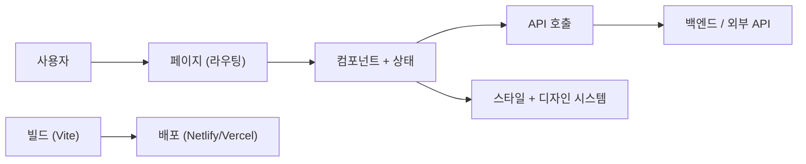

# 작은 프론트엔드 앱 만들기

> Frontend Development 101 시리즈 (10/10)

<!-- a-grade-intro:begin -->

**핵심 질문**: 지금까지 배운 *조각들* 을 어떻게 *하나의 살아있는 앱* 으로 묶을 수 있을까요?

> 작은 앱 하나를 *처음부터 배포까지* 만들면, 책에서 본 개념이 *내 손의 도구* 가 됩니다.

<!-- a-grade-intro:end -->

## 이 글에서 배울 것

- 작은 프로젝트의 *폴더 구조* 잡기
- 1\~9화에서 배운 개념을 *연결* 하기
- 개발 → 빌드 → 배포 *전체 흐름*
- 다음 학습 단계 (testing, devops)

## 왜 중요한가

지식은 *프로젝트로 묶일 때* 비로소 *내 것* 이 됩니다. 9개의 글로 배운 것은 *벽돌* 이고, 마지막 글에서 *집* 을 짓습니다.

> 완성도가 낮아도 좋습니다. *끝까지 배포* 하는 경험이 *책 한 권보다 강력* 합니다.

## 개념 한눈에 보기



## 핵심 용어 정리

- **Project structure**: 코드를 *역할별로 나눈 폴더 구조*.
- **Capstone**: *지금까지 배운 것을 묶는* 마무리 프로젝트.
- **Deployment**: 빌드 산출물을 *공개 URL로* 올리는 과정.
- **Roadmap**: *다음에 무엇을 배울지* 보여주는 길.

## Before/After

**Before (개념만 안다)**

```text
"라우팅도 알고, 폼도 알고, API도 알아."
"근데 한 번도 다 합쳐서 *앱을 만들어 본 적은 없다*."
```

**After (작은 앱이 인터넷에 살아있다)**

```text
https://my-notes.netlify.app
- 사용자가 노트를 *추가/수정/삭제* 한다.
- 코드가 *GitHub에 있다*.
- 다음 사람이 *이 코드 위에서 배운다*.
```

## 실습: 작은 노트 앱 5단계

### 1단계 — 프로젝트 구조

```text
my-notes/
├── src/
│   ├── components/   # NoteCard, NoteForm 등 (4화)
│   ├── pages/        # NotesPage, NotePage (5화)
│   ├── api/          # notes API client (6화)
│   ├── hooks/        # useNotes, useForm (4·7화)
│   ├── styles/       # tokens.css, layout.css (8화)
│   └── App.tsx
├── vite.config.ts    # 빌드 설정 (9화)
├── .env.production
└── package.json
```

### 2단계 — 라우팅과 페이지 (5화 복습)

```typescript
// src/App.tsx
import { BrowserRouter, Routes, Route } from "react-router-dom";
import NotesPage from "./pages/NotesPage";
import NotePage from "./pages/NotePage";

export default function App() {
  return (
    <BrowserRouter>
      <Routes>
        <Route path="/" element={<NotesPage />} />
        <Route path="/notes/:id" element={<NotePage />} />
      </Routes>
    </BrowserRouter>
  );
}
```

### 3단계 — API 클라이언트 (6화 복습)

```typescript
// src/api/notes.ts
const BASE = import.meta.env.VITE_API_URL;

export async function listNotes() {
  const res = await fetch(`${BASE}/notes`);
  if (!res.ok) throw new Error("Failed to list notes");
  return res.json();
}

export async function createNote(body: { title: string }) {
  const res = await fetch(`${BASE}/notes`, {
    method: "POST",
    headers: { "Content-Type": "application/json" },
    body: JSON.stringify(body),
  });
  if (!res.ok) throw new Error("Failed to create note");
  return res.json();
}
```

### 4단계 — 폼 + 컴포넌트 (4·7화 복습)

```tsx
// src/components/NoteForm.tsx
import { useState } from "react";
import { createNote } from "../api/notes";

export function NoteForm({ onCreated }: { onCreated: () => void }) {
  const [title, setTitle] = useState("");
  const [error, setError] = useState<string | null>(null);

  async function handleSubmit(e: React.FormEvent) {
    e.preventDefault();
    if (title.trim().length < 2) {
      setError("제목은 2자 이상이어야 합니다.");
      return;
    }
    await createNote({ title });
    setTitle("");
    setError(null);
    onCreated();
  }

  return (
    <form onSubmit={handleSubmit}>
      <input value={title} onChange={(e) => setTitle(e.target.value)} />
      {error && <p role="alert">{error}</p>}
      <button>추가</button>
    </form>
  );
}
```

### 5단계 — 빌드와 배포 (9화 + 새로운 단계)

```bash
npm run build
# Netlify CLI 예시
npm install -g netlify-cli
netlify deploy --dir=dist --prod
```

배포가 끝나면 *공개 URL* 이 생깁니다. 이 URL을 *다음 사람과 공유* 하세요.

## 이 코드에서 주목할 점

- 폴더가 *역할별로* 나뉘어 *어디를 고칠지* 즉시 알 수 있습니다.
- API 클라이언트가 *컴포넌트와 분리* 되어 *테스트가 쉬워집니다*.
- 환경 변수로 *개발/프로덕션 백엔드를* 분리합니다.

## 자주 하는 실수 5가지

1. **모든 코드를 `App.tsx` 에 *넣는다*.** 100줄을 넘기면 *읽을 수 없습니다*.
2. **API 호출을 *컴포넌트 안에서* 직접 한다.** 테스트와 재사용이 *어려워집니다*.
3. **README가 *없다*.** 한 달 뒤의 자신이 *돌릴 수 없습니다*.
4. **`localhost` 만 보고 *배포는 안 한다*.** 배포 단계에서 *항상 새로운 문제* 가 나옵니다.
5. **완벽을 *기다린다*.** 작은 앱이라도 *오늘 배포* 하는 것이 *완벽한 미배포보다* 낫습니다.

## 실무에서는 이렇게 쓰입니다

실무 팀도 *동일한 패턴* 을 씁니다. `pages/`, `components/`, `api/`, `hooks/`, `styles/` 같은 폴더 구조는 *수십 명이 함께 일하는 코드* 의 기본 골격이기도 합니다. 차이는 *규모와 추상화* 일 뿐 *모양은 같습니다*.

## 시니어 엔지니어는 이렇게 생각합니다

- *작게* 만들고 *자주* 배포한다.
- 폴더 구조는 *비즈니스 도메인을 따른다*.
- *README와 .env.example* 을 항상 둔다.
- 배포는 *처음부터 자동화* 한다.
- 첫 사용자는 *자기 자신* 이다.

## 체크리스트

- [ ] 폴더 구조를 그릴 수 있다.
- [ ] API 클라이언트를 *컴포넌트 밖* 으로 분리했다.
- [ ] `npm run build` 가 성공한다.
- [ ] *공개 URL* 로 앱을 띄웠다.
- [ ] README에 *실행 방법* 을 적었다.

## 연습 문제

1. 위 구조로 *노트 앱* 을 만들고 Netlify나 Vercel에 배포하세요.
2. README에 *실행 방법, 환경 변수, 배포 URL* 을 적으세요.
3. 빌드 산출물의 크기를 측정하고 *200KB 이하* 로 줄여 보세요.

## 정리 및 다음 단계

여기까지 오셨다면 *프론트엔드 입문은 끝났습니다*. 다음으로 함께 보면 좋은 시리즈는 다음과 같습니다.

- *Testing 101*: 컴포넌트와 API 호출을 *테스트* 하는 법
- *DevOps 101*: 배포를 *자동화* 하고 모니터링하는 법
- *Secure Coding 101*: 폼과 API에서 *공격을 막는* 법

> 한 번에 다 배우려 하지 말고, *지금 만든 앱에 한 가지씩* 더해 보세요.

- [프론트엔드 개발이란 무엇인가?](./01-what-is-frontend-development.md)
- [HTML과 CSS 기본](./02-html-and-css-basics.md)
- [JavaScript 기본](./03-javascript-basics.md)
- [컴포넌트와 상태](./04-components-and-state.md)
- [라우팅과 페이지](./05-routing-and-pages.md)
- [API 호출과 비동기](./06-api-calls-and-async.md)
- [폼과 유효성 검사](./07-forms-and-validation.md)
- [스타일링과 디자인 시스템](./08-styling-and-design-system.md)
- [빌드 도구와 번들링](./09-build-tools-and-bundling.md)
- **작은 프론트엔드 앱 만들기 (현재 글)**
## 참고 자료

- [Vite docs](https://vitejs.dev/)
- [React Router docs](https://reactrouter.com/)
- [Netlify docs](https://docs.netlify.com/)
- [Vercel docs](https://vercel.com/docs)

Tags: Frontend, Project, Capstone, React, Web

---

© 2026 영선북스. 이 글의 저작권은 저자에게 있습니다.
