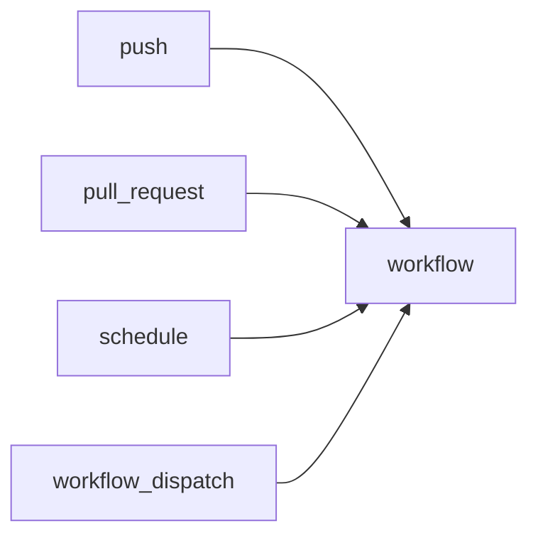

# Trigger 이해하기

> GitHub Actions 101 시리즈 (3/10)

<!-- a-grade-intro:begin -->

**핵심 질문**: *주말 새벽* 에 자동으로 도는 *야간 빌드* 를 어떻게 만듭니까?

> *언제 돌리느냐* 가 *왜 도느냐* 만큼 중요합니다.

<!-- a-grade-intro:end -->

## 이 글에서 배울 것

- *push / pull_request* 트리거의 차이
- *schedule(cron)* 으로 정기 실행
- *workflow_dispatch* 로 수동 실행
- *paths / branches* 필터로 *비용 절감*
- 흔한 함정 5가지

## 왜 중요한가

트리거 설계가 *비용과 노이즈* 를 결정합니다. *모든 commit 마다 모든 워크플로우* 를 돌리면 *비용 폭발 + 알림 피로* 가 옵니다.

> *정확한 시점* 에만 도는 워크플로우가 *좋은 워크플로우* 입니다.

## 개념 한눈에 보기



## 핵심 용어 정리

- **push**: 브랜치에 *commit이 올라올 때*.
- **pull_request**: PR이 *열리거나 갱신될 때*.
- **schedule**: *cron 표현식* 으로 정기 실행.
- **workflow_dispatch**: *수동* 실행 버튼.
- **paths/branches filter**: *경로/브랜치* 로 트리거 *제한*.
- **concurrency**: *동시 실행* 을 *직렬화*.

## Before/After

**Before**: docs만 고쳐도 *전체 빌드 + 테스트* 가 돈다.

**After**: `paths` 필터로 *코드 변경* 에서만 빌드가 돈다.

## 실습: Trigger 5단계

### 1단계 — push와 PR 분리

```yaml
on:
  push:
    branches: [main]
  pull_request:
    branches: [main]
```

### 2단계 — paths 필터로 비용 절감

```yaml
on:
  pull_request:
    paths:
      - "src/**"
      - "tests/**"
      - "pyproject.toml"
```

### 3단계 — schedule(cron) 야간 빌드

```yaml
on:
  schedule:
    - cron: "0 17 * * 0-4"  # UTC 17:00 = KST 02:00, 일~목
```

### 4단계 — workflow_dispatch 수동 실행

```yaml
on:
  workflow_dispatch:
    inputs:
      env:
        description: "deploy target"
        required: true
        default: staging
        type: choice
        options: [staging, production]
```

### 5단계 — concurrency 로 중복 실행 방지

```yaml
concurrency:
  group: ci-${{ github.ref }}
  cancel-in-progress: true
```

## 이 코드에서 주목할 점

- *paths-ignore* 보다 *paths* 가 *명시적* 입니다.
- *cron* 은 *UTC* 입니다. KST 변환 주의.
- *cancel-in-progress* 는 *PR 푸시 연타* 비용을 줄입니다.

## 자주 하는 실수 5가지

1. **모든 트리거에 *전체 워크플로우*.** 비용 폭발.
2. **`schedule` 을 *KST 로 적음*.** UTC 만 인정.
3. **`pull_request_target` 오용.** *secret 노출* 위험.
4. **`concurrency` 누락.** *중복 빌드* 가 큐를 막음.
5. **`workflow_dispatch` 만 두고 *문서 없음*.** 누가 어떻게 누르는지 모름.

## 실무에서는 이렇게 쓰입니다

성숙한 팀은 *PR* = *빠른 검증*, *main push* = *full test + build*, *nightly cron* = *느린 e2e*, *workflow_dispatch* = *프로덕션 배포* 로 트리거를 *역할별* 로 나눕니다.

## 시니어 엔지니어는 이렇게 생각합니다

- *트리거 = 비용 + 신뢰* 의 균형.
- *cron* 은 *UTC 사고*.
- *concurrency* 는 *기본 장착*.
- *수동 트리거* 도 *입력 검증*.
- *PR* 과 *main* 워크플로우를 분리.

## 체크리스트

- [ ] *paths 필터* 로 불필요한 실행 제거됨.
- [ ] *cron* 은 *UTC 로* 작성됨.
- [ ] *concurrency* 가 설정돼 있다.
- [ ] *workflow_dispatch* 가 문서화됐다.

## 연습 문제

1. *docs/* 변경에는 안 도는 워크플로우를 만드세요.
2. *매일 새벽 KST 03:00* 에 도는 cron 을 작성해 보세요.
3. *workflow_dispatch* 에 *환경 선택* 입력을 추가하세요.

## 정리 및 다음 단계

트리거는 *워크플로우의 시점* 입니다. 다음 글에서는 *Python 테스트 자동화* 를 다룹니다.

- [GitHub Actions란 무엇인가?](./01-what-is-github-actions.md)
- [Workflow와 Job](./02-workflow-and-job.md)
- **Trigger 이해하기 (현재 글)**
- Python 테스트 자동화 (예정)
- Lint와 Type Check (예정)
- 빌드 아티팩트 (예정)
- Docker 빌드 (예정)
- 배포 자동화 (예정)
- Secret 관리 (예정)
- 실전 CI/CD 파이프라인 (예정)
## 참고 자료

- [Events that trigger workflows](https://docs.github.com/actions/using-workflows/events-that-trigger-workflows)
- [Schedule events](https://docs.github.com/actions/using-workflows/events-that-trigger-workflows#schedule)
- [workflow_dispatch](https://docs.github.com/actions/using-workflows/manually-running-a-workflow)
- [Concurrency](https://docs.github.com/actions/using-jobs/using-concurrency)

Tags: GitHubActions, Trigger, Event, Schedule, CICD

---

© 2026 영선북스. 이 글의 저작권은 저자에게 있습니다.
