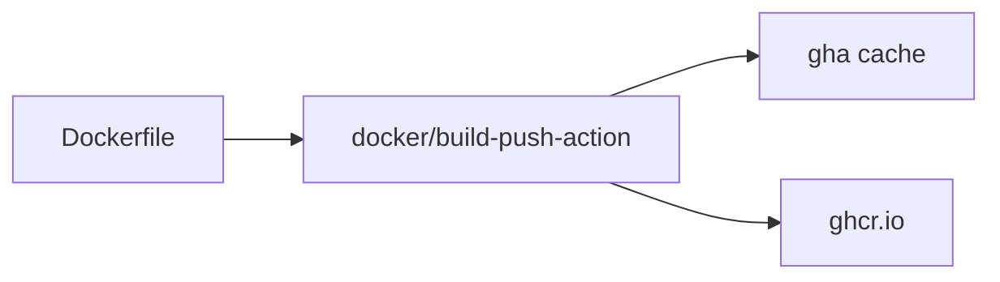

# Docker 빌드

> GitHub Actions 101 시리즈 (7/10)

<!-- a-grade-intro:begin -->

**핵심 질문**: *PR마다 Docker 이미지* 를 *빠르고 안전* 하게 빌드해 *레지스트리* 까지 올리려면 어떻게 합니까?

> *Docker 빌드* 는 *캐시 설계* 가 전부입니다.

<!-- a-grade-intro:end -->

## 이 글에서 배울 것

- *docker/setup-buildx-action* 으로 *Buildx* 활성화
- *gha 캐시* 로 빌드 시간 단축
- *GHCR* 로그인과 push
- *멀티 플랫폼* (linux/amd64+arm64) 빌드
- 흔한 함정 5가지

## 왜 중요한가

CI 의 *가장 느린 step* 은 보통 *Docker 빌드* 입니다. *캐시 + 멀티스테이지 + Buildx* 를 정확히 쓰면 *몇 분이 몇 초* 가 됩니다.

> *컨테이너 표준* 이 *배포 표준* 을 결정합니다.

## 개념 한눈에 보기



## 핵심 용어 정리

- **Buildx**: Docker 의 *고급 빌더*.
- **gha cache**: GitHub Actions *캐시 백엔드*.
- **GHCR**: *GitHub Container Registry*.
- **Multi-platform**: *여러 CPU 아키텍처* 동시 빌드.
- **OCI image**: 컨테이너 *표준 이미지 포맷*.

## Before/After

**Before**: 매번 *전체 layer 재빌드* 해 PR마다 *4분* 소요.

**After**: *gha 캐시 + 멀티스테이지* 로 *30초* 만에 빌드 완료.

## 실습: Docker 빌드 5단계

### 1단계 — Buildx 셋업

```yaml
- uses: docker/setup-qemu-action@v3
- uses: docker/setup-buildx-action@v3
```

### 2단계 — GHCR 로그인

```yaml
- uses: docker/login-action@v3
  with:
    registry: ghcr.io
    username: ${{ github.actor }}
    password: ${{ secrets.GITHUB_TOKEN }}
```

### 3단계 — build-push-action 으로 빌드 + 푸시

```yaml
- uses: docker/build-push-action@v6
  with:
    context: .
    push: true
    tags: ghcr.io/${{ github.repository }}:${{ github.sha }}
    cache-from: type=gha
    cache-to: type=gha,mode=max
```

### 4단계 — 멀티 플랫폼

```yaml
- uses: docker/build-push-action@v6
  with:
    platforms: linux/amd64,linux/arm64
    push: true
    tags: ghcr.io/${{ github.repository }}:latest
```

### 5단계 — 권한 설정 (workflow 최상단)

```yaml
permissions:
  contents: read
  packages: write
```

## 이 코드에서 주목할 점

- *cache-to: gha, mode=max* 가 *layer 캐시* 를 *최대로* 활용합니다.
- *멀티 플랫폼* 은 *비용* 이 *2배 이상* 듭니다.
- *GITHUB_TOKEN* 의 *packages: write* 권한이 필수.

## 자주 하는 실수 5가지

1. **Buildx 미사용.** *gha cache* 를 못 씁니다.
2. **`permissions: packages: write` 누락.** *push 401*.
3. ***latest* 만 푸시.** rollback 불가.
4. ***멀티 플랫폼* 을 *모든 PR* 에서.** 비용 폭발.
5. **`Dockerfile` *멀티스테이지 미사용*.** 이미지가 *수백 MB*.

## 실무에서는 이렇게 쓰입니다

성숙한 팀은 *PR* 에서는 *amd64 + 캐시* 만, *main push* 에서는 *멀티 플랫폼 + 서명 (cosign)* 으로 *공식 이미지* 를 발행합니다.

## 시니어 엔지니어는 이렇게 생각합니다

- *Docker 빌드 시간* = *팀의 인내심*.
- *캐시 전략* 이 *Dockerfile 설계* 를 결정한다.
- *latest* 는 *편의 태그*, *고정 태그* 가 *진실*.
- *권한* 은 *최소 부여*.
- *서명* 으로 *공급망 보안*.

## 체크리스트

- [ ] *Buildx + gha cache* 가 켜져 있다.
- [ ] *고정 태그* (sha) 와 *latest* 를 같이 푸시한다.
- [ ] *permissions: packages: write* 가 있다.
- [ ] *멀티 플랫폼* 은 *필요한 트리거에서만*.

## 연습 문제

1. *PR* 마다 *amd64* 만 빌드하는 워크플로우를 만드세요.
2. *main push* 에서 *멀티 플랫폼 + latest* 를 푸시하세요.
3. *Dockerfile* 을 *멀티스테이지* 로 줄여 이미지 크기를 *반* 으로 줄이세요.

## 정리 및 다음 단계

Docker 빌드 자동화는 *배포 자동화의 입구* 입니다. 다음 글에서는 *배포 자동화* 를 다룹니다.

- [GitHub Actions란 무엇인가?](./01-what-is-github-actions.md)
- [Workflow와 Job](./02-workflow-and-job.md)
- [Trigger 이해하기](./03-triggers.md)
- [Python 테스트 자동화](./04-python-test-automation.md)
- [Lint와 Type Check](./05-lint-and-typecheck.md)
- [빌드 아티팩트](./06-build-artifact.md)
- **Docker 빌드 (현재 글)**
- 배포 자동화 (예정)
- Secret 관리 (예정)
- 실전 CI/CD 파이프라인 (예정)
## 참고 자료

- [docker/build-push-action](https://github.com/docker/build-push-action)
- [docker/setup-buildx-action](https://github.com/docker/setup-buildx-action)
- [GHCR documentation](https://docs.github.com/packages/working-with-a-github-packages-registry/working-with-the-container-registry)
- [Buildx GitHub Actions cache](https://docs.docker.com/build/ci/github-actions/cache/)

Tags: GitHubActions, Docker, Buildx, GHCR, CICD

---

© 2026 영선북스. 이 글의 저작권은 저자에게 있습니다.
