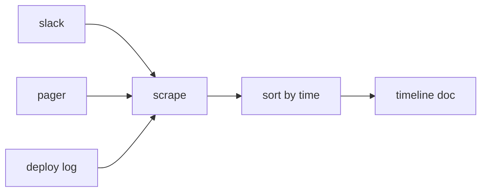

# Timeline 작성

> Incident Response 101 시리즈 (5/10)

<!-- a-grade-intro:begin -->

**핵심 질문**: *Incident* 가 *끝* 난 뒤, *무슨 일* 이 *언제* 일어났는지 어떻게 *재구성* 할까요?

> *Timeline* 은 *대응 중* 에 *동시 기록* 하고, *사실* 만 시간 순으로 정렬합니다.

<!-- a-grade-intro:end -->

## 이 글에서 배울 것

- *동시 기록*
- *채널 스크랩*
- *시간 정렬*
- *사실 vs 해석* 분리
- *Postmortem* 입력

## 왜 중요한가

*기억* 은 *왜곡* 됩니다. *지금 적은 한 줄* 이 *내일의 RCA* 를 살립니다.

## 개념 한눈에 보기



## 핵심 용어 정리

- **timestamp**: *UTC* 표기 *시간 도장*.
- **scrape**: 여러 *채널* 에서 *수집*.
- **fact**: 관찰된 *사실*.
- **interpretation**: *해석* 과 *추측*.
- **anchor**: *Detection*, *Mitigation* 같은 *기준 시각*.

## Before/After

**Before**: *기억* 으로 재구성.

**After**: *동시 기록* + *채널 스크랩* 으로 *재구성*.

## 실습: 간단한 Timeline 빌더

### 1단계 — 이벤트 모델

```python
def event(ts, source, text):
    return {"ts": ts, "src": source, "text": text}
```

### 2단계 — 채널 스크랩

```python
def scrape(channel):
    return [event(m["ts"], channel, m["text"]) for m in channel.get("messages", [])]
```

### 3단계 — 정렬

```python
def order(events):
    return sorted(events, key=lambda e: e["ts"])
```

### 4단계 — 사실/해석 분리

```python
def split(events):
    facts = [e for e in events if not e["text"].startswith("?")]
    notes = [e for e in events if e["text"].startswith("?")]
    return facts, notes
```

### 5단계 — anchor 표시

```python
ANCHORS = ("detected", "acknowledged", "mitigated", "resolved")

def mark(event):
    return event["text"].lower() in ANCHORS
```

## 이 코드에서 주목할 점

- *모든 이벤트* 는 *세 필드*.
- *해석* 은 *접두사* 로 분리.
- *anchor* 는 *대시보드* 의 기준점.

## 자주 하는 실수 5가지

1. ***끝난 뒤* 한꺼번에 작성.**
2. ***해석* 을 *사실* 처럼.**
3. ***시간대* 혼용 (KST/UTC).**
4. ***단일 채널* 만 스크랩.**
5. ***민감 정보* 그대로 붙여 넣기.**

## 실무에서는 이렇게 쓰입니다

*Slack bot* 이 `!ts <text>` 명령으로 이벤트를 *수집* 하고 *Postmortem doc* 으로 *내보내기* 합니다.

## 시니어 엔지니어는 이렇게 생각합니다

- *동시 기록* 이 *원칙*.
- *UTC* 로 통일.
- *짧고 잦은* 줄.
- *추측* 은 따로.
- *anchor* 만 정확하면 OK.

## 체크리스트

- [ ] *기록 책임자*.
- [ ] *Bot 명령*.
- [ ] *UTC 강제*.
- [ ] *anchor 정의*.

## 연습 문제

1. *anchor* 의 의미 한 줄로.
2. *fact* 와 *interpretation* 의 차이 한 줄로.
3. *UTC* 통일이 필요한 이유 한 줄로.

## 정리 및 다음 단계

다음 글은 *Root Cause Analysis* 입니다.

- [Incident란 무엇인가?](./01-what-is-incident.md)
- [Severity 분류](./02-severity.md)
- [초기 대응](./03-initial-response.md)
- [Communication](./04-communication.md)
- **Timeline 작성 (현재 글)**
- Root Cause Analysis (예정)
- Mitigation과 Resolution (예정)
- Postmortem (예정)
- 재발 방지 (예정)
- Incident Runbook 만들기 (예정)
## 참고 자료

- [Postmortem Timeline - Google SRE Workbook](https://sre.google/workbook/postmortem-culture/)
- [Building an Incident Timeline - PagerDuty](https://response.pagerduty.com/after/post_mortem_process/)
- [Incident Documentation - Atlassian](https://www.atlassian.com/incident-management/postmortem)
- [Time and Postmortems - Increment](https://increment.com/postmortems/)

Tags: Incident, Timeline, Postmortem, Logging, Operations

---

© 2026 영선북스. 이 글의 저작권은 저자에게 있습니다.
