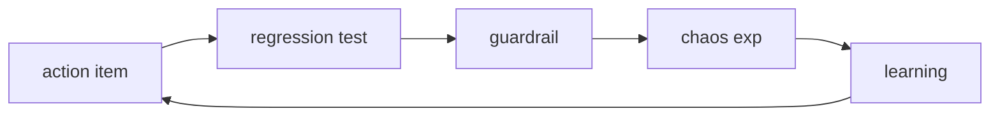

# 재발 방지

> Incident Response 101 시리즈 (9/10)

<!-- a-grade-intro:begin -->

**핵심 질문**: *Incident* 가 *다시* 일어나지 않도록 *어떻게* 보장할까요?

> *재발 방지* 는 *액션 추적*, *회귀 테스트*, *가드레일* 의 *세 축* 으로 만듭니다.

<!-- a-grade-intro:end -->

## 이 글에서 배울 것

- *액션 추적*
- *회귀 테스트*
- *가드레일* 코드
- *카오스 엔지니어링*
- *학습 루프*

## 왜 중요한가

*Postmortem* 까지만 가면 *조직 학습* 이 *행동* 으로 *전환* 되지 않습니다.

## 개념 한눈에 보기



## 핵심 용어 정리

- **action item**: *Postmortem* 의 *후속 작업*.
- **regression test**: *같은 버그* 재발 확인.
- **guardrail**: *위험* 한 행동을 *막는* 코드.
- **chaos exp**: *의도적* 장애 주입.
- **learning loop**: *학습* 의 *순환*.

## Before/After

**Before**: *Postmortem* 후 *문서* 만 남음.

**After**: *Postmortem* 후 *코드* 와 *테스트* 가 남음.

## 실습: 재발 방지 키트

### 1단계 — 액션 등록

```python
def register(action):
    return {**action, "status": "open"}
```

### 2단계 — 회귀 테스트

```python
def test_regression(scenario, run):
    return run(scenario) == "ok"
```

### 3단계 — 가드레일

```python
def guard(payload, limit=1000):
    if payload > limit:
        raise ValueError("blocked")
```

### 4단계 — 카오스 실험

```python
def inject(failure):
    return {"injected": failure, "expected": "graceful"}
```

### 5단계 — 학습 루프

```python
def closed(action):
    return action["status"] == "done"
```

## 이 코드에서 주목할 점

- *상태* 는 *open/done* 두 개.
- *가드레일* 은 *raise* 한 줄.
- *카오스* 는 *기대 결과* 와 함께.

## 자주 하는 실수 5가지

1. ***액션* 만 등록 후 *방치*.**
2. ***회귀 테스트* 누락.**
3. ***가드레일* 을 *경고* 로만.**
4. ***카오스* 없이 *가설* 만.**
5. ***루프* 가 *분기* 를 못 넘김.**

## 실무에서는 이렇게 쓰입니다

*Postmortem* 의 모든 *액션* 이 *Jira* 에 *링크* 되고, *회귀 테스트* 와 *카오스 시나리오* 로 *변환* 되어 *CI* 에서 매주 실행됩니다.

## 시니어 엔지니어는 이렇게 생각합니다

- *방지* 는 *코드*.
- *문서* 는 *시작점*.
- *카오스* 는 *친구*.
- *루프* 는 *분기 리뷰*.
- *반복* 은 *학습 실패*.

## 체크리스트

- [ ] *액션 추적*.
- [ ] *회귀 테스트*.
- [ ] *가드레일 정책*.
- [ ] *카오스 일정*.

## 연습 문제

1. *guardrail* 의 의미 한 줄로.
2. *regression test* 의 의미 한 줄로.
3. *learning loop* 의 의미 한 줄로.

## 정리 및 다음 단계

다음 글은 캡스톤 *Incident Runbook 만들기* 입니다.

- [Incident란 무엇인가?](./01-what-is-incident.md)
- [Severity 분류](./02-severity.md)
- [초기 대응](./03-initial-response.md)
- [Communication](./04-communication.md)
- [Timeline 작성](./05-timeline.md)
- [Root Cause Analysis](./06-root-cause-analysis.md)
- [Mitigation과 Resolution](./07-mitigation-and-resolution.md)
- [Postmortem](./08-postmortem.md)
- **재발 방지 (현재 글)**
- Incident Runbook 만들기 (예정)
## 참고 자료

- [Action Items - Google SRE Workbook](https://sre.google/workbook/postmortem-culture/)
- [Chaos Engineering Principles](https://principlesofchaos.org/)
- [Guardrails vs Gates - Thoughtworks](https://www.thoughtworks.com/insights/blog/guardrails-not-gates)
- [Preventing Recurrence - PagerDuty](https://response.pagerduty.com/after/preventing/)

Tags: Incident, Prevention, Reliability, Testing, Operations

---

© 2026 영선북스. 이 글의 저작권은 저자에게 있습니다.
