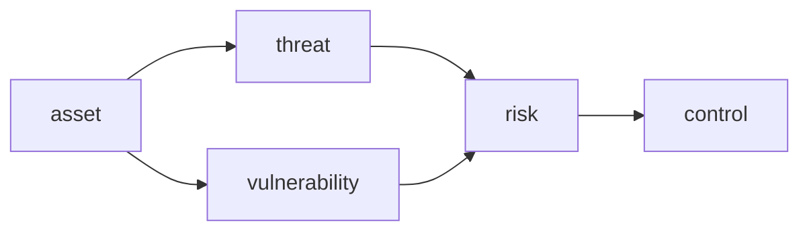

# 정보보안이란 무엇인가?

> Information Security 101 시리즈 (1/10)

<!-- a-grade-intro:begin -->

**핵심 질문**: 보안은 "막는 것"인가요, "결정하는 것"인가요?

> 보안은 위협을 0으로 만드는 일이 아니라, 위협을 알고 "어디까지 감당할지"를 결정하는 일입니다.

<!-- a-grade-intro:end -->

## 이 글에서 배울 것

- 정보보안의 정의와 CIA(기밀성·무결성·가용성)
- 위협(threat), 취약점(vulnerability), 위험(risk)의 차이
- 위협 모델링의 출발점 (STRIDE 한눈에 보기)
- 보안의 기본 원칙 5가지
- 개발자가 보안에 기여하는 가장 빠른 방법

## 왜 중요한가

보안 사고는 거의 모두 "기술이 부족해서"가 아니라 "선택을 안 해서" 일어납니다. 이 시리즈의 다른 9편은 모두 "어떻게"이지만, 1편은 "무엇을, 왜"를 정합니다. 이 위에 다른 모든 글이 서 있습니다.

> 보안은 기술이 아니라 의사결정의 학문입니다.

## 개념 한눈에 보기



자산이 위협과 취약점을 만나면 위험이 됩니다. 위험을 통제(control)하는 것이 보안 활동입니다.

## 핵심 용어 정리

- **기밀성 (Confidentiality)**: 권한이 있는 사람만 본다.
- **무결성 (Integrity)**: 데이터가 의도하지 않게 변경되지 않는다.
- **가용성 (Availability)**: 필요할 때 동작한다.
- **위협 / 취약점 / 위험**: 공격 의도 / 약점 / 둘이 만났을 때 일어날 수 있는 일.
- **STRIDE**: Spoofing, Tampering, Repudiation, Information disclosure, DoS, Elevation of privilege.

## Before/After

**Before — 보안은 인프라 팀의 일**

```text
배포 직전에 보안 검토 -> 일정 지연 -> 부분적 우회
```

**After — 설계 시점에 위협 모델링**

```text
설계 회의에 STRIDE 한 페이지 -> 위험 우선순위 결정 -> 통제 합의
```

보안을 뒤로 미룰수록 비용이 커진다는 사실이 산업적 관찰입니다.

## 실습: 위협 모델 한 페이지

### 1단계 — 자산을 적는다

```text
1_assets.md
- 사용자 비밀번호
- 결제 토큰
- 관리자 세션 쿠키
```

먼저 "보호할 것"의 목록부터 만듭니다. 자산이 없으면 위협을 정의할 수 없습니다.

### 2단계 — STRIDE로 위협 나열

```text
2_threats.md
- Spoofing: 다른 사용자 행세 (auth 우회)
- Tampering: 결제 금액 변조
- Repudiation: 결제 부인
- Information disclosure: DB 덤프 노출
- DoS: 로그인 폭주로 서비스 마비
- Elevation: 일반 사용자가 admin 권한 획득
```

각 자산에 STRIDE 한 줄씩 적어 보면 빠진 위협이 보입니다.

### 3단계 — 위험 우선순위 (간단)

```python
# 3_risk.py
def risk_score(likelihood, impact):
    return likelihood * impact   # 1-5 척도
print(risk_score(3, 5))   # 15
```

이 점수만으로도 "지금 막을 것 vs 나중에 볼 것"이 갈립니다.

### 4단계 — 통제 매핑

```text
4_controls.md
- Spoofing -> MFA, password policy
- Tampering -> HMAC, audit log
- Information disclosure -> 암호화, 접근 통제
```

통제는 위협별로 적습니다. 막연한 "보안 강화"는 검증할 수 없습니다.

### 5단계 — 잔여 위험 합의

```text
5_residual.md
- DoS는 CDN의 rate limit으로 약하게만 방어
- 사고 시 대응 절차 9편 참고
- 분기 1회 재평가
```

모든 위험을 제거할 수 없습니다. 남은 위험을 명시적으로 합의하는 것이 어른의 보안.

## 이 코드에서 주목할 점

- 위협 모델은 "완벽"이 아니라 "공유된 그림"이 목적입니다.
- STRIDE는 빠지지 않게 도와주는 체크리스트입니다.
- 위험 점수는 비교용이지 절댓값이 아닙니다.
- 잔여 위험을 적는 것이 책임을 분명히 합니다.

## 자주 하는 실수 5가지

1. **자산 없이 위협을 나열한다.** 무엇을 보호할지 모르면 통제도 정할 수 없습니다.
2. **모든 위협을 동일하게 대응한다.** 우선순위 없는 보안은 실현되지 않습니다.
3. **보안을 마지막에 한다.** 변경 비용이 100배 커집니다.
4. **위험을 0으로 만들려 한다.** 트레이드오프 없는 보안은 가용성을 죽입니다.
5. **사고 절차 없이 통제만 강화한다.** 사고는 결국 일어납니다.

## 실무에서는 이렇게 쓰입니다

OWASP의 위협 모델링, ISO 27001 / SOC 2의 위험 평가, AWS Well-Architected Security Pillar, Microsoft SDL 모두 같은 골격(자산 - 위협 - 위험 - 통제)을 따릅니다. 큰 조직일수록 이 한 페이지가 의사결정의 출발점입니다.

## 시니어 엔지니어는 이렇게 생각합니다

- 보안을 "막기"가 아니라 "결정하기"로 다룹니다.
- STRIDE 한 페이지를 PR 템플릿에 넣어 두기도 합니다.
- 잔여 위험을 ticket으로 남기고 분기 단위로 재평가합니다.
- 사고 대응 runbook을 통제 강화보다 먼저 만듭니다.
- 비용 대비 효과를 숫자로 말합니다.

## 체크리스트

- [ ] CIA를 한 줄로 설명할 수 있는가?
- [ ] STRIDE 6항목을 한 자산에 적용할 수 있는가?
- [ ] 위협 / 취약점 / 위험의 차이를 답할 수 있는가?
- [ ] 잔여 위험이라는 단어가 자연스러운가?
- [ ] 위험 우선순위에 따라 일을 정할 수 있는가?

## 연습 문제

1. 본인이 만든 서비스의 자산 5개를 적고, 각각에 STRIDE를 붙여 보세요.
2. likelihood/impact를 1-5로 매겨 가장 위험한 항목을 찾아 보세요.
3. 위 결과를 한 장으로 만들어 팀과 공유해 보세요.

## 정리 및 다음 단계

정보보안의 출발점은 통제 기술이 아니라 "무엇을 왜 보호하는가"의 질문입니다. 다음 글에서는 가장 자주 마주치는 통제 — 인증과 인가 — 를 다룹니다.

- **정보보안이란 무엇인가? (현재 글)**
- 인증과 인가 (예정)
- 암호화와 해시 (예정)
- TLS와 인증서 (예정)
- Web 보안 기초 (예정)
- SQL Injection과 XSS (예정)
- secret 관리 (예정)
- 권한 최소화 (예정)
- 로그와 감사 (예정)
- 보안 사고 대응 (예정)
## 참고 자료

- [OWASP Threat Modeling](https://owasp.org/www-community/Threat_Modeling)
- [Microsoft STRIDE](https://learn.microsoft.com/en-us/azure/security/develop/threat-modeling-tool-threats)
- [NIST SP 800-30 Risk Assessment](https://csrc.nist.gov/publications/detail/sp/800-30/rev-1/final)
- [AWS Well-Architected Security Pillar](https://docs.aws.amazon.com/wellarchitected/latest/security-pillar/welcome.html)

Tags: Computer Science, Security, CIA, ThreatModel, RiskAssessment, InfoSec

---

© 2026 영선북스. 이 글의 저작권은 저자에게 있습니다.
