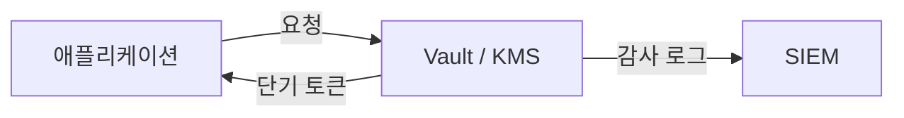

# secret 관리

> Information Security 101 시리즈 (7/10)

<!-- a-grade-intro:begin -->

**핵심 질문**: secret이 코드에 들어가는 순간, 우리는 무엇을 잃나요?

> secret 관리는 "어디에 두느냐"가 아니라 "어떻게 회전하느냐"의 문제입니다.

<!-- a-grade-intro:end -->

## 이 글에서 배울 것

- secret의 종류 (정적/동적/사용자/시스템)
- 환경 변수의 한계
- vault / KMS의 역할
- 회전(rotation) 정책의 핵심
- 코드에서 secret을 다루는 안전 패턴

## 왜 중요한가

대규모 사고의 절반 이상이 secret 노출에서 시작합니다. 한 번 유출된 secret은 회전하지 않으면 영구적 위험입니다.

> secret은 자산이 아니라 부채입니다 — 짧게 살게 합니다.

## 개념 한눈에 보기



코드는 secret 자체가 아니라 secret을 가져올 권한만 가집니다.

## 핵심 용어 정리

- **Static secret**: 수동으로 설정한 키/암호.
- **Dynamic secret**: 요청마다 vault가 생성하는 단기 자격.
- **Vault**: HashiCorp Vault 등 secret 관리 시스템.
- **KMS**: 키 관리 서비스 (AWS KMS, GCP KMS).
- **Rotation**: 정기적으로 secret을 교체.

## Before/After

**Before — `.env`에 평문으로 보관**

```text
git에 실수로 커밋 -> 영구 유출 -> 모든 환경 회전 필요
```

**After — vault에서 단기 토큰 발급**

```text
앱은 부팅 시 토큰 요청 -> 만료 시 자동 회전
```

저장 위치보다 수명이 보안을 결정합니다.

## 실습: 코드와 설정으로 보기

### 1단계 — 환경 변수 (최소선)

```python
# 1_env.py
import os
db_url = os.environ["DATABASE_URL"]
# 코드에 하드코딩 금지: db_url = "postgres://user:pw@..."
```

`.env` 파일은 절대 git에 커밋하지 않습니다.

### 2단계 — Vault에서 secret 가져오기

```python
# 2_vault.py
import hvac
client = hvac.Client(url="http://vault:8200", token=os.environ["VAULT_TOKEN"])
data = client.secrets.kv.read_secret_version(path="myapp/db")
db_pw = data["data"]["data"]["password"]
```

vault 토큰 자체도 단기여야 합니다 (예: AppRole, K8s SA).

### 3단계 — KMS로 데이터 키 암호화

```python
# 3_kms.py
import boto3
kms = boto3.client("kms")
resp = kms.generate_data_key(KeyId="alias/app", KeySpec="AES_256")
plaintext = resp["Plaintext"]      # 메모리에서만
ciphertext = resp["CiphertextBlob"] # DB에 저장
```

평문 데이터 키는 메모리에만 잠깐 존재합니다.

### 4단계 — secret 스캐너 (사전 방어)

```bash
# 4_scan.sh
# pre-commit hook: trufflehog 등으로 커밋 전 스캔
trufflehog filesystem . --only-verified
```

git history를 항상 의심하고, 사전에 막습니다.

### 5단계 — 회전 의사코드

```python
# 5_rotation.py
def rotate_db_password():
    new_pw = generate_strong_password()
    db.execute(f"ALTER USER app WITH PASSWORD %s", (new_pw,))
    vault.put("myapp/db", {"password": new_pw})
    notify_apps_to_reload()
```

회전은 자동화되어 있어야 합니다.

## 이 코드에서 주목할 점

- secret은 가능한 짧은 수명을 갖습니다.
- 평문 secret은 메모리에서만 존재합니다.
- 모든 secret 접근은 감사 로그를 남깁니다.
- 회전은 수동이 아닌 자동화로.

## 자주 하는 실수 5가지

1. **`.env`를 git에 커밋.** 가장 흔한 사고.
2. **단일 마스터 키 사용.** 회전 불가능.
3. **로그/예외에 secret 출력.** SIEM 통해 광범위 노출.
4. **회전 정책 부재.** 유출되면 무기한 노출.
5. **Slack/이메일로 secret 공유.** 검색 가능한 비밀.

## 실무에서는 이렇게 쓰입니다

Kubernetes는 `Secret` 객체 + ESO(External Secrets Operator)로 vault와 동기화합니다. CI/CD는 OIDC 페더레이션으로 단기 자격을 발급받아 정적 키를 제거합니다. AWS는 IAM Role + STS로 인스턴스 단위 단기 자격을 제공합니다.

## 시니어 엔지니어는 이렇게 생각합니다

- 모든 secret에 만료가 있어야 합니다.
- secret 관리는 ID 관리(IAM)와 함께 설계합니다.
- `.env`는 로컬 개발용일 뿐입니다.
- 사고 시 회전 시간을 SLO로 관리합니다 (예: 1시간 이내).
- secret 스캐너는 pre-commit + CI 둘 다 적용.

## 체크리스트

- [ ] 모든 secret에 만료/회전 주기가 정의되어 있는가?
- [ ] `.env` 파일이 `.gitignore`에 있는가?
- [ ] secret 접근 감사 로그가 수집되는가?
- [ ] 사고 시 회전 절차가 문서화되어 있는가?
- [ ] CI/CD에 정적 자격이 남아 있지 않은가?

## 연습 문제

1. 환경 변수와 vault의 차이를 한 문단으로 설명해 보세요.
2. secret 회전 SLO를 어떻게 측정하시겠습니까?
3. 실수로 git에 커밋한 secret을 안전하게 처리하는 절차를 적어 보세요.

## 정리 및 다음 단계

secret 관리는 위치보다 수명입니다. 다음 글에서는 secret을 받은 주체가 무엇을 할 수 있어야 하는지 — 권한 최소화 — 를 봅니다.

- [정보보안이란 무엇인가?](./01-what-is-information-security.md)
- [인증과 인가](./02-authentication-and-authorization.md)
- [암호화와 해시](./03-cryptography-and-hash.md)
- [TLS와 인증서](./04-tls-and-certificates.md)
- [Web 보안 기초](./05-web-security-basics.md)
- [SQL Injection과 XSS](./06-sql-injection-and-xss.md)
- **secret 관리 (현재 글)**
- 권한 최소화 (예정)
- 로그와 감사 (예정)
- 보안 사고 대응 (예정)
## 참고 자료

- [HashiCorp Vault — Documentation](https://developer.hashicorp.com/vault/docs)
- [AWS KMS — Best Practices](https://docs.aws.amazon.com/kms/latest/developerguide/best-practices.html)
- [OWASP — Secrets Management Cheat Sheet](https://cheatsheetseries.owasp.org/cheatsheets/Secrets_Management_Cheat_Sheet.html)
- [trufflehog — Find Leaked Credentials](https://github.com/trufflesecurity/trufflehog)

Tags: Computer Science, Security, Secrets, Vault, KMS, Rotation

---

© 2026 영선북스. 이 글의 저작권은 저자에게 있습니다.
