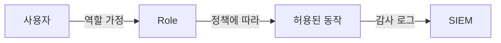

# 권한 최소화

> Information Security 101 시리즈 (8/10)

<!-- a-grade-intro:begin -->

**핵심 질문**: "있으면 편한 권한"이 왜 위험한가요?

> 최소 권한은 사고가 났을 때의 폭발 반경을 결정합니다.

<!-- a-grade-intro:end -->

## 이 글에서 배울 것

- 최소 권한 원칙(PoLP)의 정확한 의미
- IAM 정책의 deny/allow 작성법
- RBAC vs ABAC vs ReBAC
- Zero Trust의 실제 의미
- 사람과 시스템 권한의 분리

## 왜 중요한가

침해는 막을 수 없을 때가 있어도, 폭발 반경은 항상 줄일 수 있습니다. 권한 최소화는 사고의 비용을 결정합니다.

> 권한은 부여하는 것이 아니라 빌려주는 것입니다.

## 개념 한눈에 보기



모든 권한은 명시적이고 추적 가능해야 합니다.

## 핵심 용어 정리

- **PoLP**: 일을 하기에 딱 필요한 권한만.
- **RBAC**: 역할 기반 접근 제어.
- **ABAC**: 속성(태그/시간/위치)에 따른 제어.
- **Zero Trust**: 위치/네트워크와 무관하게 매번 검증.
- **Privilege escalation**: 권한 상승 — 모든 시스템에서 차단해야 함.

## Before/After

**Before — 모든 서비스가 admin 자격**

```text
한 서비스 침해 -> 클러스터 전체 통제권 상실
```

**After — 서비스별 최소 권한**

```text
한 서비스 침해 -> 해당 서비스의 자원만 영향
```

폭발 반경의 차이가 사고의 등급을 결정합니다.

## 실습: 최소 권한 적용

### 1단계 — AWS IAM 정책 (최소 권한)

```json
{
  "Version": "2012-10-17",
  "Statement": [{
    "Effect": "Allow",
    "Action": ["s3:GetObject"],
    "Resource": "arn:aws:s3:::my-bucket/reports/*"
  }]
}
```

`Action: "*"`나 `Resource: "*"`는 위험 신호입니다.

### 2단계 — Kubernetes RBAC

```yaml
# 2_role.yaml
kind: Role
apiVersion: rbac.authorization.k8s.io/v1
metadata: { namespace: app, name: pod-reader }
rules:
- apiGroups: [""]
  resources: ["pods"]
  verbs: ["get", "list"]
```

특정 namespace + 특정 리소스 + 읽기만.

### 3단계 — 서비스 계정 분리

```yaml
# 3_sa.yaml
kind: ServiceAccount
apiVersion: v1
metadata: { name: reports-reader, namespace: app }
```

각 워크로드에 전용 SA를 부여합니다.

### 4단계 — 임시 권한 (sudo 패턴)

```python
# 4_temp_grant.py
def assume_emergency_role():
    # break-glass: 30분 만료, 알림 발송, 감사 로그
    issue_short_lived_credential(role="incident-responder", ttl_min=30)
```

평소엔 권한이 없고, 필요할 때만 발급합니다.

### 5단계 — 정책 검증 (정적 분석)

```bash
# 5_check.sh
# IAM 정책에서 와일드카드 검출
grep -r '"\*"' iam/ && echo "WARNING: wildcard in IAM"
```

정책은 코드처럼 검증합니다.

## 이 코드에서 주목할 점

- 와일드카드는 위험 신호로 lint합니다.
- 권한은 시간 제한이 있을 수 있습니다 (TTL).
- 사람용/시스템용 권한을 분리합니다.
- break-glass는 알림과 감사를 동반합니다.

## 자주 하는 실수 5가지

1. **모든 서비스에 admin 부여.** 폭발 반경 최대.
2. **임시로 부여한 권한을 영구 유지.** 권한 누적.
3. **RBAC 역할의 너무 넓은 정의.** 사실상 admin.
4. **break-glass에 알림 없음.** 비상 권한이 일상화.
5. **권한 검토 부재.** 시간이 흐르면 모두 admin이 됩니다.

## 실무에서는 이렇게 쓰입니다

AWS는 SCP + IAM + Resource Policy + Permission Boundary로 다층 제어. K8s는 Namespace + RBAC + NetworkPolicy + PodSecurityAdmission. 사람용 access는 IdP(Okta) + JIT(Just-In-Time) 발급으로 영구 권한을 없앱니다.

## 시니어 엔지니어는 이렇게 생각합니다

- 권한은 정기 검토 대상입니다 (분기별).
- 새 권한 부여는 만료 일자를 함께 적습니다.
- 정책은 git에 두고 PR로 변경합니다.
- 사고 후 항상 폭발 반경을 회고합니다.
- "임시" 권한을 만들지 않습니다 — 공식 절차로.

## 체크리스트

- [ ] 모든 서비스 계정이 전용으로 분리되어 있는가?
- [ ] IAM 정책에 와일드카드가 없는가?
- [ ] 권한 검토 주기가 정해져 있는가?
- [ ] break-glass 절차가 알림과 함께 있는가?
- [ ] 사람용 access가 JIT로 발급되는가?

## 연습 문제

1. RBAC와 ABAC의 차이를 한 문단으로 설명해 보세요.
2. break-glass 권한의 알림 이벤트 두 가지를 적어 보세요.
3. 한 서비스가 침해되었을 때 폭발 반경을 줄이는 구조 두 가지를 적어 보세요.

## 정리 및 다음 단계

권한 최소화는 사고의 비용을 결정합니다. 다음 글에서는 사고를 알아챌 수 있게 해주는 — 로그와 감사 — 를 봅니다.

- [정보보안이란 무엇인가?](./01-what-is-information-security.md)
- [인증과 인가](./02-authentication-and-authorization.md)
- [암호화와 해시](./03-cryptography-and-hash.md)
- [TLS와 인증서](./04-tls-and-certificates.md)
- [Web 보안 기초](./05-web-security-basics.md)
- [SQL Injection과 XSS](./06-sql-injection-and-xss.md)
- [secret 관리](./07-secret-management.md)
- **권한 최소화 (현재 글)**
- 로그와 감사 (예정)
- 보안 사고 대응 (예정)
## 참고 자료

- [NIST — Principle of Least Privilege](https://csrc.nist.gov/glossary/term/least_privilege)
- [AWS — IAM Best Practices](https://docs.aws.amazon.com/IAM/latest/UserGuide/best-practices.html)
- [Kubernetes — RBAC Authorization](https://kubernetes.io/docs/reference/access-authn-authz/rbac/)
- [Google — BeyondCorp Zero Trust](https://cloud.google.com/beyondcorp)

Tags: Computer Science, Security, LeastPrivilege, IAM, AccessControl, ZeroTrust

---

© 2026 영선북스. 이 글의 저작권은 저자에게 있습니다.
