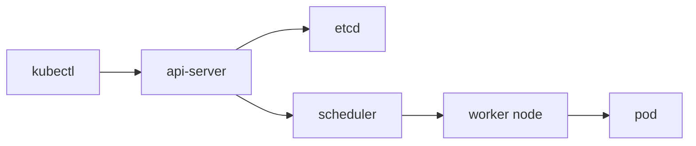

# What is Kubernetes?

> Kubernetes 101 시리즈 (1/10)

<!-- a-grade-intro:begin -->

**핵심 질문**: *수십, 수백 개* 의 컨테이너를 *사람이* 일일이 관리할 수 있을까요?

> *Kubernetes* 는 *컨테이너* 를 *희망 상태* 로 *유지* 해 주는 *오케스트레이터* 입니다.

<!-- a-grade-intro:end -->

## 이 글에서 배울 것

- *오케스트레이션* 의 의미
- *컨트롤 플레인* 과 *워커 노드*
- *희망 상태* 모델
- *kubectl* 의 위치
- *언제 도입* 할지 기준

## 왜 중요한가

*컨테이너* 한두 개는 *Compose* 로 충분합니다. *수십 개* 부터는 *오케스트레이터* 가 *생존 조건* 입니다.

## 개념 한눈에 보기



## 핵심 용어 정리

- **cluster**: *제어판 + 워커 노드* 한 묶음.
- **control plane**: *api-server, etcd, scheduler, controller-manager*.
- **node**: *컨테이너* 가 실제로 *돌아가는* 머신.
- **desired state**: *YAML* 로 *선언* 한 *목표 상태*.
- **kubectl**: *클러스터* 와 대화하는 *CLI*.

## Before/After

**Before**: *서버마다* *수동 docker run* 으로 *재현 불가*.

**After**: *YAML* 한 장으로 *어디서나* 동일 결과.

## 실습: 첫 클러스터 둘러보기

### 1단계 — 컨텍스트 확인

```python
import subprocess

def current_context():
    res = subprocess.run(
        ["kubectl", "config", "current-context"],
        capture_output=True, text=True, check=True,
    )
    return res.stdout.strip()
```

### 2단계 — 노드 조회

```python
def get_nodes():
    res = subprocess.run(
        ["kubectl", "get", "nodes", "-o", "wide"],
        capture_output=True, text=True, check=True,
    )
    return res.stdout
```

### 3단계 — 네임스페이스

```python
def list_namespaces():
    res = subprocess.run(
        ["kubectl", "get", "ns"],
        capture_output=True, text=True, check=True,
    )
    return res.stdout
```

### 4단계 — 시스템 파드

```python
def system_pods():
    res = subprocess.run(
        ["kubectl", "-n", "kube-system", "get", "pods"],
        capture_output=True, text=True, check=True,
    )
    return res.stdout
```

### 5단계 — 헬스 체크

```python
def cluster_info():
    res = subprocess.run(
        ["kubectl", "cluster-info"],
        capture_output=True, text=True, check=True,
    )
    return res.stdout
```

## 이 코드에서 주목할 점

- *kubectl* 은 *api-server* 만 호출.
- *etcd* 는 *직접 다루지 않는다*.
- *namespace* 가 *기본 격리 단위*.

## 자주 하는 실수 5가지

1. ***Kubernetes = 컨테이너* 와 동의어로 오해.**
2. **노드 *수* 만 늘리면 *해결* 된다고 착각.**
3. ***etcd* 를 *직접* 만지려 함.**
4. ***kubectl* 컨텍스트 혼동으로 *프로덕션* 에 적용.**
5. **소규모인데 *Kubernetes* 부터 도입.**

## 실무에서는 이렇게 쓰입니다

*EKS / GKE / AKS* 같은 *managed Kubernetes* 가 *컨트롤 플레인* 을 *대신 운영*, 팀은 *워크로드 YAML* 에 집중합니다.

## 시니어 엔지니어는 이렇게 생각합니다

- *희망 상태* 가 *철학*.
- *컨트롤 플레인* 은 *대뇌*, *노드* 는 *팔다리*.
- *작은 팀* 에 *Kubernetes* 는 *과잉*.
- *managed* 가 *기본 선택*.
- *kubectl* 은 *얇은 클라이언트*.

## 체크리스트

- [ ] *컨텍스트* 명시적으로 전환.
- [ ] *네임스페이스* 분리.
- [ ] *희망 상태* 를 *YAML* 로 보관.
- [ ] *managed* 우선 검토.

## 연습 문제

1. *컨트롤 플레인* 의 *역할* 한 줄로.
2. *희망 상태* 가 *왜* 중요한지 한 줄로.
3. *Kubernetes* 도입을 *미뤄야 할 상황* 한 가지.

## 정리 및 다음 단계

오케스트레이션의 *큰 그림* 이 잡혔습니다. 다음 글은 *가장 작은 단위* 인 *Pod*.

- **Kubernetes란 무엇인가? (현재 글)**
- Pod (예정)
- Deployment (예정)
- Service (예정)
- Ingress (예정)
- ConfigMap과 Secret (예정)
- Volume (예정)
- HPA (예정)
- Helm (예정)
- 운영 관점의 Kubernetes (예정)
## 참고 자료

- [Kubernetes Overview](https://kubernetes.io/docs/concepts/overview/)
- [Kubernetes components](https://kubernetes.io/docs/concepts/overview/components/)
- [kubectl reference](https://kubernetes.io/docs/reference/kubectl/)
- [Managed Kubernetes options](https://landscape.cncf.io/)

Tags: Kubernetes, Orchestration, Containers, DevOps, SRE

---

© 2026 영선북스. 이 글의 저작권은 저자에게 있습니다.
