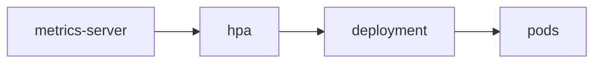

# HPA

> Kubernetes 101 시리즈 (8/10)

<!-- a-grade-intro:begin -->

**핵심 질문**: *트래픽* 이 *변할 때* *Pod 수* 를 *사람* 이 매번 바꿔야 할까요?

> *HorizontalPodAutoscaler* 가 *지표* 를 보고 *Pod 수* 를 *자동* 으로 늘리고 줄입니다.

<!-- a-grade-intro:end -->

## 이 글에서 배울 것

- *HPA* 의 위치
- *metrics-server* 필요성
- *CPU/메모리* 타깃
- *커스텀 지표*
- *VPA / Cluster Autoscaler* 와의 관계

## 왜 중요한가

*수동 스케일* 은 *지연* 과 *과잉 프로비저닝* 의 원인입니다. *오토스케일* 이 *비용* 과 *가용성* 을 동시에 잡습니다.

## 개념 한눈에 보기



## 핵심 용어 정리

- **HPA**: *Pod 수* 를 *자동* 조절.
- **metrics-server**: *기본 지표* 수집기.
- **target utilization**: *CPU/Mem 목표 비율*.
- **custom metric**: *큐 길이* 같은 *외부 지표*.
- **VPA**: *Pod 자체 자원* 을 조절.

## Before/After

**Before**: *야간* 에는 *낭비*, *피크* 에는 *503*.

**After**: *HPA* 가 *수요* 에 맞춰 *Pod* 자동 조절.

## 실습: CPU 기반 HPA

### 1단계 — Deployment에 자원 요청

```python
"""
spec:
  template:
    spec:
      containers:
      - name: app
        image: myorg/app:1.0
        resources:
          requests: {cpu: 200m, memory: 256Mi}
"""
```

### 2단계 — HPA manifest

```python
"""
apiVersion: autoscaling/v2
kind: HorizontalPodAutoscaler
metadata: {name: web}
spec:
  scaleTargetRef:
    apiVersion: apps/v1
    kind: Deployment
    name: web
  minReplicas: 2
  maxReplicas: 10
  metrics:
  - type: Resource
    resource:
      name: cpu
      target: {type: Utilization, averageUtilization: 60}
"""
```

### 3단계 — apply

```python
import subprocess

def apply(path):
    subprocess.run(["kubectl", "apply", "-f", path], check=True)
```

### 4단계 — 부하 발생

```python
def load(target):
    subprocess.run([
        "kubectl", "run", "load", "--rm", "-i", "--restart=Never",
        "--image=busybox", "--", "sh", "-c",
        f"while true; do wget -q -O- {target}; done",
    ], check=False)
```

### 5단계 — HPA 상태

```python
def hpa_status(name):
    res = subprocess.run(
        ["kubectl", "get", "hpa", name, "-o", "wide"],
        capture_output=True, text=True, check=True,
    )
    return res.stdout
```

## 이 코드에서 주목할 점

- *resource requests* 가 *없으면* HPA *동작 안 함*.
- *minReplicas ≥ 2* 가 *고가용성* 시작.
- *averageUtilization* 은 *requests* 대비 비율.

## 자주 하는 실수 5가지

1. ***requests* 미설정으로 *지표 0%*.**
2. ***maxReplicas* 너무 낮아 *피크 흡수 실패*.**
3. ***커스텀 지표* 를 *바로* 도입.**
4. ***노드 한계* 무시 → *스케일 못 함*.**
5. ***쿨다운* 무시로 *플랩*.**

## 실무에서는 이렇게 쓰입니다

*HPA + Cluster Autoscaler* 조합으로 *Pod* 가 *늘 때* *노드* 도 *늘어나는* 두 단 자동화가 흔합니다.

## 시니어 엔지니어는 이렇게 생각합니다

- *requests* 가 *모든 자동화의 기반*.
- *지표 신뢰도* 가 *오토스케일 신뢰도*.
- *커스텀 지표* 는 *실측* 후.
- *플랩* 은 *비용* 으로 돌아온다.
- *노드 자동화* 와 *짝* 이다.

## 체크리스트

- [ ] *requests* 설정.
- [ ] *minReplicas ≥ 2*.
- [ ] *Cluster Autoscaler* 도입 검토.
- [ ] *플랩* 모니터링.

## 연습 문제

1. *HPA* 가 *requests* 없이 *왜* 안 도는지 한 줄로.
2. *VPA* 와 *HPA* 의 *차이* 한 줄로.
3. *Cluster Autoscaler* 의 *역할* 한 줄로.

## 정리 및 다음 단계

자동화가 잡혔으면 *반복 가능한 배포 단위* 가 필요합니다. 다음 글은 *Helm*.

- [Kubernetes란 무엇인가?](./01-what-is-kubernetes.md)
- [Pod](./02-pod.md)
- [Deployment](./03-deployment.md)
- [Service](./04-service.md)
- [Ingress](./05-ingress.md)
- [ConfigMap과 Secret](./06-configmap-and-secret.md)
- [Volume](./07-volume.md)
- **HPA (현재 글)**
- Helm (예정)
- 운영 관점의 Kubernetes (예정)
## 참고 자료

- [HorizontalPodAutoscaler](https://kubernetes.io/docs/tasks/run-application/horizontal-pod-autoscale/)
- [metrics-server](https://github.com/kubernetes-sigs/metrics-server)
- [Cluster Autoscaler](https://github.com/kubernetes/autoscaler/tree/master/cluster-autoscaler)
- [VPA](https://github.com/kubernetes/autoscaler/tree/master/vertical-pod-autoscaler)

Tags: Kubernetes, HPA, Autoscaling, Metrics, DevOps

---

© 2026 영선북스. 이 글의 저작권은 저자에게 있습니다.
