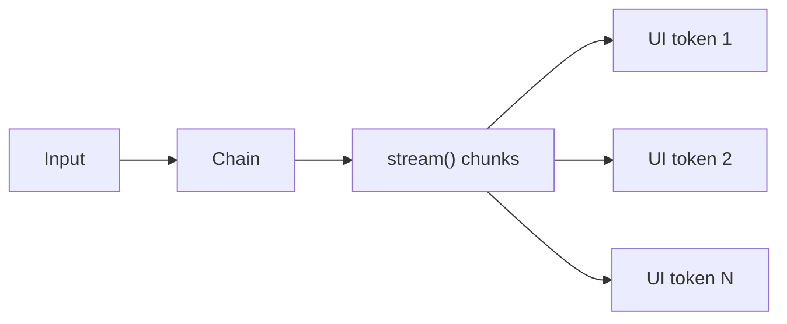

# Streaming — 실시간 출력 처리

> LangChain 101 시리즈 (5/6)

<!-- a-grade-intro:begin -->

**핵심 질문**: *LLM* 답변을 *기다리지 않고* *바로* *보여* *주려면* *어떻게* 하나요?

> `invoke` 대신 `stream` 또는 `astream` 으로 *토큰* 을 *조각* 으로 *받습니다*.

<!-- a-grade-intro:end -->

## 이 글에서 배울 것

- *stream* 과 *invoke* 의 *차이*
- *동기 stream* *사용*
- *비동기 astream* *사용*
- *astream_events* 로 *세부 이벤트* *추적*
- *체인 전체* 에 *streaming* *적용*

## 왜 중요한가

*LLM* 답변은 *수 초* 가 *걸립니다*. *streaming* 이 없으면 *사용자* 는 *빈 화면* 을 *바라봐야* *합니다*. *체감 지연* 을 *줄이는* *가장* *쉬운* *방법* 입니다.

## 개념 한눈에 보기



## 핵심 용어 정리

- **stream**: *동기* 제너레이터로 *조각* 을 *yield* 하는 *Runnable* 메서드.
- **astream**: *비동기* 버전. `async for` 로 *순회*.
- **chunk**: *토큰* 또는 *짧은* *문자열* *조각*.
- **astream_events**: *체인 내부* *모든* *이벤트* 를 *비동기* 로 *방출*.
- **token**: *모델* 이 *한 번* 에 *생성* 하는 *최소 단위*.

## Before/After

**Before**: "`invoke` 가 *끝날* *때까지* *UI* 가 *멈춥니다*."

**After**: "*첫 토큰* 이 *오자마자* *화면* 에 *흐르듯* *표시* 됩니다."

## 실습: Streaming 5단계

### 1단계 — 기본 체인 준비

```python
import os
from langchain_core.prompts import ChatPromptTemplate
from langchain_core.output_parsers import StrOutputParser
from langchain_groq import ChatGroq

os.environ.setdefault("GROQ_API_KEY", "your-key-here")
llm = ChatGroq(model="llama-3.1-8b-instant", temperature=0)
prompt = ChatPromptTemplate.from_messages([
    ("system", "한국어로 길게 설명합니다."),
    ("human", "{topic} 을 5개 단락으로 설명해 주세요."),
])
chain = prompt | llm | StrOutputParser()
```

### 2단계 — 동기 stream

```python
for chunk in chain.stream({"topic": "벡터 데이터베이스"}):
    print(chunk, end="", flush=True)
```

### 3단계 — 비동기 astream

```python
import asyncio

async def run():
    async for chunk in chain.astream({"topic": "RAG"}):
        print(chunk, end="", flush=True)

asyncio.run(run())
```

### 4단계 — astream_events 로 세부 이벤트

```python
async def run_events():
    async for event in chain.astream_events({"topic": "임베딩"}, version="v2"):
        if event["event"] == "on_chat_model_stream":
            chunk = event["data"]["chunk"]
            print(chunk.content, end="", flush=True)

asyncio.run(run_events())
```

### 5단계 — FastAPI 응답으로 흘려보내기

```python
from fastapi import FastAPI
from fastapi.responses import StreamingResponse

app = FastAPI()

@app.get("/stream")
def stream_endpoint(topic: str):
    def gen():
        for chunk in chain.stream({"topic": topic}):
            yield chunk
    return StreamingResponse(gen(), media_type="text/plain")
```

## 이 코드에서 주목할 점

- *체인 끝* 에 *StrOutputParser* 가 있어야 *문자열 청크* 가 *깔끔* 하게 *흐릅니다*.
- *astream_events* 는 *체인 안* *어떤* *Runnable* 에서 *이벤트* 가 *나왔는지* 도 *알려* *줍니다*.
- *FastAPI StreamingResponse* 는 *제너레이터* 만 *넘기면* *되어* *통합* 이 *간단* 합니다.

## 자주 하는 실수 5가지

1. ***flush=False*** — `print` 가 *버퍼링* 되어 *조각* 이 *한꺼번에* *나옵니다*.
2. ***JsonOutputParser 와 stream 혼용*** — *완성* 된 *JSON* 만 *파싱* 가능하므로 *조각* 이 *나오지* *않습니다*.
3. ***event 버전 미지정*** — `astream_events(..., version="v2")` 를 *명시* 하지 않으면 *경고* 가 *나옵니다*.
4. ***Tool Calling 중간 결과* 무시** — *tool 호출* 단계에서는 *콘텐츠* 가 *비어* *있을* *수* *있습니다*.
5. ***네트워크 버퍼*** — *프록시* 가 *버퍼링* 하면 *체감* 으로는 *streaming* 이 *안* *보입니다*.

## 실무에서는 이렇게 쓰입니다

*프로덕션* 에서는 *FastAPI* 또는 *SSE* 엔드포인트로 *토큰* 을 *흘려* *보내고* *프런트엔드* 가 *그대로* *그립니다*. *모니터링* 에는 *astream_events* 로 *모델 호출* 시점 과 *Tool 호출* 시점 을 *분리* 합니다.

## 시니어 엔지니어는 이렇게 생각합니다

- *streaming* 은 *기능* 이 아니라 *UX 기본기* 입니다.
- *백엔드* *프록시* 의 *버퍼링* 옵션을 *반드시* *확인* 합니다.
- *구조화 출력* 이 *필요* 하면 *streaming* 을 *포기* 하거나 *부분 파서* 를 *씁니다*.
- *Tool 호출* 흐름은 *event* 단위 로 *관찰* 합니다.
- *첫 토큰 지연* 을 *별도* *지표* 로 *추적* 합니다.

## 체크리스트

- [ ] *체인 끝* 에 *StrOutputParser* *연결*.
- [ ] *동기/비동기* *상황* 에 *맞는* *메서드* *선택*.
- [ ] *프록시* *버퍼링* *비활성화*.
- [ ] *첫 토큰 지연* *측정*.

## 연습 문제

1. *동기* `stream` 과 *비동기* `astream` 의 *총 소요 시간* 을 *측정* 해 *비교* 하세요.
2. `astream_events` 로 *모델 호출* 과 *파서 호출* 이벤트만 *필터링* 해 *출력* 하세요.
3. *FastAPI* 엔드포인트에 *클라이언트 접속 종료* 를 *감지* 해 *조기 종료* 하는 *로직* 을 *추가* 하세요.

## 정리 및 다음 단계

다음 글은 *실전 체인 조립 — 컴포넌트를 하나로 연결하기* 입니다.

## 시리즈 목차

- [LangChain 소개 — LCEL과 Runnable 기본](./01-lcel-runnable-basics.md)
- [Prompt와 LLM Chain — 체인 첫 번째 구성](./02-prompt-llm-chain.md)
- [Retriever — 문서 검색과 컨텍스트 주입](./03-retriever.md)
- [Tool Calling — 외부 도구 연결하기](./04-tool-calling.md)
- **Streaming — 실시간 출력 처리 (현재 글)**
- 실전 체인 조립 — 컴포넌트를 하나로 연결하기 (예정)

## 참고 자료

- [Streaming concept](https://python.langchain.com/docs/concepts/streaming/)
- [How to stream chat models](https://python.langchain.com/docs/how_to/chat_streaming/)
- [astream_events reference](https://python.langchain.com/docs/how_to/streaming/)
- [LangChain GitHub](https://github.com/langchain-ai/langchain)

Tags: LangChain, LCEL, Python, LLM

---

© 2026 영선북스. 이 글의 저작권은 저자에게 있습니다.
