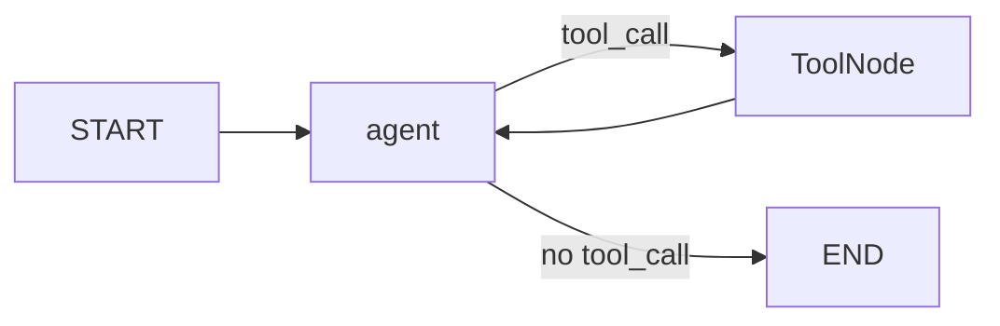

# 도구 호출 에이전트

> LangGraph 101 시리즈 (4/6)

<!-- a-grade-intro:begin -->

**핵심 질문**: *LLM* 이 *도구* 를 *언제* *부르고* *언제* *멈출지* 를 *그래프* 가 *어떻게* *판단* *하나요*?

> *LLM* 이 *tool_call* 을 *내면* *ToolNode* 로, *없으면* *END* 로. *tools_condition* 이 *이* *판단* 을 *맡습니다*.

<!-- a-grade-intro:end -->

## 이 글에서 배울 것

- *@tool* *데코레이터* 로 *도구* *정의*
- *bind_tools* 와 *MessagesState*
- *ToolNode* *책임* 분리
- *tools_condition* 의 *분기* 의미
- *agent → tools → agent* *루프*

## 왜 중요한가

*도구* *호출* 을 *루프* 안에 *직접* *짜면* *재시도*, *로깅*, *테스트* 가 *모두* *섞입니다*. *LangGraph* 의 *prebuilt* *컴포넌트* 는 *호출 결정*, *실행*, *결과 해석* 을 *별도* *노드* 로 *분리* 합니다.

## 개념 한눈에 보기



## 핵심 용어 정리

- **@tool**: *함수* 를 *LLM* *호출* *가능* 도구로 *래핑*. *docstring* 이 *설명* 입니다.
- **bind_tools**: *모델* 에 *도구 스키마* 를 *부착*. *모델* 이 *tool_call* 을 *내게* *합니다*.
- **MessagesState**: *messages* 필드 가 *기본* 으로 *준비* 된 *상태* 타입.
- **ToolNode**: *AIMessage* 의 *tool_calls* 를 *읽어* *실행* 하고 *ToolMessage* 를 *추가*.
- **tools_condition**: *마지막* *AIMessage* 에 *tool_call* 있으면 *"tools"*, 없으면 *END*.

## Before/After

**Before**: "*if response.tool_calls* 같은 *수동* *분기* 가 *함수* *안* 에 *쌓입니다*."

**After**: "*tools_condition* 이 *그래프* 위에서 *그* *판단* 을 *대신* *합니다*."

## 실습: 도구 에이전트 5단계

### 1단계 — 도구 두 개 정의

```python
import json
from langchain_core.tools import tool

@tool
def add(a: int, b: int) -> int:
    """Add two integers and return the sum."""
    return a + b

@tool
def word_stats(text: str) -> str:
    """Return word and character counts as JSON."""
    return json.dumps({"words": len(text.split()), "characters": len(text)})

TOOLS = [add, word_stats]
```

### 2단계 — 모델에 도구 바인딩

```python
import os
from langchain_core.messages import SystemMessage
from langchain_groq import ChatGroq

os.environ.setdefault("GROQ_API_KEY", "your-key-here")

def call_model(state):
    llm = ChatGroq(model="llama-3.3-70b-versatile", temperature=0).bind_tools(TOOLS)
    system = SystemMessage(content="Use tools for arithmetic and counting tasks.")
    response = llm.invoke([system, *state["messages"]])
    return {"messages": [response]}
```

### 3단계 — 그래프 빌드

```python
from langgraph.graph import StateGraph, START, END, MessagesState
from langgraph.prebuilt import ToolNode, tools_condition

builder = StateGraph(MessagesState)
builder.add_node("agent", call_model)
builder.add_node("tools", ToolNode(TOOLS))

builder.add_edge(START, "agent")
builder.add_conditional_edges("agent", tools_condition, {"tools": "tools", "__end__": END})
builder.add_edge("tools", "agent")

graph = builder.compile()
```

### 4단계 — 도구 사용 질문

```python
from langchain_core.messages import HumanMessage

result = graph.invoke({"messages": [HumanMessage(content="What is add(144, 25)? Use a tool.")]})
print(result["messages"][-1].content)
```

### 5단계 — 도구 미사용 질문

```python
result = graph.invoke({"messages": [HumanMessage(content="Say hello in one word.")]})
print(result["messages"][-1].content)
```

## 이 코드에서 주목할 점

- *@tool* *docstring* 이 *그대로* *모델* *프롬프트* 의 *도구* *설명* 으로 *전달* 됩니다.
- *ToolNode* 는 *tool_calls* 의 *id* 를 *맞춰* *ToolMessage* 를 *생성* 합니다. *수작업* 이 *없습니다*.
- *agent → tools → agent* *루프* 가 *그래프* *위* 로 *드러* *납니다*.

## 자주 하는 실수 5가지

1. ***bind_tools 누락*** — *모델* 이 *tool_call* 을 *낼* *방법* 자체 가 *없습니다*.
2. ***tools → END 직결*** — *도구* *결과* 를 *모델* 에 *돌려* *주지* *않으면* *답변* 이 *비어* *있습니다*.
3. ***tools_condition path_map 누락*** — *END* 매핑 *없으면* *종료* 가 *동작* *하지* *않습니다*.
4. ***eval 기반 계산 도구*** — *임의* *코드* *실행* *위험*. *명시적* *함수* 만 *제공* 합니다.
5. ***재귀* *깊이* *방치*** — *recursion limit* 까지 *돌면* *그래프* 가 *예외* 로 *멈춥니다*.

## 실무에서는 이렇게 쓰입니다

*프로덕션* 에서는 *DB 조회*, *외부 API*, *사내* *RAG* *조회* 같은 *도구* 를 *연결* 합니다. *도구* *별* *권한*, *타임아웃*, *재시도* 정책은 *ToolNode* 옆 에 *별도* 노드 로 *분리* 합니다.

## 시니어 엔지니어는 이렇게 생각합니다

- *도구* *설명* 이 *입력 형식* 과 *반환 형식* 을 *분명* 히 *말해야* *합니다*.
- *결정적* 인 *계산* 도구는 *디버깅* 이 *쉽습니다*.
- *agent* 와 *tools* 가 *분리* 되어 *각자* *테스트* *가능* 합니다.
- *멀티턴* 시 *체크포인터* 와 *결합* 합니다 (*5편*, *6편*).
- *실패* 응답 도 *ToolMessage* 로 *남깁니다*. *모델* 이 *다음* *턴* 에 *복구* *시도* 합니다.

## 체크리스트

- [ ] *@tool* *docstring* 작성.
- [ ] *bind_tools* 호출.
- [ ] *agent ↔ tools* *루프* 구성.
- [ ] *tools_condition* *path_map* 에 *END* 포함.

## 연습 문제

1. `multiply(a, b)` 도구를 *추가* 하고 *복합* *계산* *질문* 을 *처리* 하세요.
2. *재귀* *깊이* 를 *낮춰* `recursion_limit=2` 로 *동작* 을 *관찰* 하세요.
3. *도구* *실행* 시 *예외* 를 *발생* 시키고 *모델* 의 *후속* *응답* 을 *확인* 하세요.

## 정리 및 다음 단계

다음 글은 *멀티 에이전트 시스템* 입니다.

## 시리즈 목차

- [LangGraph 소개와 그래프 기초](./01-graph-basics.md)
- [상태 관리와 체크포인트](./02-state-and-checkpoints.md)
- [조건부 엣지와 분기 흐름](./03-conditional-edges.md)
- **도구 호출 에이전트 (현재 글)**
- 멀티 에이전트 시스템 (예정)
- LangGraph 완성 (예정)

## 참고 자료

- [Tool calling how-to](https://langchain-ai.github.io/langgraph/how-tos/tool-calling/)
- [ToolNode reference](https://langchain-ai.github.io/langgraph/reference/prebuilt/#langgraph.prebuilt.tool_node.ToolNode)
- [LangChain tool concepts](https://python.langchain.com/docs/concepts/tools/)
- [Tool calling concepts](https://python.langchain.com/docs/concepts/tool_calling/)

Tags: LangGraph, Agent, Python, LLM

---

© 2026 영선북스. 이 글의 저작권은 저자에게 있습니다.
