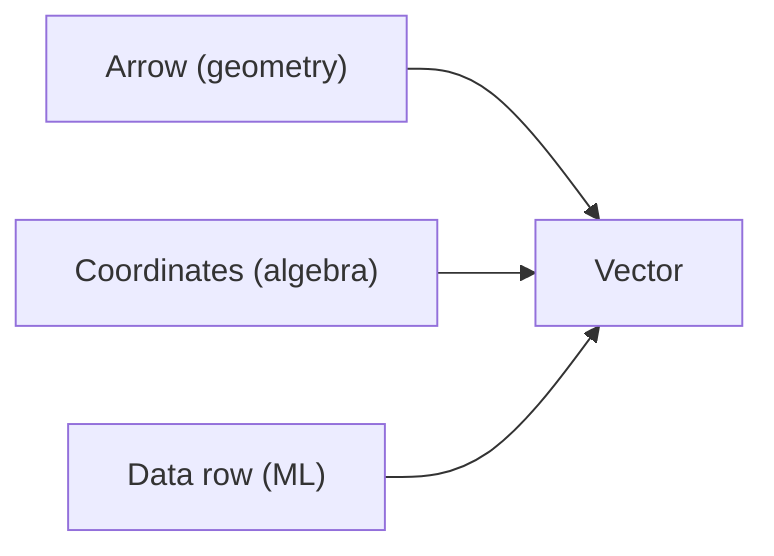

# 벡터

> Linear Algebra 101 시리즈 (2/10)

<!-- a-grade-intro:begin -->

**핵심 질문**: *벡터* 는 *숫자의 묶음* 일까요, *공간의 화살표* 일까요?

> *벡터는 *방향과 크기* 를 가진 객체이며, 동시에 *데이터 한 행* 이기도 하다.*

<!-- a-grade-intro:end -->

## 이 글에서 배울 것

- *벡터* 의 *세 가지 관점* — 화살표, 좌표, 데이터
- *덧셈/스칼라곱* 의 *기하학적 의미*
- *노름과 정규화*
- 5단계 실습
- 흔한 함정 5가지

## 왜 중요한가

ML에서 *데이터의 한 행* 은 *벡터* 입니다. *벡터 연산* 을 *제대로 다루지 못하면* 모델 입력부터 막힙니다.

> *Vectors are how we package data for machines.*

## 개념 한눈에 보기



## 핵심 용어 정리

- **벡터**: *순서가 있는 숫자 묶음* — `[x1, x2, ..., xn]`.
- **차원**: 벡터의 *원소 개수*.
- **노름 ||v||**: 벡터의 *크기* — 보통 *유클리드 길이*.
- **단위벡터**: 노름이 *1* 인 벡터.
- **스칼라곱**: *길이* 만 *변경*, *방향* 은 *유지/반전*.

## Before/After

**Before**: *“벡터는 그냥 리스트.”* — 기하학적 의미 *없음*.

**After**: *“벡터는 *공간의 점/화살표* 이며 *연산은 기하학적 변형*.”*

## 실습: 5단계 벡터 다루기

### 1단계 — 벡터 만들기

```python
import numpy as np
v = np.array([3.0, 4.0])
w = np.array([1.0, 2.0])
print("v:", v, "w:", w)
```

### 2단계 — 덧셈과 뺄셈

```python
print("v+w:", v + w)
print("v-w:", v - w)
```

### 3단계 — 스칼라곱

```python
print("2v:", 2 * v)
print("-v:", -v)
```

### 4단계 — 노름

```python
norm_v = np.linalg.norm(v)
print("||v||:", norm_v)
```

### 5단계 — 정규화 (단위벡터)

```python
unit_v = v / np.linalg.norm(v)
print("unit v:", unit_v, "norm:", np.linalg.norm(unit_v))
```

## 이 코드에서 주목할 점

- *NumPy* 의 *벡터 연산* 은 *원소별*.
- *노름* 은 *L2(유클리드)* 가 *기본*.
- *정규화* 는 *방향 보존*, *길이만 1*.

## 자주 하는 실수 5가지

1. ***차원 불일치* 에서 *암묵 broadcasting* 의존.**
2. ***노름 0 벡터* 정규화 — *0으로 나눔*.**
3. ***행벡터/열벡터* 구분을 *대충*.**
4. ***내적과 원소곱* 혼동.**
5. ***부동소수점 오차* 무시.**

## 실무에서는 이렇게 쓰입니다

ML 입력 피처, *임베딩 벡터*, 추천 시스템의 *유저/아이템 벡터*, NLP의 *단어 임베딩* — 모두 *벡터의 연산* 입니다.

## 시니어 엔지니어는 이렇게 생각합니다

- *형상* 을 *항상 출력*.
- *노름* 을 *반드시 확인*.
- *정규화* 가 *언제 필요한지* 안다.
- *기하학적 의미* 를 *그림으로 본다*.
- *수치 안정성* 을 신경 쓴다.

## 체크리스트

- [ ] *벡터 덧셈/스칼라곱* 가능.
- [ ] *노름* 계산 가능.
- [ ] *정규화* 가능.
- [ ] *기하학적 의미* 를 안다.

## 연습 문제

1. *벡터 v = [3, 4]* 의 *유클리드 노름* 을 손으로 구하세요.
2. *벡터 정규화* 후 *노름이 1* 이 되는지 코드로 확인하세요.
3. *영벡터의 정규화* 가 *왜 정의되지 않는지* 설명하세요.

## 정리 및 다음 단계

벡터는 *공간의 점/화살표* 이며 *데이터의 한 행* 입니다. 다음 글에서는 *행렬* 을 다룹니다.

- [선형대수란 무엇인가?](./01-what-is-linear-algebra.md)
- **벡터 (현재 글)**
- 행렬 (예정)
- 내적과 거리 (예정)
- 선형변환 (예정)
- 기저와 차원 (예정)
- 고유값과 고유벡터 (예정)
- 행렬 분해 (예정)
- PCA (예정)
- 머신러닝에서의 선형대수 (예정)
## 참고 자료

- [3Blue1Brown — Vectors](https://www.3blue1brown.com/lessons/vectors)
- [Khan Academy — Vectors](https://www.khanacademy.org/math/linear-algebra/vectors-and-spaces)
- [NumPy — Array creation](https://numpy.org/doc/stable/user/basics.creation.html)
- [Wikipedia — Euclidean vector](https://en.wikipedia.org/wiki/Euclidean_vector)

Tags: LinearAlgebra, Vectors, NumPy, DataScience, Beginner

---

© 2026 영선북스. 이 글의 저작권은 저자에게 있습니다.
