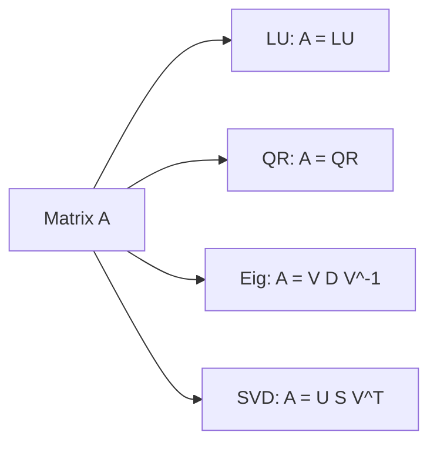

# 행렬 분해

> Linear Algebra 101 시리즈 (8/10)

<!-- a-grade-intro:begin -->

**핵심 질문**: 행렬을 *간단한 조각* 으로 쪼갤 수 있을까요?

> *행렬 분해는 *복잡한 변환* 을 *해석 가능한 단순 변환의 곱* 으로 표현한다.*

<!-- a-grade-intro:end -->

## 이 글에서 배울 것

- *LU 분해*, *QR 분해*
- *고유분해*, *SVD*
- *각 분해의 용도*
- 5단계 실습
- 흔한 함정 5가지

## 왜 중요한가

선형방정식, 최소제곱, PCA, 차원축소 — 모두 *행렬 분해* 가 *수치적 핵심* 입니다. *역행렬보다 안정적* 입니다.

> *Decompositions are how numerical linear algebra actually works.*

## 개념 한눈에 보기



## 핵심 용어 정리

- **LU**: 하/상 삼각행렬의 곱 — *방정식 풀이*.
- **QR**: 직교 + 상삼각 — *최소제곱*.
- **고유분해**: `V D V^-1` — *대각화*.
- **SVD**: `U S V^T` — *모든 행렬* 에 적용 가능, *PCA의 기반*.
- **특이값**: *SVD의 대각 원소*, *항상 비음수*.

## Before/After

**Before**: *“역행렬로 모든 걸 푼다.”*

**After**: *“상황에 맞는 *분해* 를 사용 — *훨씬 빠르고 안정적*.”*

## 실습: 5단계 행렬 분해

### 1단계 — LU 분해

```python
import numpy as np
from scipy.linalg import lu
A = np.array([[4.0, 3.0], [6.0, 3.0]])
P, L, U = lu(A)
print("L:", L)
print("U:", U)
```

### 2단계 — QR 분해

```python
Q, R = np.linalg.qr(A)
print("Q^T Q ~ I:", np.allclose(Q.T @ Q, np.eye(2)))
print("R:", R)
```

### 3단계 — 고유분해

```python
vals, vecs = np.linalg.eig(A)
print("vals:", vals)
```

### 4단계 — SVD

```python
U, S, Vt = np.linalg.svd(A)
print("U:", U)
print("S:", S)
print("Vt:", Vt)
```

### 5단계 — SVD로 재구성

```python
A_reconstructed = U @ np.diag(S) @ Vt
print("close to A:", np.allclose(A_reconstructed, A))
```

## 이 코드에서 주목할 점

- *분해마다 용도* 가 다름.
- *SVD* 는 *항상 존재*.
- *재구성* 으로 *분해 검증*.

## 자주 하는 실수 5가지

1. ***LU* 를 *직사각형* 행렬에 적용 시도.**
2. ***QR/SVD 차이* 모름.**
3. ***SVD 특이값* 의 *순서* 망각.**
4. ***부동소수점 비교* 에 *== 사용*.**
5. ***np.linalg.inv* 로 *최소제곱* — *불안정*.**

## 실무에서는 이렇게 쓰입니다

선형방정식(*LU*), 최소제곱(*QR*), PCA(*SVD*), *추천 시스템 행렬분해(MF)*, *이미지 압축(저랭크 SVD)* — 모두 *행렬 분해* 입니다.

## 시니어 엔지니어는 이렇게 생각합니다

- *역행렬 대신 분해* 를 쓴다.
- *SVD* 가 *가장 일반적/강력*.
- *조건수* 와 *수치 안정성* 을 본다.
- *저랭크 근사* 로 *압축/노이즈 제거*.
- *분해의 비용/이득* 을 안다.

## 체크리스트

- [ ] *LU/QR/Eig/SVD* 의 *용도* 를 안다.
- [ ] *NumPy* 로 분해 가능.
- [ ] *재구성* 으로 검증 가능.
- [ ] *역행렬보다 분해* 를 선호한다.

## 연습 문제

1. *3x2 직사각형 행렬* 의 *SVD* 를 수행하고 *형상* 을 적으세요.
2. *QR 분해* 로 *최소제곱* 을 풀어보세요.
3. *SVD 저랭크 근사* 로 *원본과의 오차* 를 측정하세요.

## 정리 및 다음 단계

행렬 분해는 *수치 선형대수의 핵심* 입니다. 다음 글에서는 *PCA* 를 다룹니다.

- [선형대수란 무엇인가?](./01-what-is-linear-algebra.md)
- [벡터](./02-vectors.md)
- [행렬](./03-matrices.md)
- [내적과 거리](./04-inner-product-and-distance.md)
- [선형변환](./05-linear-transformation.md)
- [기저와 차원](./06-basis-and-dimension.md)
- [고유값과 고유벡터](./07-eigenvalues-and-eigenvectors.md)
- **행렬 분해 (현재 글)**
- PCA (예정)
- 머신러닝에서의 선형대수 (예정)
## 참고 자료

- [Wikipedia — Matrix decomposition](https://en.wikipedia.org/wiki/Matrix_decomposition)
- [Wikipedia — Singular value decomposition](https://en.wikipedia.org/wiki/Singular_value_decomposition)
- [NumPy — linalg.svd](https://numpy.org/doc/stable/reference/generated/numpy.linalg.svd.html)
- [SciPy — linalg.lu](https://docs.scipy.org/doc/scipy/reference/generated/scipy.linalg.lu.html)

Tags: LinearAlgebra, Decomposition, SVD, DataScience, Beginner

---

© 2026 영선북스. 이 글의 저작권은 저자에게 있습니다.
