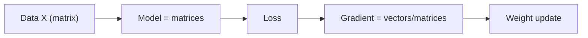

# 머신러닝에서의 선형대수

> Linear Algebra 101 시리즈 (10/10)

<!-- a-grade-intro:begin -->

**핵심 질문**: 지금까지 배운 *선형대수* 가 *ML 어디에서* 어떻게 쓰일까요?

> *선형대수는 *데이터 표현*, *모델 정의*, *학습 알고리즘* 의 공통 언어다.*

<!-- a-grade-intro:end -->

## 이 글에서 배울 것

- *선형회귀* 의 *정규방정식*
- *신경망 레이어* 의 *행렬 곱*
- *임베딩 공간* 의 *내적/코사인*
- 5단계 종합 실습
- 흔한 함정 5가지

## 왜 중요한가

*선형대수가 약한 ML 엔지니어* 는 *디버깅도, 최적화도* 못합니다. *내부를 보는 눈* 이 사라집니다.

> *Every ML algorithm has linear algebra inside.*

## 개념 한눈에 보기



## 핵심 용어 정리

- **설계행렬 X**: 행=샘플, 열=피처.
- **가중치 W**: *선형변환* 의 *학습 가능한 파라미터*.
- **임베딩**: *고차원 객체* 를 *벡터* 로 표현.
- **그래디언트**: *손실의 벡터/행렬 미분*.
- **배치 행렬 곱**: 여러 입력을 *동시에* 처리.

## Before/After

**Before**: *“ML은 마법”* — 내부가 *블랙박스*.

**After**: *“모든 레이어 = *선형변환 + 비선형* — *행렬과 벡터의 연속*.”*

## 실습: 5단계 ML × 선형대수

### 1단계 — 선형회귀 (정규방정식)

```python
import numpy as np
rng = np.random.default_rng(0)
X = rng.normal(size=(100, 3))
y = X @ np.array([1.0, -2.0, 0.5]) + rng.normal(scale=0.1, size=100)
w_hat, *_ = np.linalg.lstsq(X, y, rcond=None)
print("w_hat:", w_hat)
```

### 2단계 — 신경망 한 레이어

```python
W1 = rng.normal(size=(3, 4))
b1 = np.zeros(4)
h = np.maximum(0, X @ W1 + b1)  # ReLU
print("hidden shape:", h.shape)
```

### 3단계 — 코사인 유사도(임베딩)

```python
emb = rng.normal(size=(5, 8))
norms = np.linalg.norm(emb, axis=1, keepdims=True)
emb_n = emb / norms
sim = emb_n @ emb_n.T
print("sim matrix shape:", sim.shape)
```

### 4단계 — 그래디언트 한 스텝

```python
def loss_and_grad(w, X, y):
    pred = X @ w
    err = pred - y
    loss = (err ** 2).mean()
    grad = 2 * X.T @ err / len(y)
    return loss, grad

w = np.zeros(3)
for _ in range(50):
    L, g = loss_and_grad(w, X, y)
    w -= 0.05 * g
print("learned w:", w)
```

### 5단계 — PCA로 피처 압축

```python
Xc = X - X.mean(axis=0)
U, S, Vt = np.linalg.svd(Xc, full_matrices=False)
X_2d = Xc @ Vt[:2].T
print("compressed:", X_2d.shape)
```

## 이 코드에서 주목할 점

- *모든 레이어* 가 *행렬 곱 + 비선형*.
- *그래디언트* 는 *벡터/행렬* 의 미분.
- *임베딩 공간* 의 *유사도* 가 *코사인*.

## 자주 하는 실수 5가지

1. ***형상 불일치* 디버깅 회피.**
2. ***정규화/표준화* 망각.**
3. ***행렬 곱 vs 원소곱* 혼동.**
4. ***그래디언트 형상* 잘못 — *전치 위치* 실수.**
5. ***수치 안정성* 무시 — `inv` 직접 사용.**

## 실무에서는 이렇게 쓰입니다

선형회귀, 로지스틱, *MLP/CNN/RNN/Transformer*, *임베딩 검색*, *RecSys* — 모두 *선형대수 위* 에서 돌아갑니다.

## 시니어 엔지니어는 이렇게 생각합니다

- *형상* 을 *항상 출력*.
- *분해/정규화* 로 *수치 안정성* 확보.
- *그래디언트 모양* 을 손으로 도출.
- *임베딩 공간 직관* 을 가진다.
- *PCA/SVD* 로 *데이터 이해* 를 빠르게.

## 체크리스트

- [ ] *선형회귀* 를 lstsq로 풀 수 있다.
- [ ] *MLP 한 레이어* 를 만들 수 있다.
- [ ] *코사인 유사도 행렬* 계산 가능.
- [ ] *경사하강법* 한 스텝 구현 가능.

## 연습 문제

1. *iris* 에 *로지스틱 회귀* 를 *정규방정식 없이* 경사하강법으로 학습.
2. *2층 MLP* 를 NumPy로 구현하고 *순전파* 만 작성.
3. *임베딩 5개* 의 *Top-2 유사도* 를 코사인으로 추출.

## 정리 및 다음 단계

선형대수는 *ML의 골격* 입니다. 이 시리즈를 통해 *모델 내부를 보는 눈* 을 얻었길 바랍니다. 다음 단계는 *Calculus for ML* 시리즈입니다.

- [선형대수란 무엇인가?](./01-what-is-linear-algebra.md)
- [벡터](./02-vectors.md)
- [행렬](./03-matrices.md)
- [내적과 거리](./04-inner-product-and-distance.md)
- [선형변환](./05-linear-transformation.md)
- [기저와 차원](./06-basis-and-dimension.md)
- [고유값과 고유벡터](./07-eigenvalues-and-eigenvectors.md)
- [행렬 분해](./08-matrix-decomposition.md)
- [PCA](./09-pca.md)
- **머신러닝에서의 선형대수 (현재 글)**
## 참고 자료

- [Deep Learning Book — Linear Algebra](https://www.deeplearningbook.org/contents/linear_algebra.html)
- [fast.ai — Computational Linear Algebra](https://github.com/fastai/numerical-linear-algebra)
- [Stanford CS229 — Linear Algebra Review](https://cs229.stanford.edu/section/cs229-linalg.pdf)
- [3Blue1Brown — Essence of Linear Algebra](https://www.3blue1brown.com/topics/linear-algebra)

Tags: LinearAlgebra, MachineLearning, DeepLearning, DataScience, Beginner

---

© 2026 영선북스. 이 글의 저작권은 저자에게 있습니다.
