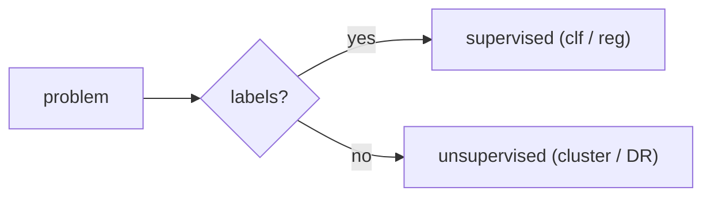

# 지도학습과 비지도학습

> Machine Learning 101 시리즈 (2/10)

<!-- a-grade-intro:begin -->

**핵심 질문**: *레이블이 있을 때* 와 *없을 때*, *우리는 같은 알고리즘* 을 쓸 수 있을까요?

> *지도학습은 *정답* 으로 *함수를 맞추고*, *비지도학습은 *구조* 를 *스스로 찾는다*.*

<!-- a-grade-intro:end -->

## 이 글에서 배울 것

- *지도/비지도/준지도/강화* 의 *경계*
- *분류 vs 회귀* 의 *판별*
- *군집 vs 차원축소* 의 *역할*
- 5단계 실습 흐름
- 흔한 함정 5가지

## 왜 중요한가

*잘못된 패러다임* 으로 *문제를 풀면* — *모델 성능* 이 *아무리 올라도 무의미*. 첫 단계는 *문제 정의* 입니다.

## 개념 한눈에 보기



## 핵심 용어 정리

- **지도학습**: *(X, y)* 쌍으로 *함수 학습*.
- **비지도학습**: *X* 만으로 *구조 발견*.
- **분류**: *이산 레이블* 예측.
- **회귀**: *연속 값* 예측.
- **군집**: *유사도* 로 *그룹화*.

## Before/After

**Before**: *“ML = 회귀 한 줄”* — *문제 유형* 무시.

**After**: *“레이블 유무 → 패러다임 → 알고리즘”* 의 *순서* 로 *결정*.

## 실습: 5단계 패러다임 비교

### 1단계 — 데이터 로드

```python
from sklearn.datasets import load_iris
X, y = load_iris(return_X_y=True)
```

### 2단계 — 지도(분류)

```python
from sklearn.linear_model import LogisticRegression
clf = LogisticRegression(max_iter=1000).fit(X, y)
print("clf acc:", clf.score(X, y))
```

### 3단계 — 지도(회귀) 데이터

```python
from sklearn.datasets import fetch_california_housing
Xr, yr = fetch_california_housing(return_X_y=True)
```

### 4단계 — 회귀 모델

```python
from sklearn.linear_model import LinearRegression
reg = LinearRegression().fit(Xr, yr)
print("R^2:", reg.score(Xr, yr))
```

### 5단계 — 비지도(군집)

```python
from sklearn.cluster import KMeans
km = KMeans(n_clusters=3, n_init=10).fit(X)
print("inertia:", km.inertia_)
```

## 이 코드에서 주목할 점

- *clf.score* 는 *정확도*, *reg.score* 는 *R^2*, *km.inertia_* 는 *군집 응집도* — *지표 의미가 다름*.
- *KMeans 의 n_init* 은 *재현성 / 안정성* 에 중요.
- *비지도* 는 *정답이 없으니* *해석* 이 더 어렵다.

## 자주 하는 실수 5가지

1. ***회귀 문제* 를 *분류* 로 풀기 (혹은 반대).**
2. ***레이블 일부* 만 있을 때 *전부 버리기* (준지도 가능).**
3. ***군집 결과* 를 *정답* 처럼 다루기.**
4. ***K* 를 *시각화 없이* 고정.**
5. ***표준화 없이* *거리 기반 알고리즘* 사용.**

## 실무에서는 이렇게 쓰입니다

스팸/사기 *분류*, 가격/수요 *회귀*, 고객 *군집* — *세 가지가 결합* 되어 *추천·랭킹·세그먼테이션* 을 구성.

## 시니어 엔지니어는 이렇게 생각합니다

- *문제 → 지표 → 패러다임* 순서.
- *비지도* 는 *탐색 단계* 에 자주 쓴다.
- *준지도* 가 *현실에서 흔하다*.
- *강화학습* 은 *마지막 카드*.
- *알고리즘* 보다 *데이터 라벨링 전략* 이 더 중요.

## 체크리스트

- [ ] *분류/회귀/군집* 을 *예시로 구분* 할 수 있다.
- [ ] *score 의 의미* 가 다름을 안다.
- [ ] *KMeans* 의 *K* 가 *하이퍼파라미터* 임을 안다.
- [ ] *표준화 필요* 한 알고리즘을 안다.

## 연습 문제

1. *iris* 를 *KMeans* 로 *군집* 한 결과와 *실제 y* 의 *교차표* 를 그리세요.
2. *회귀로 풀어야 할 예* 와 *분류로 풀어야 할 예* 를 *각 3개* 들어보세요.
3. *준지도* 가 *유리한 상황* 을 설명하세요.

## 정리 및 다음 단계

*패러다임 선택* 이 *모델 성능* 의 *천장* 을 결정합니다. 다음 글에서는 *Train/Test Split* 으로 *일반화 측정* 을 시작합니다.

- [Machine Learning이란 무엇인가?](./01-what-is-machine-learning.md)
- **지도학습과 비지도학습 (현재 글)**
- Train/Test Split (예정)
- Linear Regression (예정)
- Logistic Regression (예정)
- Decision Tree와 Random Forest (예정)
- Clustering (예정)
- Overfitting과 Regularization (예정)
- Model Evaluation (예정)
- ML 프로젝트 전체 흐름 (예정)
## 참고 자료

- [scikit-learn — Supervised learning](https://scikit-learn.org/stable/supervised_learning.html)
- [scikit-learn — Unsupervised learning](https://scikit-learn.org/stable/unsupervised_learning.html)
- [Pattern Recognition and Machine Learning — Bishop](https://www.microsoft.com/en-us/research/people/cmbishop/prml-book/)
- [Google — ML Problem Framing](https://developers.google.com/machine-learning/problem-framing)

Tags: MachineLearning, SupervisedLearning, UnsupervisedLearning, Classification, Clustering

---

© 2026 영선북스. 이 글의 저작권은 저자에게 있습니다.
