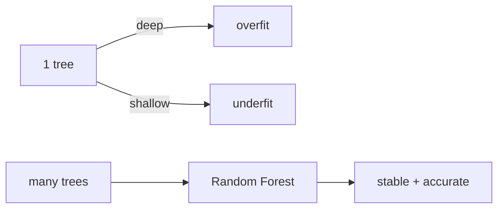

# Decision Tree와 Random Forest

> Machine Learning 101 시리즈 (6/10)

<!-- a-grade-intro:begin -->

**핵심 질문**: *if-else 의 거대한 묶음* 이 *왜 신경망보다 강력* 할 때가 있을까요?

> *Decision Tree 는 *해석 가능한 비선형* 모델이고, *Random Forest 는 *수많은 트리* 의 *집단지성* 입니다.*

<!-- a-grade-intro:end -->

## 이 글에서 배울 것

- *결정 트리* 의 *분할 기준 (지니/엔트로피)*
- *과적합* 과 *가지치기*
- *Bagging* 과 *Random Forest*
- *피처 중요도* 의 의미와 한계
- 흔한 함정 5가지

## 왜 중요한가

*표 데이터 (tabular)* 에서 *Random Forest / GBDT* 가 *여전히 최강*. *딥러닝 이전* 에 *반드시 시도*.

## 개념 한눈에 보기



## 핵심 용어 정리

- **분할**: *피처/임계값* 으로 *데이터 분리*.
- **지니/엔트로피**: *불순도* 측정.
- **가지치기**: *깊이/잎 크기* 제한.
- **Bagging**: *부트스트랩* + 평균.
- **피처 중요도**: *분할 기여도*.

## Before/After

**Before**: *“트리는 해석 가능하니까 끝”* — *단일 트리* 의 *분산* 무시.

**After**: *Forest* 로 *분산 감소*, *해석은 SHAP* 으로.

## 실습: 5단계 트리/숲

### 1단계 — 데이터

```python
from sklearn.datasets import load_breast_cancer
X, y = load_breast_cancer(return_X_y=True)
```

### 2단계 — 분할

```python
from sklearn.model_selection import train_test_split
Xtr, Xte, ytr, yte = train_test_split(X, y, test_size=0.2, stratify=y, random_state=42)
```

### 3단계 — 단일 트리

```python
from sklearn.tree import DecisionTreeClassifier
tree = DecisionTreeClassifier(max_depth=4, random_state=0).fit(Xtr, ytr)
print("tree:", tree.score(Xte, yte))
```

### 4단계 — Random Forest

```python
from sklearn.ensemble import RandomForestClassifier
rf = RandomForestClassifier(n_estimators=200, random_state=0).fit(Xtr, ytr)
print("rf  :", rf.score(Xte, yte))
```

### 5단계 — 피처 중요도

```python
import numpy as np
order = np.argsort(rf.feature_importances_)[::-1][:5]
print("top:", order)
```

## 이 코드에서 주목할 점

- *max_depth* 가 *과적합 제어* 의 핵심.
- *n_estimators* 는 *많을수록 안정* (수확체감).
- *feature_importances_* 는 *상관 피처* 에서 *분산* 됨.

## 자주 하는 실수 5가지

1. ***단일 트리* 만 쓰고 *깊이 미제한*.**
2. ***피처 중요도* 를 *인과* 로 해석.**
3. ***표준화* 가 *필요하다고 착각* (트리는 *불필요*).**
4. ***훈련 정확도 100%* 에 안심.**
5. ***GBDT (XGBoost/LightGBM)* 비교 생략.**

## 실무에서는 이렇게 쓰입니다

신용 평가, 클릭 예측, 추천 — *표 데이터* 의 *주력 모델*.

## 시니어 엔지니어는 이렇게 생각합니다

- *RF* 는 *베이스라인 + α*.
- *GBDT* 가 *대개 더 강함*.
- *Permutation Importance* 가 *더 신뢰* 가능.
- *해석은 SHAP* 으로 *추가*.
- *카테고리 피처* 는 *모델별 처리* 다름.

## 체크리스트

- [ ] *max_depth* 를 *명시*.
- [ ] *n_estimators* 를 *충분히* 늘림.
- [ ] *피처 중요도* 의 *한계* 를 안다.
- [ ] *GBDT* 와 *비교* 한다.

## 연습 문제

1. *max_depth* 를 1~20 으로 *바꿔* 점수 변화를 보세요.
2. *RandomForest vs GradientBoosting* 점수를 비교하세요.
3. *Permutation Importance* 와 *기본 importance* 를 비교하세요.

## 정리 및 다음 단계

트리/숲은 *표 데이터의 주력* 입니다. 다음 글에서는 *Clustering* 으로 *비지도학습* 을 다룹니다.

- [Machine Learning이란 무엇인가?](./01-what-is-machine-learning.md)
- [지도학습과 비지도학습](./02-supervised-and-unsupervised.md)
- [Train/Test Split](./03-train-test-split.md)
- [Linear Regression](./04-linear-regression.md)
- [Logistic Regression](./05-logistic-regression.md)
- **Decision Tree와 Random Forest (현재 글)**
- Clustering (예정)
- Overfitting과 Regularization (예정)
- Model Evaluation (예정)
- ML 프로젝트 전체 흐름 (예정)
## 참고 자료

- [scikit-learn — Decision Trees](https://scikit-learn.org/stable/modules/tree.html)
- [scikit-learn — Ensemble methods](https://scikit-learn.org/stable/modules/ensemble.html)
- [Random Forests — Breiman (2001)](https://link.springer.com/article/10.1023/A:1010933404324)
- [StatQuest — Random Forests](https://www.youtube.com/watch?v=J4Wdy0Wc_xQ)

Tags: MachineLearning, DecisionTree, RandomForest, Ensemble, scikit-learn

---

© 2026 영선북스. 이 글의 저작권은 저자에게 있습니다.
