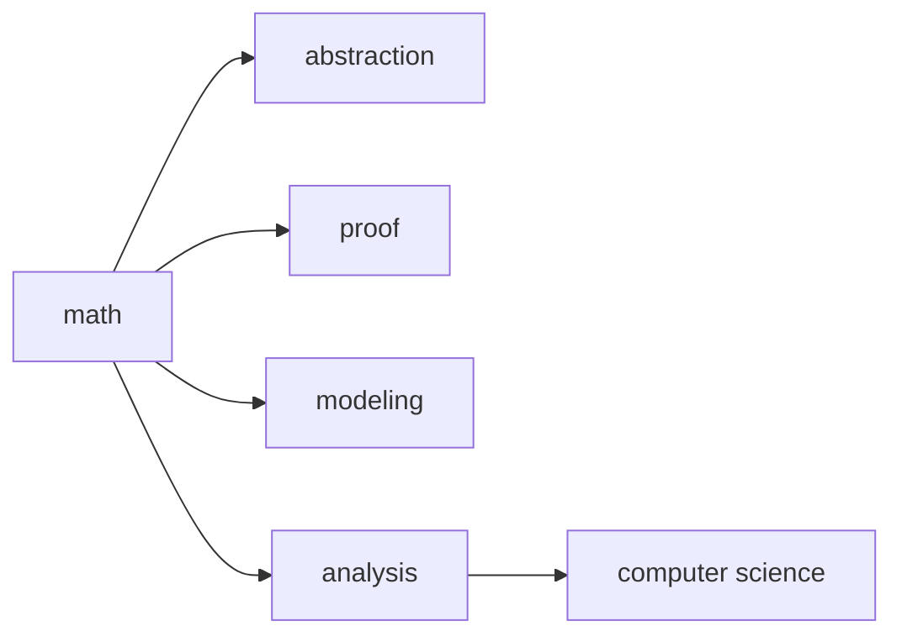

# CS에 수학이 필요한 이유

> Math for CS 101 시리즈 (1/10)

<!-- a-grade-intro:begin -->

**핵심 질문**: *코딩* 만 잘하면 되는데, *수학* 은 *왜* 필요할까요?

> *수학* 은 *추상화*, *증명*, *모델링*, *분석* 의 *공통 언어* 입니다.

<!-- a-grade-intro:end -->

## 이 글에서 배울 것

- *수학* 의 *역할*
- *추상화* 와 *증명*
- *모델링* 과 *분석*
- *9 가지 영역* 의 큰 그림
- *학습* 순서

## 왜 중요한가

*문제* 가 *어렵다는 느낌* 의 절반은 *수학 어휘* 가 부족해서 옵니다.

## 개념 한눈에 보기



## 핵심 용어 정리

- **abstraction**: *공통* 패턴 *추출*.
- **proof**: *논리* 로 *참* 임을 *보장*.
- **modeling**: *현실* 을 *수식* 으로.
- **analysis**: *동작* 의 *측정*.
- **invariant**: 변하지 *않는* 성질.

## Before/After

**Before**: *코드* 가 *동작* 하면 끝.

**After**: *동작 이유* 를 *수학* 으로 설명.

## 실습: 수학으로 사고하기 5단계

### 1단계 — 패턴 추출

```python
def common(a, b):
    return [x for x in a if x in b]
```

### 2단계 — 불변량 확인

```python
def invariant(items):
    assert sum(items) >= 0
    return True
```

### 3단계 — 모델링

```python
def model(rate, time):
    return rate * time
```

### 4단계 — 복잡도 측정

```python
def linear(n):
    return [i for i in range(n)]
```

### 5단계 — 증명 스케치

```python
def proof_sketch(claim):
    return f"assume {claim}; derive contradiction"
```

## 이 코드에서 주목할 점

- *공통* 은 *집합* 연산.
- *불변량* 은 *assert* 한 줄.
- *복잡도* 는 *입력 크기* 의 함수.

## 자주 하는 실수 5가지

1. ***수학* 을 *공식* 만으로 본다.**
2. ***증명* 없는 *직관*.**
3. ***모델* 과 *현실* 혼동.**
4. ***복잡도* 를 *벤치마크* 로 대체.**
5. ***기호* 를 *외우기* 만 한다.**

## 실무에서는 이렇게 쓰입니다

*추천 시스템* 은 *선형대수*, *분산 시스템* 은 *논리* 와 *확률*, *AI* 는 *미분* 과 *정보이론* 을 *공통 언어* 로 씁니다.

## 시니어 엔지니어는 이렇게 생각합니다

- *수학* 은 *어휘*.
- *직관* 은 *수학* 으로 *검증*.
- *복잡도* 는 *예측* 도구.
- *증명* 은 *디버깅* 도구.
- *9 영역* 은 *사다리*.

## 체크리스트

- [ ] *증명* 에 익숙한가.
- [ ] *복잡도* 를 *분석* 하는가.
- [ ] *모델* 과 *현실* 을 *구분* 하는가.
- [ ] *불변량* 을 *세우는가*.

## 연습 문제

1. *abstraction* 의 의미 한 줄로.
2. *invariant* 의 의미 한 줄로.
3. *modeling* 의 의미 한 줄로.

## 정리 및 다음 단계

다음 글은 *논리와 증명* 입니다.

- **CS에 수학이 필요한 이유 (현재 글)**
- 논리와 증명 (예정)
- 집합과 함수 (예정)
- 그래프 (예정)
- 조합 (예정)
- 확률 (예정)
- 선형대수 (예정)
- 미분 (예정)
- 정보이론 (예정)
- 알고리즘과 수학 (예정)
## 참고 자료

- [Concrete Mathematics - Knuth, Graham, Patashnik](https://en.wikipedia.org/wiki/Concrete_Mathematics)
- [Mathematics for Computer Science - MIT OCW](https://ocw.mit.edu/courses/6-042j-mathematics-for-computer-science-fall-2010/)
- [Why CS Needs Math - ACM Communications](https://cacm.acm.org/magazines/2014/2/171688-mathematical-foundations-of-computer-science/)
- [The Importance of Math in Programming - Dev.to](https://dev.to/codenameone/the-importance-of-math-in-programming-21k0)

Tags: Math, CS, Foundations, Learning, Beginner

---

© 2026 영선북스. 이 글의 저작권은 저자에게 있습니다.
