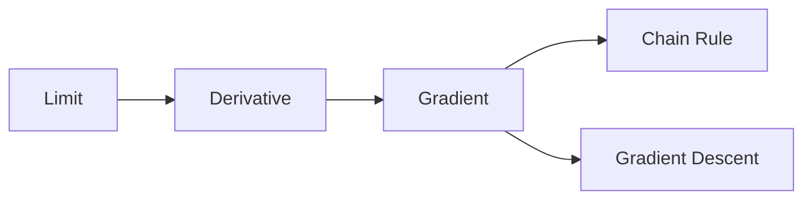

# 미분

> Math for CS 101 시리즈 (8/10)

<!-- a-grade-intro:begin -->

**핵심 질문**: *변화* 를 *어떻게* 수치로 다루고 *최적값* 을 찾을까요?

> *미분* 은 *변화율* 의 *언어* 이고, *최적화* 와 *학습* 의 *기반* 입니다.

<!-- a-grade-intro:end -->

## 이 글에서 배울 것

- *극한* 직관
- *도함수*
- *기울기 (gradient)*
- *연쇄 법칙*
- *경사하강* 직관

## 왜 중요한가

*ML 학습*, *수치 최적화*, *물리 시뮬레이션*, *AB 테스트 곡선* 모두 *미분* 위에서 동작합니다.

## 개념 한눈에 보기



## 핵심 용어 정리

- **limit**: *접근* 하는 값.
- **derivative**: *순간 변화율*.
- **gradient**: *다변수 도함수*.
- **chain rule**: *합성 함수* 의 미분.
- **gradient descent**: *경사 반대* 로 이동.

## Before/After

**Before**: *수많은 점* 으로 그래프 추정.

**After**: *한 점* 의 *기울기* 로 *방향* 결정.

## 실습: 미니 미분 키트

### 1단계 — 수치 미분

```python
def deriv(f, x, h=1e-5):
    return (f(x + h) - f(x - h)) / (2 * h)
```

### 2단계 — 기울기

```python
def grad(f, x, h=1e-5):
    return [(f([xi + (h if i == j else 0) for i, xi in enumerate(x)])
             - f([xi - (h if i == j else 0) for i, xi in enumerate(x)])) / (2 * h)
            for j in range(len(x))]
```

### 3단계 — 연쇄 법칙

```python
def chain(df_dy, dy_dx):
    return df_dy * dy_dx
```

### 4단계 — 경사하강 한 스텝

```python
def step(x, g, lr=0.1):
    return [xi - lr * gi for xi, gi in zip(x, g)]
```

### 5단계 — 미니 학습 루프

```python
def descend(f, x, lr=0.1, steps=100):
    for _ in range(steps):
        x = step(x, grad(f, x), lr)
    return x
```

## 이 코드에서 주목할 점

- *수치 미분* 은 *근사*.
- *기울기* 는 *벡터*.
- *경사하강* 은 *반대 방향* 이동.

## 자주 하는 실수 5가지

1. ***학습률* 을 *너무 크게*.**
2. ***수치 미분* 의 *h* 가 *너무 작거나 큼*.**
3. ***연쇄 법칙* 의 *순서* 혼동.**
4. ***국소 최소* 를 *전역* 으로 오해.**
5. ***스케일* 무시한 변수 비교.**

## 실무에서는 이렇게 쓰입니다

*신경망 학습*, *추천 모델 튜닝*, *광고 입찰 최적화*, *제어 시스템* 까지 모두 *미분 기반* 입니다.

## 시니어 엔지니어는 이렇게 생각합니다

- *기울기* 는 *방향*.
- *학습률* 은 *속도*.
- *연쇄 법칙* 은 *역전파* 의 본질.
- *수치 안정성* 이 핵심.
- *국소 최적* 을 *항상* 의심.

## 체크리스트

- [ ] *기울기* 부호 확인.
- [ ] *학습률* 조정.
- [ ] *수렴* 모니터링.
- [ ] *스케일링* 점검.

## 연습 문제

1. *도함수* 한 줄 정의.
2. *연쇄 법칙* 한 줄.
3. *경사하강* 한 줄.

## 정리 및 다음 단계

다음 글은 *정보이론* 입니다.

- [CS에 수학이 필요한 이유](./01-why-math-for-cs.md)
- [논리와 증명](./02-logic-and-proofs.md)
- [집합과 함수](./03-sets-and-functions.md)
- [그래프](./04-graphs.md)
- [조합](./05-combinatorics.md)
- [확률](./06-probability.md)
- [선형대수](./07-linear-algebra.md)
- **미분 (현재 글)**
- 정보이론 (예정)
- 알고리즘과 수학 (예정)
## 참고 자료

- [Calculus - Khan Academy](https://www.khanacademy.org/math/calculus-1)
- [Essence of Calculus - 3Blue1Brown](https://www.3blue1brown.com/topics/calculus)
- [Gradient Descent - Deep Learning Book](https://www.deeplearningbook.org/contents/numerical.html)
- [SymPy Calculus Documentation](https://docs.sympy.org/latest/modules/calculus/index.html)

Tags: Math, Calculus, Derivative, GradientDescent, Beginner

---

© 2026 영선북스. 이 글의 저작권은 저자에게 있습니다.
