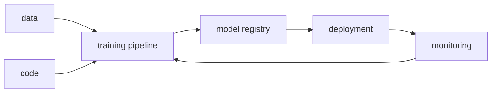

# MLOps란 무엇인가?

> MLOps 101 시리즈 (1/10)

<!-- a-grade-intro:begin -->

**핵심 질문**: *데모로 잘 도는 모델* 을 *365일 굴러가는 시스템* 으로 만들려면 *무엇* 이 필요할까요?

> *MLOps 는 *모델, 데이터, 코드* 의 *세 축* 을 *DevOps 의 원칙* 으로 *운영 가능한 형태* 로 묶는 분야입니다.*

<!-- a-grade-intro:end -->

## 이 글에서 배울 것

- *MLOps* 의 *정의*
- *DevOps* 와의 *공통점/차이*
- *핵심 구성요소* 6가지
- *성숙도* 0~2단계
- 흔한 함정 5가지

## 왜 중요한가

*ML 프로젝트* 의 *대다수* 가 *프로덕션* 에 도달하지 못합니다. *MLOps* 는 *그 격차* 를 메우는 *체계* 입니다.

## 개념 한눈에 보기



## 핵심 용어 정리

- **MLOps**: *ML* + *DevOps*. *지속적 학습/배포/모니터링*.
- **CT (Continuous Training)**: *데이터 변화* 에 따른 *재학습*.
- **Model Registry**: *학습된 모델* 의 *버전 저장소*.
- **Feature Store**: *피처* 의 *공유 저장소*.
- **Drift**: *데이터/모델* 의 *시간적 변화*.

## Before/After

**Before**: *Notebook 한 개*, *수동 배포*, *모니터링 없음*.

**After**: *파이프라인 자동화*, *모델 버전 관리*, *드리프트 알람*.

## 실습: 5단계 미니 MLOps

### 1단계 — 데이터 스냅샷

```python
import hashlib, json
data = [{"x": 1, "y": 0}, {"x": 2, "y": 1}]
snap = hashlib.sha1(json.dumps(data).encode()).hexdigest()[:10]
print("data version:", snap)
```

### 2단계 — 모델 학습

```python
from sklearn.linear_model import LogisticRegression
import numpy as np
X = np.array([[1], [2], [3], [4]])
y = np.array([0, 0, 1, 1])
model = LogisticRegression().fit(X, y)
```

### 3단계 — 모델 저장 (registry 흉내)

```python
import pickle, os
os.makedirs("registry", exist_ok=True)
with open("registry/model_v1.pkl", "wb") as f:
    pickle.dump(model, f)
```

### 4단계 — 메타데이터

```python
meta = {"data_version": snap, "model_version": "v1", "metric": float(model.score(X, y))}
print(meta)
```

### 5단계 — 모니터링 (간단)

```python
import time
log = {"ts": time.time(), "pred": int(model.predict([[5]])[0])}
print("log:", log)
```

## 이 코드에서 주목할 점

- *데이터 해시* 가 *재현성* 의 시작.
- *Registry* 는 *파일 한 개* 라도 *시작 가능*.
- *예측 로그* 가 *모니터링* 의 *원천* 데이터.

## 자주 하는 실수 5가지

1. ***모델 만 버전 관리* 하고 *데이터/코드* 무시.**
2. ***모니터링* 없이 *배포*.**
3. ***Notebook* 직접 *배포*.**
4. ***재학습 트리거* 가 *수동*.**
5. ***성능 지표* 와 *비즈니스 지표* 분리 안 됨.**

## 실무에서는 이렇게 쓰입니다

*추천 시스템* 과 *사기 탐지* 같이 *데이터 분포* 가 *자주 바뀌는 도메인* 에서 *MLOps* 가 *생존 조건*.

## 시니어 엔지니어는 이렇게 생각합니다

- *모델 정확도* 는 *시작점* 일 뿐.
- *재학습* 가능성이 *아키텍처* 를 결정.
- *데이터/코드/모델* 모두 *불변 버전*.
- *모니터링이 없는 모델* 은 *없는 것* 과 같다.
- *MLOps 성숙도* 는 *점진적* 으로 끌어올린다.

## 체크리스트

- [ ] *데이터 버전* 이 있다.
- [ ] *모델 버전* 이 있다.
- [ ] *예측 로그* 를 남긴다.
- [ ] *재학습 절차* 가 문서화.

## 연습 문제

1. *팀의 마지막 모델* 의 *데이터 해시* 를 만들어 보세요.
2. *모델 두 버전* 을 *registry* 에 저장하고 *비교* 하세요.
3. *예측 로그* 에 *지연시간* 을 추가해 보세요.

## 정리 및 다음 단계

MLOps 는 *모델 한 줄* 이 아니라 *시스템* 입니다. 다음 글에서는 *실험 관리* 부터 시작합니다.

- **MLOps란 무엇인가? (현재 글)**
- 실험 관리 (예정)
- 데이터 버전 관리 (예정)
- 모델 학습 파이프라인 (예정)
- 모델 배포 (예정)
- 모델 모니터링 (예정)
- Data Drift와 Model Drift (예정)
- 재학습 (예정)
- Feature Store (예정)
- 운영 가능한 ML 시스템 (예정)
## 참고 자료

- [Google — MLOps levels](https://cloud.google.com/architecture/mlops-continuous-delivery-and-automation-pipelines-in-machine-learning)
- [ml-ops.org](https://ml-ops.org/)
- [Microsoft — MLOps maturity](https://learn.microsoft.com/en-us/azure/architecture/ai-ml/guide/mlops-maturity-model)
- [Sculley et al. — Hidden Tech Debt in ML](https://papers.nips.cc/paper_files/paper/2015/hash/86df7dcfd896fcaf2674f757a2463eba-Abstract.html)

Tags: MLOps, DevOps, MLSystem, Production, DataScience

---

© 2026 영선북스. 이 글의 저작권은 저자에게 있습니다.
