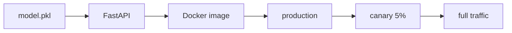

# 모델 배포

> MLOps 101 시리즈 (5/10)

<!-- a-grade-intro:begin -->

**핵심 질문**: *학습이 끝난 모델 파일* 을 *어떻게 사용자에게 안전하게 노출* 할까요?

> *모델 배포 는 *모델 파일* 을 *API 또는 배치 작업* 으로 감싸 *재현 가능한 환경* 에서 *서비스* 합니다.*

<!-- a-grade-intro:end -->

## 이 글에서 배울 것

- *배포 패턴* 3가지 (online / batch / streaming)
- *FastAPI* 로 *모델 API* 만들기
- *Docker* 로 *환경 고정*
- *블루/그린* 과 *카나리*
- 흔한 함정 5가지

## 왜 중요한가

*배포가 어렵다* 는 말은 *환경 차이* 와 *롤백 부재* 때문입니다. *컨테이너* 와 *점진적 전환* 이 그 답입니다.

## 개념 한눈에 보기



## 핵심 용어 정리

- **Online inference**: *요청 → 즉시 응답*.
- **Batch inference**: *대량 데이터* 를 *주기적* 으로 처리.
- **Blue/Green**: *두 환경* 을 *스위치* 로 전환.
- **Canary**: *소량 트래픽* 부터 *점진* 노출.
- **Rollback**: *이전 버전* 으로 *되돌리기*.

## Before/After

**Before**: *노트북* 에서 *predict* 를 직접 호출.

**After**: *컨테이너* 가 *HTTP 엔드포인트* 를 노출.

## 실습: FastAPI로 모델 서빙

### 1단계 — 모델 준비

```python
import pickle
from sklearn.linear_model import LogisticRegression

m = LogisticRegression().fit([[0], [1], [2], [3]], [0, 0, 1, 1])
with open("model.pkl", "wb") as f:
    pickle.dump(m, f)
```

### 2단계 — FastAPI 앱

```python
from fastapi import FastAPI
from pydantic import BaseModel
import pickle

app = FastAPI()
model = pickle.load(open("model.pkl", "rb"))

class Req(BaseModel):
    x: float

@app.post("/predict")
def predict(r: Req):
    p = model.predict([[r.x]])[0]
    return {"prediction": int(p)}
```

### 3단계 — 헬스체크

```python
@app.get("/healthz")
def health():
    return {"ok": True, "version": "1.0.0"}
```

### 4단계 — Dockerfile

```dockerfile
FROM python:3.11-slim
WORKDIR /app
COPY requirements.txt .
RUN pip install -r requirements.txt
COPY . .
CMD ["uvicorn", "main:app", "--host", "0.0.0.0", "--port", "8000"]
```

### 5단계 — 빌드/실행

```bash
docker build -t model-api:1.0.0 .
docker run -p 8000:8000 model-api:1.0.0
curl -X POST localhost:8000/predict -H "Content-Type: application/json" -d '{"x": 2.5}'
```

## 이 코드에서 주목할 점

- *모델 로드* 는 *시작 시 1회*.
- *Pydantic* 으로 *입력 검증*.
- *헬스체크* 가 *오케스트레이터* 와 통신.

## 자주 하는 실수 5가지

1. ***버전 태그 없음* → *어떤 모델인지 모름*.**
2. ***requirements 미고정* → *재현 실패*.**
3. ***롤백 절차* 없음.**
4. ***모델 + 코드 강결합* → *교체 어려움*.**
5. ***입력 검증 누락* → *서버 크래시*.**

## 실무에서는 이렇게 쓰입니다

*추천 모델* 은 *FastAPI + Docker + Kubernetes*. *주간 리포트* 는 *배치 잡*. *실시간 광고* 는 *스트리밍*.

## 시니어 엔지니어는 이렇게 생각합니다

- *모델 = 아티팩트*. *코드와 분리*.
- *카나리* 로 *위험* 줄이기.
- *헬스체크 + 메트릭* 은 *기본*.
- *환경 변수* 로 *모델 경로* 주입.
- *이미지 태그* = *모델 버전*.

## 체크리스트

- [ ] *Dockerfile* 이 있다.
- [ ] *헬스체크* 엔드포인트.
- [ ] *입력 스키마* 검증.
- [ ] *롤백 계획* 문서.

## 연습 문제

1. 위 API 에 *`/version`* 엔드포인트를 추가하세요 (모델 SHA 반환).
2. *카나리 배포* 를 *Nginx weight* 로 설명하는 의사코드를 쓰세요.
3. *배치 추론* 으로 변환하면 어떤 부분을 바꿔야 할까요?

## 정리 및 다음 단계

배포는 *시작* 일 뿐, *모니터링* 이 *진짜 시작* 입니다. 다음 글은 *모델 모니터링* 으로 *운영 중 모델* 을 *관찰* 합니다.

- [MLOps란 무엇인가?](./01-what-is-mlops.md)
- [실험 관리](./02-experiment-tracking.md)
- [데이터 버전 관리](./03-data-versioning.md)
- [모델 학습 파이프라인](./04-training-pipeline.md)
- **모델 배포 (현재 글)**
- 모델 모니터링 (예정)
- Data Drift와 Model Drift (예정)
- 재학습 (예정)
- Feature Store (예정)
- 운영 가능한 ML 시스템 (예정)
## 참고 자료

- [FastAPI 공식 문서](https://fastapi.tiangolo.com/)
- [Docker — Best practices](https://docs.docker.com/develop/develop-images/dockerfile_best-practices/)
- [BentoML](https://docs.bentoml.com/)
- [Seldon Core](https://docs.seldon.io/projects/seldon-core/en/latest/)

Tags: MLOps, Deployment, FastAPI, Docker, DataScience

---

© 2026 영선북스. 이 글의 저작권은 저자에게 있습니다.
