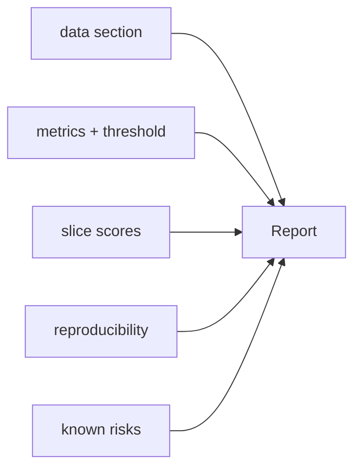

# 평가 리포트 만들기

> Model Evaluation 101 시리즈 (10/10)

<!-- a-grade-intro:begin -->

**핵심 질문**: *모델을 출시* 할 때, *한 장의 평가 리포트* 에는 *무엇이* 들어가야 할까요?

> *좋은 리포트는 *데이터, 지표, 임계값, 슬라이스, 재현성* 의 *5요소* 를 *한 곳* 에 모읍니다.*

<!-- a-grade-intro:end -->

## 이 글에서 배울 것

- *평가 리포트* 의 *5가지 섹션*
- *Model Card* 와의 차이
- *재현성* 메타데이터
- *자동 생성* 패턴
- 흔한 함정 5가지

## 왜 중요한가

*리뷰* 와 *감사* 그리고 *사고 후 분석* 모두 *동일 리포트* 를 본다. *형식이 일정* 해야 *팀 속도* 가 빨라집니다.

## 개념 한눈에 보기



## 핵심 용어 정리

- **Model Card**: *모델 의도/한계* 를 기술한 문서.
- **Datasheet**: *데이터셋* 의 *출처/편향* 기술.
- **Operating threshold**: *운영용 결정 경계*.
- **Reproducibility hash**: *데이터/코드 버전* 식별자.
- **Risk register**: *알려진 실패 모드*.

## Before/After

**Before**: *Slack 메시지 한 줄로 “acc 0.92 ship”*.

**After**: *5개 섹션의 정형 리포트 + 자동 생성*.

## 실습: 5단계 리포트

### 1단계 — 메트릭 모으기

```python
from sklearn.datasets import make_classification
from sklearn.model_selection import train_test_split
from sklearn.linear_model import LogisticRegression
from sklearn.metrics import f1_score, roc_auc_score, brier_score_loss
X, y = make_classification(n_samples=3000, weights=[0.7, 0.3], random_state=0)
Xtr, Xte, ytr, yte = train_test_split(X, y, stratify=y, random_state=42)
m = LogisticRegression(max_iter=1000).fit(Xtr, ytr)
proba = m.predict_proba(Xte)[:, 1]
pred = (proba >= 0.5).astype(int)
metrics = {
    "f1_macro": f1_score(yte, pred, average="macro"),
    "auc_roc": roc_auc_score(yte, proba),
    "brier": brier_score_loss(yte, proba),
}
```

### 2단계 — 슬라이스 점수

```python
slice_mask = Xte[:, 0] > 0
slices = {
    "slice_pos": f1_score(yte[slice_mask], pred[slice_mask]),
    "slice_neg": f1_score(yte[~slice_mask], pred[~slice_mask]),
}
```

### 3단계 — 메타데이터

```python
import hashlib, sys, sklearn
meta = {
    "python": sys.version.split()[0],
    "sklearn": sklearn.__version__,
    "data_hash": hashlib.sha1(X.tobytes()).hexdigest()[:10],
    "threshold": 0.5,
}
```

### 4단계 — 리포트 직렬화

```python
import json
report = {"metrics": metrics, "slices": slices, "meta": meta,
          "risks": ["minor calibration drift", "slice_neg lower F1"]}
print(json.dumps(report, indent=2))
```

### 5단계 — 마크다운으로 변환

```python
def to_md(rep):
    lines = ["# Evaluation Report", "## Metrics"]
    for k, v in rep["metrics"].items():
        lines.append(f"- {k}: {round(v, 3)}")
    lines.append("## Slices")
    for k, v in rep["slices"].items():
        lines.append(f"- {k}: {round(v, 3)}")
    lines.append("## Meta")
    for k, v in rep["meta"].items():
        lines.append(f"- {k}: {v}")
    return "\n".join(lines)

print(to_md(report))
```

## 이 코드에서 주목할 점

- *JSON 1차* → *MD 2차* 변환 패턴.
- *데이터 해시* 가 *재현성* 의 핵심.
- *임계값* 명시가 *해석 차이* 를 막는다.

## 자주 하는 실수 5가지

1. ***임계값* 을 *기록* 하지 않음.**
2. ***슬라이스 점수* 를 *생략*.**
3. ***버전 정보* 누락.**
4. ***리스크* 섹션을 *비워둠*.**
5. ***수기 작성* 만 의존 → *재현 불가*.**

## 실무에서는 이렇게 쓰입니다

*ML 출시 게이트* 와 *모니터링 알람* 의 *기준 문서* 로 *평가 리포트* 가 사용됩니다.

## 시니어 엔지니어는 이렇게 생각합니다

- *리포트* 는 *코드의 산출물* 이어야 한다.
- *Model Card* 와 *리포트* 는 *분리*.
- *모든 숫자* 옆에 *어떤 데이터/임계값* 인지 적는다.
- *리스크 섹션* 이 *가장 중요*.
- *주기적 재생성* 으로 *드리프트* 추적.

## 체크리스트

- [ ] *지표 + 임계값* 명시.
- [ ] *슬라이스 점수* 포함.
- [ ] *버전/해시* 메타데이터.
- [ ] *알려진 리스크* 명시.

## 연습 문제

1. *팀의 마지막 모델* 평가를 *위 템플릿* 에 채워 보세요.
2. *동일 모델* 을 *다른 임계값* 으로 *두 개의 리포트* 로 만드세요.
3. *리포트 자동 생성* 스크립트를 *CI* 에 연결하세요.

## 정리 및 다음 단계

10편을 통해 *평가의 어휘* 와 *현실적 함정* 을 정리했습니다. *MLOps* 와 *Error Analysis* 를 더 깊이 다루는 시리즈로 자연스럽게 이어집니다.

- [모델 평가는 왜 어려운가?](./01-why-evaluation-is-hard.md)
- [train/validation/test](./02-train-val-test.md)
- [Accuracy의 한계](./03-limits-of-accuracy.md)
- [Precision과 Recall](./04-precision-and-recall.md)
- [F1 Score](./05-f1-score.md)
- [ROC와 AUC](./06-roc-and-auc.md)
- [Calibration](./07-calibration.md)
- [Cross Validation](./08-cross-validation.md)
- [Error Analysis](./09-error-analysis.md)
- **평가 리포트 만들기 (현재 글)**
## 참고 자료

- [Google — Model Cards](https://modelcards.withgoogle.com/about)
- [Datasheets for Datasets](https://arxiv.org/abs/1803.09010)
- [scikit-learn — Model evaluation](https://scikit-learn.org/stable/modules/model_evaluation.html)
- [MLOps — Production ML guide](https://ml-ops.org/)

Tags: ModelEvaluation, Reporting, ModelCard, Reproducibility, scikit-learn

---

© 2026 영선북스. 이 글의 저작권은 저자에게 있습니다.
