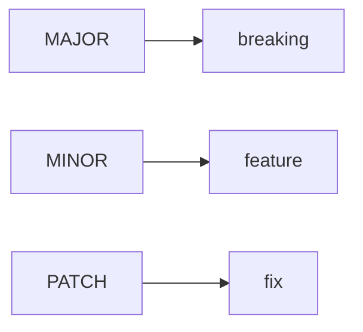

# Release 와 Versioning

> 오픈소스 101 시리즈 (6/10)

<!-- a-grade-intro:begin -->

**핵심 질문**: *버전* 을 *언제* *어떻게* *올려야* *사용자* 가 *안전* 할까요?

> *SemVer* 와 *changelog* 를 *함께* *씁니다*.

<!-- a-grade-intro:end -->

## 이 글에서 배울 것

- *SemVer* 의 *세 자리*
- *Pre-release* 표기
- *Changelog* 작성
- *git tag* 활용
- *자동 릴리스* 워크플로

## 왜 중요한가

*버전* 이 *흔들* 리면 *생태계* 가 *깨집니다*.

## 개념 한눈에 보기



## 핵심 용어 정리

- **SemVer**: *MAJOR.MINOR.PATCH*.
- **breaking**: *호환성* *파괴*.
- **changelog**: *변경* *기록*.
- **tag**: *불변* *참조*.
- **pre-release**: *시험* *버전*.

## Before/After

**Before**: "*버전* 을 *날짜* 로 *붙인다*."

**After**: "*SemVer* 로 *영향 범위* 를 *전달* 한다."

## 실습: 릴리스 절차

### 1단계 — 버전 결정

```text
1.2.3 → 1.3.0 (새 기능)
1.2.3 → 2.0.0 (호환성 깨짐)
1.2.3 → 1.2.4 (버그 수정)
```

### 2단계 — Changelog 갱신

```markdown
## [1.3.0] - 2026-05-04
### Added
- new --json flag
```

### 3단계 — git tag

```bash
git tag -a v1.3.0 -m "v1.3.0"
git push origin v1.3.0
```

### 4단계 — Release 노트

```bash
gh release create v1.3.0 --notes-file CHANGELOG.md
```

### 5단계 — 자동화

```yaml
on:
  push:
    tags: ['v*']
jobs:
  release:
    runs-on: ubuntu-latest
```

## 이 코드에서 주목할 점

- *MAJOR* 는 *경고*.
- *MINOR* 는 *추가*.
- *PATCH* 는 *수정*.

## 자주 하는 실수 5가지

1. ***breaking* 을 *MINOR* 로 *낸다*.**
2. ***changelog* 가 *없다*.**
3. ***tag* 와 *버전* 이 *어긋난다*.**
4. ***pre-release* 표기를 *생략* 한다.**
5. ***릴리스 노트* 가 *비어 있다*.**

## 실무에서는 이렇게 쓰입니다

기업의 *내부 라이브러리* 도 *SemVer* 로 *의존성* 을 *관리* 합니다.

## 시니어 엔지니어는 이렇게 생각합니다

- *SemVer* 는 *계약* 이다.
- *changelog* 는 *기억*.
- *tag* 는 *재현* 가능.
- *MAJOR* 는 *드물게*.
- *PATCH* 는 *자주*.

## 체크리스트

- [ ] *버전* 결정.
- [ ] *Changelog* 갱신.
- [ ] *Tag* 푸시.
- [ ] *Release* 발행.

## 연습 문제

1. *breaking* 변경의 *예* 한 줄.
2. *pre-release* 표기 *예* 한 줄.
3. *tag* 와 *branch* 의 *차이* 한 줄.

## 정리 및 다음 단계

다음 글은 *Community 관리* 입니다.

- [오픈소스란 무엇인가](./01-what-is-open-source.md)
- [라이선스 이해하기](./02-understanding-licenses.md)
- [Issue 읽기](./03-reading-issues.md)
- [PR 만들기](./04-creating-pull-requests.md)
- [좋은 README](./05-good-readme.md)
- **Release 와 Versioning (현재 글)**
- Community 관리 (예정)
- Maintainer 의 역할 (예정)
- 오픈소스 포트폴리오 (예정)
- 내 첫 오픈소스 프로젝트 (예정)
## 참고 자료

- [Semantic Versioning](https://semver.org/)
- [Keep a Changelog](https://keepachangelog.com/)
- [GitHub Releases](https://docs.github.com/en/repositories/releasing-projects-on-github)
- [git tag docs](https://git-scm.com/docs/git-tag)

Tags: OpenSource, SemVer, Release, Changelog, Beginner

---

© 2026 영선북스. 이 글의 저작권은 저자에게 있습니다.
