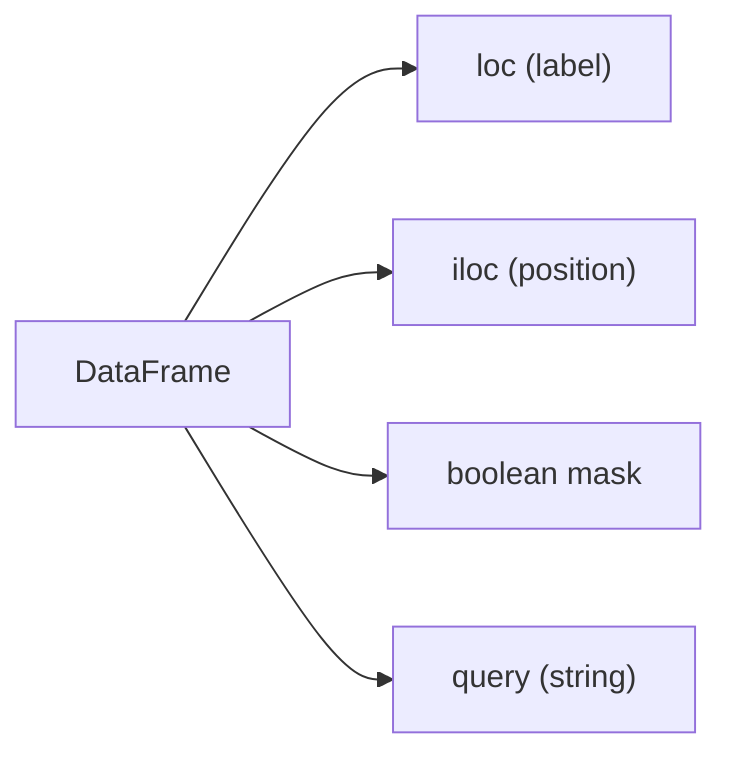

# filtering과 selection

> Pandas 101 시리즈 (4/10)

<!-- a-grade-intro:begin -->

**핵심 질문**: *행을 고르는 방법* 이 *왜 4가지* 일까요?

> *서로 다른 의도(라벨/위치/조건)에 따라 *다른 도구* 를 써야 합니다. 한 가지로 다 하지 마세요.*

<!-- a-grade-intro:end -->

## 이 글에서 배울 것

- *loc* 과 *iloc* 의 차이
- *boolean indexing* 의 직관
- *query* 의 가독성
- 5단계 선택 실습
- 흔한 함정 5가지

## 왜 중요한가

데이터 분석의 *모든 단계* 에서 *서브셋 추출* 이 일어납니다. *느리거나 잘못된 선택* 은 *전체 파이프라인* 을 흔듭니다.

## 개념 한눈에 보기



## 핵심 용어 정리

- **loc**: *라벨 기반* 선택.
- **iloc**: *위치 기반* 선택.
- **boolean mask**: *True/False 시리즈* 로 행 선택.
- **query**: *문자열 표현식* 으로 필터링.
- **isin**: *여러 값* 중 *포함 여부* 검사.

## Before/After

**Before**: *“df[조건] 만 사용”* — *체이닝 인덱싱* 으로 *경고* 발생.

**After**: *“의도에 맞는 도구”* — *loc/iloc/query* 로 *명확하게* 분리.

## 실습: 5단계 선택

### 1단계 — 열 선택

```python
import pandas as pd
df = pd.DataFrame({"x": [1, 2, 3], "y": [10, 20, 30]}, index=["a", "b", "c"])
print(df["x"])
print(df[["x", "y"]])
```

### 2단계 — loc

```python
print(df.loc["a"])
print(df.loc[["a", "c"], "x"])
```

### 3단계 — iloc

```python
print(df.iloc[0])
print(df.iloc[0:2, 0])
```

### 4단계 — boolean indexing

```python
print(df[df["x"] > 1])
print(df[(df["x"] > 1) & (df["y"] < 30)])
```

### 5단계 — query와 isin

```python
print(df.query("x > 1 and y < 30"))
print(df[df["x"].isin([1, 3])])
```

## 이 코드에서 주목할 점

- *loc* 은 *끝점 포함*, *iloc* 은 *끝점 제외*.
- *&* 와 *|* 는 *비트 연산자* — *and/or* 가 아닙니다.
- *query* 는 *큰 표현식* 에서 *가독성* 이 좋습니다.

## 자주 하는 실수 5가지

1. ***and/or* 사용 → 오류.** *&/|* 와 *괄호* 필요.
2. ***체이닝 인덱싱***: `df[df["x"]>1]["y"] = ...` → *SettingWithCopyWarning*.
3. ***loc 의 끝점 포함* 을 모름.**
4. ***iloc 으로 라벨* 을 시도.**
5. ***isin 대신* 여러 *|* 로 길게 씀.**

## 실무에서는 이렇게 쓰입니다

KPI 대시보드, 이상치 탐지, A/B 테스트 분리 — *조건 기반 선택* 이 *분석 함수의 핵심* 입니다. *팀 코드 표준* 으로 *loc 사용* 을 *강제* 하기도 합니다.

## 시니어 엔지니어는 이렇게 생각합니다

- *복잡한 조건* 은 *변수에 분리* 한다.
- *값을 쓸 때는 항상 loc* 으로.
- *query* 는 *가독성 우위* 가 있을 때만.
- *isin/between* 으로 *코드를 짧게*.
- *경고를 무시하지 않는다*.

## 체크리스트

- [ ] *loc* 과 *iloc* 을 구분한다.
- [ ] *&/|* 와 *괄호* 를 쓴다.
- [ ] *체이닝 인덱싱* 을 피한다.
- [ ] *query* 와 *isin* 을 안다.

## 연습 문제

1. *loc* 으로 *특정 라벨* 의 *부분집합* 을 추출하세요.
2. *iloc* 으로 *상위 5행* 을 출력하세요.
3. *query* 로 *2개 이상의 조건* 을 표현하세요.

## 정리 및 다음 단계

선택은 *분석의 기본 동작* 입니다. 다음 글에서는 *missing value* 처리를 다룹니다.

- [Pandas란 무엇인가?](./01-what-is-pandas.md)
- [Series와 DataFrame](./02-series-and-dataframe.md)
- [CSV와 Excel 읽기](./03-read-csv-and-excel.md)
- **filtering과 selection (현재 글)**
- missing value 처리 (예정)
- groupby (예정)
- merge와 join (예정)
- time series (예정)
- apply와 vectorization (예정)
- 실전 데이터 분석 (예정)
## 참고 자료

- [pandas — Indexing and selecting data](https://pandas.pydata.org/docs/user_guide/indexing.html)
- [pandas — query](https://pandas.pydata.org/docs/reference/api/pandas.DataFrame.query.html)
- [pandas — Boolean indexing](https://pandas.pydata.org/docs/user_guide/indexing.html#boolean-indexing)
- [Real Python — Pandas DataFrame Indexing](https://realpython.com/pandas-dataframe/)

Tags: Pandas, Filtering, Selection, Indexing, Beginner

---

© 2026 영선북스. 이 글의 저작권은 저자에게 있습니다.
