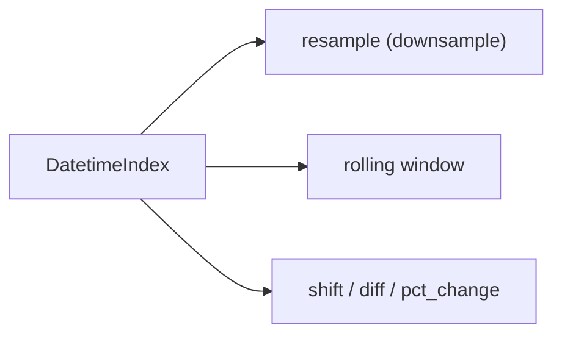

# time series

> Pandas 101 시리즈 (8/10)

<!-- a-grade-intro:begin -->

**핵심 질문**: *시계열 데이터* 는 *왜 별도 도구* 가 필요할까요?

> *시간은 *불규칙한 간격, 시간대, 결측* 을 가집니다. Pandas의 시계열 도구는 그 모든 것을 *기본 기능* 으로 제공합니다.*

<!-- a-grade-intro:end -->

## 이 글에서 배울 것

- *DatetimeIndex* 의 직관
- *resample* 과 *rolling*
- *시간대(tz)* 처리
- 5단계 시계열 실습
- 흔한 함정 5가지

## 왜 중요한가

매출, 트래픽, 센서, 금융 — *대부분의 운영 데이터* 는 시계열입니다. *시간 인덱스* 를 잘 다루면 *KPI 트렌드* 가 즉시 보입니다.

## 개념 한눈에 보기



## 핵심 용어 정리

- **DatetimeIndex**: *시간 라벨* 을 가진 인덱스.
- **resample**: *시간 단위 변환* — 일별 → 주별 등.
- **rolling**: *이동 윈도우* 통계.
- **shift**: *행을 시간 방향* 으로 밀기.
- **tz_localize / tz_convert**: 시간대 *부여 / 변환*.

## Before/After

**Before**: *“날짜 컬럼은 string”* — *비교, 필터, 집계 모두 어색*.

**After**: *“DatetimeIndex로 변환”* — *df.loc["2026-05"]* 같은 *문자 슬라이싱* 가능.

## 실습: 5단계 시계열

### 1단계 — DatetimeIndex 만들기

```python
import pandas as pd
idx = pd.date_range("2026-01-01", periods=10, freq="D")
ts = pd.Series(range(10), index=idx)
print(ts.head())
```

### 2단계 — 시간 슬라이싱

```python
print(ts.loc["2026-01-03":"2026-01-06"])
```

### 3단계 — resample

```python
print(ts.resample("3D").sum())
```

### 4단계 — rolling

```python
print(ts.rolling(window=3).mean())
```

### 5단계 — 시간대

```python
ts2 = ts.tz_localize("UTC").tz_convert("Asia/Seoul")
print(ts2.head())
```

## 이 코드에서 주목할 점

- *문자열 슬라이싱* 은 *DatetimeIndex* 에서만 자연스럽습니다.
- *resample* 은 *집계 함수* 와 함께 씁니다.
- *시간대* 는 *명시적으로 부여* 한 후 *변환* 합니다.

## 자주 하는 실수 5가지

1. ***to_datetime* 누락 — 문자열 그대로 사용.**
2. ***resample 결과* 의 *집계 함수* 누락.**
3. ***rolling* 의 *min_periods* 미설정.**
4. ***tz-naive* 와 *tz-aware* 혼용.**
5. ***shift* 후 *NaN* 처리 누락.**

## 실무에서는 이렇게 쓰입니다

매출 트렌드, 사용자 활동 패턴, IoT 센서 모니터링 — *시간 단위 변환과 윈도우 통계* 가 *KPI 대시보드* 의 핵심. *시간대 통일* 은 *글로벌 서비스* 의 기본.

## 시니어 엔지니어는 이렇게 생각합니다

- *모든 시간* 을 *UTC로 정규화* 후 분석.
- *resample 단위* 는 *분석 목적* 에 맞춰 선택.
- *rolling* 의 *경계 NaN* 을 *명시적으로* 처리.
- *시계열 결측* 은 *interpolate*.
- *shift* 는 *피처 엔지니어링* 의 기본 도구.

## 체크리스트

- [ ] *DatetimeIndex* 를 만든다.
- [ ] *resample* 을 *집계와 함께* 쓴다.
- [ ] *rolling* 으로 *이동 평균* 을 낸다.
- [ ] *tz_convert* 를 한다.

## 연습 문제

1. *일별 데이터* 를 *주별 합계* 로 *resample* 하세요.
2. *7일 이동 평균* 을 만들고 *경계 NaN* 을 처리하세요.
3. *UTC → Asia/Seoul* 변환 결과를 출력하세요.

## 정리 및 다음 단계

시계열은 *Pandas의 강점* 입니다. 다음 글에서는 *apply와 vectorization* 을 다룹니다.

- [Pandas란 무엇인가?](./01-what-is-pandas.md)
- [Series와 DataFrame](./02-series-and-dataframe.md)
- [CSV와 Excel 읽기](./03-read-csv-and-excel.md)
- [filtering과 selection](./04-filtering-and-selection.md)
- [missing value 처리](./05-missing-values.md)
- [groupby](./06-groupby.md)
- [merge와 join](./07-merge-and-join.md)
- **time series (현재 글)**
- apply와 vectorization (예정)
- 실전 데이터 분석 (예정)
## 참고 자료

- [pandas — Time series / date functionality](https://pandas.pydata.org/docs/user_guide/timeseries.html)
- [pandas — resample](https://pandas.pydata.org/docs/reference/api/pandas.DataFrame.resample.html)
- [pandas — rolling](https://pandas.pydata.org/docs/reference/api/pandas.DataFrame.rolling.html)
- [Forecasting — Hyndman & Athanasopoulos](https://otexts.com/fpp3/)

Tags: Pandas, TimeSeries, Resample, Datetime, Beginner

---

© 2026 영선북스. 이 글의 저작권은 저자에게 있습니다.
