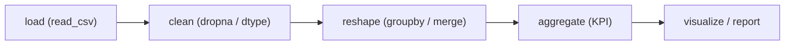

# 실전 데이터 분석

> Pandas 101 시리즈 (10/10)

<!-- a-grade-intro:begin -->

**핵심 질문**: 지금까지 배운 것을 *하나의 분석 흐름* 으로 묶을 수 있을까요?

> *분석은 *적재 → 정제 → 변형 → 집계 → 시각화* 의 *5단계* 입니다. 모두 한 편에서 연결합니다.*

<!-- a-grade-intro:end -->

## 이 글에서 배울 것

- *EDA 워크플로우* 의 정석
- *함수 단위 분리* 의 가치
- *재현 가능한 분석* 만들기
- 5단계 끝까지 가기
- 흔한 함정 5가지

## 왜 중요한가

각 도구를 따로 아는 것과 *하나의 결과* 로 묶는 것은 다릅니다. *프로 분석가* 의 차이는 *연결 능력* 에서 나옵니다.

## 개념 한눈에 보기



## 핵심 용어 정리

- **EDA**: *Exploratory Data Analysis* — 탐색적 데이터 분석.
- **파이프라인**: *순서가 있는* 변환 단계.
- **재현성**: *같은 입력 → 같은 결과*.
- **KPI**: *핵심 성과 지표*.
- **노트북**: *분석과 결과* 가 함께 기록되는 환경.

## Before/After

**Before**: *“스크립트 한 덩어리”* — 다시 못 돌림.

**After**: *“함수 단위 파이프라인”* — *재현, 테스트, 공유* 가능.

## 실습: 5단계 끝까지 가기

### 1단계 — 적재

```python
import pandas as pd

def load(path):
    return pd.read_csv(path, parse_dates=["date"])

df = load("sales.csv")
print(df.shape)
```

### 2단계 — 정제

```python
def clean(df):
    df = df.dropna(subset=["sales"])
    df["sales"] = df["sales"].astype(float)
    return df

df = clean(df)
```

### 3단계 — 변형

```python
def enrich(df):
    df["month"] = df["date"].dt.to_period("M")
    return df

df = enrich(df)
```

### 4단계 — 집계 (KPI)

```python
def kpi(df):
    return df.groupby("month").agg(
        total=("sales", "sum"),
        n=("sales", "count"),
        mean=("sales", "mean"),
    )

monthly = kpi(df)
print(monthly)
```

### 5단계 — 시각화

```python
import matplotlib.pyplot as plt
monthly["total"].plot(kind="bar", title="Monthly Sales")
plt.tight_layout()
plt.savefig("monthly.png")
```

## 이 코드에서 주목할 점

- *함수 단위 분리* 로 *각 단계 독립 테스트* 가능.
- *parse_dates* 가 *시계열 분석* 의 시작.
- *plot* 은 *Pandas 내장* 으로 *빠르게* 그립니다.

## 자주 하는 실수 5가지

1. ***모든 단계* 를 *하나의 셀* 에 작성.**
2. ***중간 결과* 를 *저장하지 않음*.**
3. ***컬럼 이름* 을 *문서화하지 않음*.**
4. ***시각화 없이* 표만 보고 결론.**
5. ***재현성* 무시 — *seed/버전* 미고정.**

## 실무에서는 이렇게 쓰입니다

KPI 리포트 자동화, 마케팅 분석, 운영 대시보드 — *분석 파이프라인* 은 *재사용 가능한 라이브러리* 가 됩니다. *Jupyter 노트북* 과 *Python 모듈* 을 함께 운영합니다.

## 시니어 엔지니어는 이렇게 생각합니다

- *함수 단위* 로 분리.
- *각 함수* 에 *docstring* 과 *간단한 테스트*.
- *원본 → 결과* 흐름을 *그림으로* 그린다.
- *시각화* 와 *수치 요약* 을 *함께* 본다.
- *seed/버전/시각* 을 *기록* 한다.

## 체크리스트

- [ ] *load/clean/enrich/kpi/visualize* 함수 분리.
- [ ] *시각화* 산출물 생성.
- [ ] *컬럼 명세* 문서화.
- [ ] *재현 가능* 한지 확인.

## 연습 문제

1. *load/clean/enrich/kpi* 4개 함수로 *작은 프로젝트* 를 만드세요.
2. *월별 KPI* 와 *주별 KPI* 를 *동시에* 계산하세요.
3. *결과* 를 *PNG와 CSV* 로 함께 저장하세요.

## 정리 및 다음 단계

이제 *Pandas 입문* 을 *완성* 했습니다. 다음 단계는 *Polars, Dask* 또는 *시각화 (Matplotlib/Plotly)*, 그리고 *ML 전처리 (scikit-learn)* 입니다. 데이터를 다루는 모든 길은 *Pandas 에서 시작* 합니다.

- [Pandas란 무엇인가?](./01-what-is-pandas.md)
- [Series와 DataFrame](./02-series-and-dataframe.md)
- [CSV와 Excel 읽기](./03-read-csv-and-excel.md)
- [filtering과 selection](./04-filtering-and-selection.md)
- [missing value 처리](./05-missing-values.md)
- [groupby](./06-groupby.md)
- [merge와 join](./07-merge-and-join.md)
- [time series](./08-time-series.md)
- [apply와 vectorization](./09-apply-and-vectorization.md)
- **실전 데이터 분석 (현재 글)**
## 참고 자료

- [pandas — Cookbook](https://pandas.pydata.org/docs/user_guide/cookbook.html)
- [pandas — Visualization](https://pandas.pydata.org/docs/user_guide/visualization.html)
- [Wes McKinney — Python for Data Analysis](https://wesmckinney.com/book/)
- [Kaggle — Pandas Course](https://www.kaggle.com/learn/pandas)

Tags: Pandas, DataAnalysis, EDA, Workflow, Beginner

---

© 2026 영선북스. 이 글의 저작권은 저자에게 있습니다.
