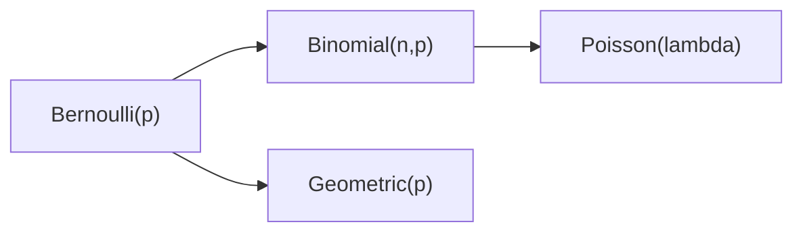

# 이산분포

> Probability 101 시리즈 (7/10)

<!-- a-grade-intro:begin -->

**핵심 질문**: *동전, 클릭, 주문, 콜* — *수많은 현실의 셈* 은 *몇 가지 이산분포* 로 *재사용* 됩니다. 어떤 분포가 *언제* 맞을까요?

> *분포를 알면 *데이터를 보지 않고도 추론* 할 수 있다.*

<!-- a-grade-intro:end -->

## 이 글에서 배울 것

- *베르누이 / 이항 / 기하 / 포아송*
- 각 분포의 *평균 / 분산*
- *상황 → 분포* 매칭
- 5단계 이산분포 실습
- 흔한 함정 5가지

## 왜 중요한가

대부분의 *셈 데이터* 는 이 네 분포 중 하나입니다. *모수* 만 정하면 *평균/분산/확률* 이 *공식* 으로 나옵니다.

> *Distributions are reusable models of the world.*

## 개념 한눈에 보기



## 핵심 용어 정리

- **베르누이(p)**: *0/1* 한 번. E=p, Var=p(1-p).
- **이항(n,p)**: 베르누이 *n번 합*. E=np, Var=np(1-p).
- **기하(p)**: *처음 성공* 까지 시도 수. E=1/p.
- **포아송(λ)**: *단위 시간 발생 수*. E=Var=λ.
- **모수**: 분포 모양을 정하는 *숫자*.

## Before/After

**Before**: *“주문이 시간당 5건 평균”* — 구체 분포 모름.

**After**: *Poisson(λ=5)* — *P(시간당 0건)* 도 *공식* 으로 계산.

## 실습: 5단계 이산분포

### 1단계 — 베르누이/이항

```python
from scipy import stats
print("Binomial(10, 0.3) P(X=3):", stats.binom.pmf(3, 10, 0.3))
```

### 2단계 — 기하

```python
from scipy import stats
print("Geometric(0.2) P(X=5):", stats.geom.pmf(5, 0.2))
```

### 3단계 — 포아송

```python
from scipy import stats
print("Poisson(5) P(X=0):", stats.poisson.pmf(0, 5))
```

### 4단계 — 평균/분산 비교

```python
from scipy import stats
for d in [stats.binom(10, 0.3), stats.geom(0.2), stats.poisson(5)]:
    print(d.dist.name, d.mean(), d.var())
```

### 5단계 — 시뮬레이션

```python
import numpy as np
samples = np.random.default_rng(0).poisson(5, 10_000)
print("mean:", samples.mean(), "var:", samples.var())
```

## 이 코드에서 주목할 점

- 같은 데이터도 *모델 선택* 에 따라 결과가 다르다.
- 포아송은 *평균=분산* 가정. 위반 시 *Negative Binomial* 고려.
- 이항은 *고정 시도수 n*, 기하는 *첫 성공까지*.

## 자주 하는 실수 5가지

1. ***이항* 을 *기하* 로 사용.**
2. ***포아송 분산 ≠ 평균*** 인데 *포아송* 강행.
3. ***독립 시도* 가정 무시.**
4. ***모수 추정* 을 *표본 1개* 로.**
5. ***확률 vs 가능도*** 혼동.

## 실무에서는 이렇게 쓰입니다

A/B 의 *전환 수*(이항), *콜센터 도착*(포아송), *재시도 수*(기하), *에러 수*(포아송) — *카운트 데이터* 분석의 기본입니다.

## 시니어 엔지니어는 이렇게 생각합니다

- *상황 → 분포* 매핑을 외운다.
- 가정을 *명시* 한다.
- *과분산* 을 진단한다.
- *시뮬레이션* 으로 *직관* 을 잡는다.
- *Negative Binomial* 같은 *대안* 을 안다.

## 체크리스트

- [ ] 네 분포의 *모수* 와 *E/Var* 를 안다.
- [ ] 상황을 *분포* 와 매핑할 수 있다.
- [ ] *scipy.stats* 로 PMF 를 다룬다.
- [ ] *과분산* 을 검진한다.

## 연습 문제

1. *전환율 0.05, n=200* 일 때 *X≥15* 의 확률을 구하세요.
2. *시간당 평균 3건* 도착 시 *분당 0건* 의 확률은?
3. *기하분포* 가 *메모리리스* 라는 의미를 적으세요.

## 정리 및 다음 단계

이산분포는 *카운트 모델* 의 사전입니다. 다음 글에서는 *연속분포* 를 봅니다.

- [확률이란 무엇인가?](./01-what-is-probability.md)
- [사건과 표본공간](./02-events-and-sample-space.md)
- [조건부확률](./03-conditional-probability.md)
- [베이즈 정리](./04-bayes-theorem.md)
- [확률변수](./05-random-variables.md)
- [기대값과 분산](./06-expectation-and-variance.md)
- **이산분포 (현재 글)**
- 연속분포 (예정)
- 대수의 법칙과 중심극한정리 (예정)
- 머신러닝에서의 확률 (예정)
## 참고 자료

- [Wikipedia — Bernoulli distribution](https://en.wikipedia.org/wiki/Bernoulli_distribution)
- [Wikipedia — Binomial distribution](https://en.wikipedia.org/wiki/Binomial_distribution)
- [Wikipedia — Poisson distribution](https://en.wikipedia.org/wiki/Poisson_distribution)
- [scipy.stats — Discrete](https://docs.scipy.org/doc/scipy/reference/stats.html#discrete-distributions)

Tags: Probability, Discrete, Bernoulli, Binomial, Beginner

---

© 2026 영선북스. 이 글의 저작권은 저자에게 있습니다.
