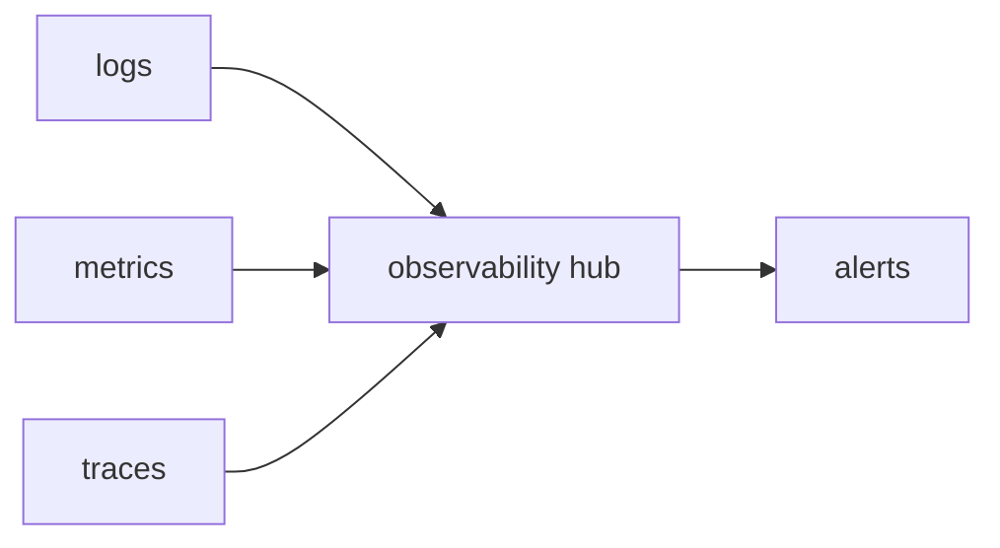

# Observability

> Serverless 101 시리즈 (8/10)

<!-- a-grade-intro:begin -->

**핵심 질문**: *함수* 가 *어디* 서 *왜* 느렸는지 어떻게 알 수 있나요?

> *로그, 지표, 분산 추적* 세 다리를 모두 갖춰야 *서버리스* 가 *디버그 가능* 합니다.

<!-- a-grade-intro:end -->

## 이 글에서 배울 것

- *세 다리* 관측성
- *상관관계 ID*
- *콜드 vs 워밍* 식별
- *비용 인지형* 로그
- *대시보드 / 알람* 설계

## 왜 중요한가

*함수* 는 *짧고 분산* 되어 있어 *한 곳* 만 봐서는 *원인* 을 모릅니다. *연결* 가능한 신호가 필요합니다.

## 개념 한눈에 보기



## 핵심 용어 정리

- **structured log**: *JSON* 등 *기계 가독*.
- **metric**: *숫자* 형태 신호.
- **trace**: *요청* 의 *경로*.
- **correlation id**: *요청* 식별자.
- **sampling**: *비용* 과 *해상도* 의 균형.

## Before/After

**Before**: *grep* 으로 *plain log* 추적.

**After**: *correlation id* + *trace* 로 *5분* 안에 원인 도달.

## 실습: 관측성 기초

### 1단계 — 구조화 로그

```python
import json, time

def log(level, msg, **fields):
    print(json.dumps({"t": time.time(), "level": level, "msg": msg, **fields}))
```

### 2단계 — correlation id 전파

```python
def with_corr(handler):
    def wrap(event, ctx):
        cid = event.get("correlation_id", "unknown")
        log("info", "start", cid=cid)
        return handler(event, ctx)
    return wrap
```

### 3단계 — 메트릭 카운트

```python
metrics = {}
def incr(name, n=1):
    metrics[name] = metrics.get(name, 0) + n
```

### 4단계 — 트레이스 스팬 (의사 코드)

```python
import contextlib, time

@contextlib.contextmanager
def span(name):
    t0 = time.perf_counter()
    yield
    log("info", "span", name=name, ms=(time.perf_counter() - t0) * 1000)
```

### 5단계 — 콜드 식별

```python
COLD = True

def handler(event, ctx):
    global COLD
    log("info", "invoke", cold=COLD)
    COLD = False
```

## 이 코드에서 주목할 점

- *구조화 로그* 가 *집계* 의 시작.
- *correlation id* 는 *모든 함수* 가 *전파*.
- *콜드 플래그* 는 *p99 분석* 핵심.

## 자주 하는 실수 5가지

1. ***plain text* 로그.**
2. ***민감 정보* 로깅.**
3. ***로그* 만 보고 *지표* 무시.**
4. ***샘플링* 없이 *trace* 비용 폭증.**
5. ***알람* 을 *너무 많이* 설정.**

## 실무에서는 이렇게 쓰입니다

*OpenTelemetry* 같은 표준으로 *세 다리* 신호를 *하나의 백엔드* 에 모아 *한 화면* 에서 봅니다.

## 시니어 엔지니어는 이렇게 생각합니다

- *Observability* 는 *디자인* 부터.
- *상관관계* 가 *생명*.
- *비용* 도 *관측* 한다.
- *알람* 은 *행동 가능* 해야.
- *샘플링* 으로 *해상도* 와 *비용* 균형.

## 체크리스트

- [ ] *구조화 로그*.
- [ ] *correlation id* 전파.
- [ ] *지표 + 트레이스* 수집.
- [ ] *알람* 행동 가능성.

## 연습 문제

1. *세 다리* 가 무엇인지 한 줄로.
2. *correlation id* 의 *역할* 한 줄로.
3. *trace 샘플링* 의 *목적* 한 줄로.

## 정리 및 다음 단계

다음 글은 *Cost* 입니다.

- [Serverless란 무엇인가?](./01-what-is-serverless.md)
- [Function as a Service](./02-function-as-a-service.md)
- [Trigger와 Event](./03-trigger-and-event.md)
- [Cold Start](./04-cold-start.md)
- [Scaling](./05-scaling.md)
- [State 관리](./06-state-management.md)
- [Queue와 Event-driven Architecture](./07-queue-and-event-driven.md)
- **Observability (현재 글)**
- Cost (예정)
- Serverless 앱 설계 (예정)
## 참고 자료

- [OpenTelemetry](https://opentelemetry.io/docs/)
- [AWS X-Ray](https://docs.aws.amazon.com/xray/latest/devguide/aws-xray.html)
- [CloudWatch Logs Insights](https://docs.aws.amazon.com/AmazonCloudWatch/latest/logs/AnalyzingLogData.html)
- [Distributed Tracing in Serverless](https://aws.amazon.com/blogs/compute/instrumenting-distributed-systems-for-operational-visibility/)

Tags: Serverless, Observability, Logging, Tracing, Metrics

---

© 2026 영선북스. 이 글의 저작권은 저자에게 있습니다.
