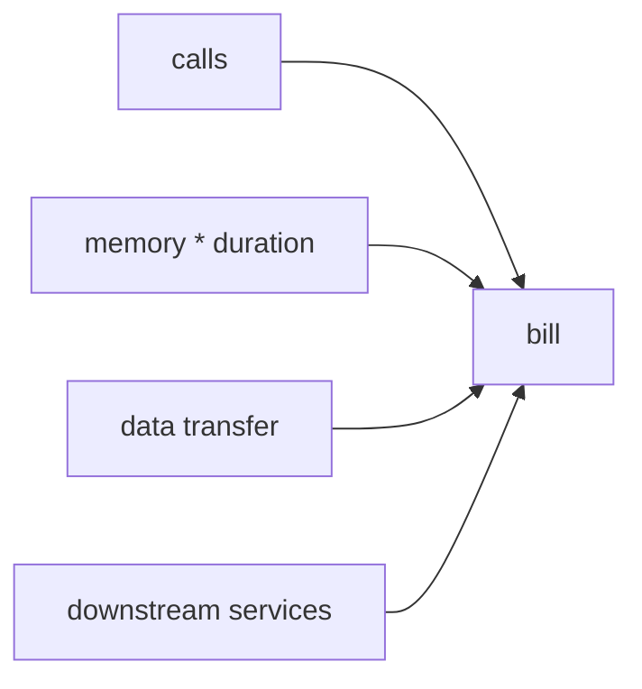

# Cost

> Serverless 101 시리즈 (9/10)

<!-- a-grade-intro:begin -->

**핵심 질문**: *호출당 0.0001달러* 인데 왜 *청구서* 가 *깜짝* 일까요?

> *비용* 은 *호출 수 + 실행 시간 + 메모리 + 데이터 전송 + 의존 서비스* 의 *합* 입니다.

<!-- a-grade-intro:end -->

## 이 글에서 배울 것

- *비용 구성요소*
- *메모리 튜닝* 효과
- *데이터 전송* 비용
- *Idle* 비용
- *FinOps* 시작점

## 왜 중요한가

*Serverless* 라고 *항상 싸지* 않습니다. *워크로드* 에 따라 *EC2* 보다 *비쌀 수* 있습니다.

## 개념 한눈에 보기



## 핵심 용어 정리

- **invocation cost**: *호출 단가*.
- **GB-seconds**: *메모리 × 시간*.
- **egress**: *데이터 외부 전송*.
- **idle**: *프로비저닝* 의 비용.
- **unit economics**: *호출당 마진*.

## Before/After

**Before**: *호출당 가격* 만 계산.

**After**: *총소유비용* 으로 *대안* 비교.

## 실습: 비용 모델링

### 1단계 — 호출 비용

```python
def calls_cost(n, unit_price=0.0000002):
    return n * unit_price
```

### 2단계 — GB-seconds

```python
def gb_seconds(memory_mb, duration_ms, n):
    return (memory_mb / 1024) * (duration_ms / 1000) * n
```

### 3단계 — 데이터 전송

```python
def egress_cost(gb, price_per_gb=0.09):
    return gb * price_per_gb
```

### 4단계 — 시나리오 비교

```python
def total(n, mem_mb, dur_ms, gb_out):
    return (
        calls_cost(n)
        + gb_seconds(mem_mb, dur_ms, n) * 0.0000166667
        + egress_cost(gb_out)
    )
```

### 5단계 — 메모리 튜닝 비교

```python
sizes = [128, 256, 512, 1024]
for s in sizes:
    print(s, total(1_000_000, s, 200, 5))
```

## 이 코드에서 주목할 점

- *메모리* 가 *CPU* 와 *비용* 모두 결정.
- *데이터 전송* 이 *숨은 비용*.
- *비교* 는 *시나리오* 단위.

## 자주 하는 실수 5가지

1. ***호출 단가* 만 보고 *총비용* 추정.**
2. ***메모리* 를 *최소* 로 고정.**
3. ***egress* 무시.**
4. ***DB/Queue* 비용 누락.**
5. ***프로비저닝* 을 *비용 인지* 없이 사용.**

## 실무에서는 이렇게 쓰입니다

*FinOps* 팀이 *호출당 마진* 을 *제품 결정* 에 *피드백* 합니다.

## 시니어 엔지니어는 이렇게 생각합니다

- *비용* 은 *기능* 의 일부.
- *메모리 튜닝* 은 *시간 vs 돈*.
- *egress* 는 *네트워크 설계* 로.
- *idle* 은 *프로비저닝* 의 *세금*.
- *대안* 과 *공정 비교*.

## 체크리스트

- [ ] *총비용 모델*.
- [ ] *메모리 튜닝* 검토.
- [ ] *egress* 측정.
- [ ] *FinOps* 대시보드.

## 연습 문제

1. *GB-seconds* 의 의미 한 줄로.
2. *egress* 의 의미 한 줄로.
3. *프로비저닝* 의 *idle 비용* 한 줄로.

## 정리 및 다음 단계

마지막 글은 *Serverless 앱 설계* 입니다.

- [Serverless란 무엇인가?](./01-what-is-serverless.md)
- [Function as a Service](./02-function-as-a-service.md)
- [Trigger와 Event](./03-trigger-and-event.md)
- [Cold Start](./04-cold-start.md)
- [Scaling](./05-scaling.md)
- [State 관리](./06-state-management.md)
- [Queue와 Event-driven Architecture](./07-queue-and-event-driven.md)
- [Observability](./08-observability.md)
- **Cost (현재 글)**
- Serverless 앱 설계 (예정)
## 참고 자료

- [Lambda 가격](https://aws.amazon.com/lambda/pricing/)
- [Cloud Functions 가격](https://cloud.google.com/functions/pricing)
- [Azure Functions 가격](https://azure.microsoft.com/pricing/details/functions/)
- [FinOps Foundation](https://www.finops.org/)

Tags: Serverless, Cost, FinOps, Pricing, Cloud

---

© 2026 영선북스. 이 글의 저작권은 저자에게 있습니다.
