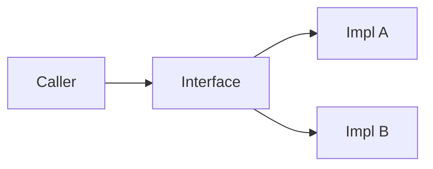

# 인터페이스와 추상화

> Software Design 101 시리즈 (5/10)

<!-- a-grade-intro:begin -->

**핵심 질문**: 좋은 인터페이스는 무엇이 다를까요?

> 사용자의 의도를 표현하면서, 구현이 바뀌어도 깨지지 않습니다.

<!-- a-grade-intro:end -->

## 이 글에서 배울 것

- 인터페이스의 역할
- 추상화 수준 맞추기
- 다형성으로 분기 줄이기
- 리스코프 치환 원칙(LSP)
- 좋은 인터페이스 설계 패턴

## 왜 중요한가

인터페이스는 약속입니다. 약속이 작고 명확하면 양쪽이 자유롭습니다.

> 인터페이스는 사용자의 언어로 쓴다.

## 개념 한눈에 보기



호출자는 하나만 알고, 구현은 여럿일 수 있다.

## 핵심 용어 정리

- **Interface**: 호출 가능한 약속의 모양.
- **Abstraction level**: 호출자의 언어와 일치하는 정도.
- **Polymorphism**: 같은 호출이 여러 구현으로 동작.
- **LSP (Liskov Substitution)**: 하위 타입은 상위 타입의 자리에 무리 없이 들어갈 수 있어야 한다.
- **Leaky abstraction**: 내부가 새 나오는 인터페이스.

## Before/After

**Before**

```python
def notify(kind, user, msg):
    if kind == "email": send_email(user, msg)
    elif kind == "sms": send_sms(user, msg)
    elif kind == "push": send_push(user, msg)
```

**After**

```python
class Notifier:
    def send(self, user, msg): ...

def notify(notifier: Notifier, user, msg):
    notifier.send(user, msg)
```

분기가 사라지고, 새 채널 추가가 쉬워집니다.

## 실습: 좋은 인터페이스를 만드는 5단계

### 1단계 — 사용자의 언어로 이름 짓기

```python
# 1_naming.py
# Bad: process_data()
# Good: charge_user()
```

이름이 의도를 담아야 합니다.

### 2단계 — 추상화 수준 맞추기

```python
# 2_level.py
# Bad: send_bytes_over_tcp(host, port, payload)
# Good: notify(user, message)
```

호출자가 신경 쓰지 않을 것을 숨깁니다.

### 3단계 — 인자는 적게, 의도는 분명하게

```python
# 3_params.py
# Bad: charge(u, a, c, r, m, x, y)
# Good: charge(user, amount, *, reason)
```

위치 인자 4개를 넘기면 의심하세요.

### 4단계 — LSP 검증

```python
# 4_lsp.py
class Bird:
    def fly(self): ...

class Penguin(Bird):
    def fly(self): raise NotImplementedError
# 호출자가 깨진다 — Bird를 다시 설계해야 한다.
```

하위 타입이 상위 약속을 깨면 인터페이스가 잘못된 것입니다.

### 5단계 — 작은 인터페이스 여러 개

```python
# 5_isp.py
class Reader:
    def read(self): ...

class Writer:
    def write(self, x): ...
# 한 덩어리 IO 인터페이스보다 낫다.
```

읽기만 필요한 호출자에게 쓰기를 강요하지 마세요.

## 이 코드에서 주목할 점

- 인터페이스 이름이 호출자 언어입니다.
- 인자 수가 적고 의미가 분명합니다.
- 구현 교체가 호출자 코드를 흔들지 않습니다.

## 자주 하는 실수 5가지

1. **구현 용어로 메서드 이름.** `flush_buffer` 같은 이름이 인터페이스에 등장.
2. **파라미터 폭발.** 7개 인자를 받는 인터페이스.
3. **LSP 위반.** 하위 타입이 예외를 던지거나 약속을 좁힘.
4. **거대한 한 덩어리 인터페이스.** ISP 위반.
5. **누수된 추상화.** `get_redis_client()`가 인터페이스에 노출.

## 실무에서는 이렇게 쓰입니다

결제 게이트웨이, 저장소, 알림 채널 등에 인터페이스가 빛납니다. 벤더가 바뀌어도 호출자는 모릅니다.

## 시니어 엔지니어는 이렇게 생각합니다

- 인터페이스는 호출자의 입장에서 짠다.
- 한 인터페이스는 한 가지를 잘한다.
- LSP가 깨지면 타입 계층을 의심한다.
- 인자 수가 늘면 의도가 뭉개진 것이다.
- 구현 용어가 새 나오면 추상화 수준을 높인다.

## 체크리스트

- [ ] 메서드 이름이 호출자 언어인가?
- [ ] 인자 수가 적은가?
- [ ] 하위 타입이 상위 약속을 지키는가?
- [ ] 인터페이스가 한 가지 책임만 가지는가?
- [ ] 구현 세부가 새 나오지 않는가?

## 연습 문제

1. 본인 코드의 인터페이스 1개를 골라 인자를 줄여 보세요.
2. 한 덩어리 인터페이스를 2개로 쪼개 보세요.
3. LSP 위반 사례를 찾아 메모해 두세요.

## 정리 및 다음 단계

좋은 인터페이스는 자유의 단위입니다. 다음 글에서는 인터페이스가 모여 구조를 이루는 방식 — 계층 아키텍처 — 를 봅니다.

- [소프트웨어 설계란 무엇인가?](./01-what-is-software-design.md)
- [관심사 분리](./02-separation-of-concerns.md)
- [모듈과 경계](./03-modules-and-boundaries.md)
- [의존성 방향](./04-dependency-direction.md)
- **인터페이스와 추상화 (현재 글)**
- 계층 아키텍처 (예정)
- 데이터 흐름 설계 (예정)
- 변경 영향 줄이기 (예정)
- 설계 원칙 모음 (예정)
- 작은 프로젝트로 설계 연습 (예정)
## 참고 자료

- [Liskov Substitution Principle (Barbara Liskov)](https://www.cs.cmu.edu/~wing/publications/LiskovWing94.pdf)
- [Interface Segregation Principle](https://web.archive.org/web/20150905081110/http://www.objectmentor.com/resources/articles/isp.pdf)
- [Joshua Bloch — How to Design a Good API](https://www.youtube.com/watch?v=heh4OeB9A-c)
- [Designing Data-Intensive Applications — Abstractions](https://dataintensive.net/)

Tags: Computer Science, SoftwareDesign, Interfaces, Abstraction, LSP, Polymorphism

---

© 2026 영선북스. 이 글의 저작권은 저자에게 있습니다.
