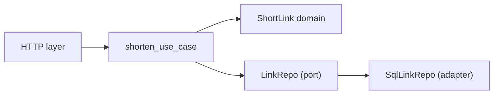

# 작은 프로젝트로 설계 연습

> Software Design 101 시리즈 (10/10)

<!-- a-grade-intro:begin -->

**핵심 질문**: 시리즈에서 배운 도구들을 한 프로젝트에서 어떻게 모두 써볼까요?

> 작은 URL 단축기를 만들면서 관심사 분리, 의존성 방향, 계층, 데이터 흐름을 한 줄씩 풀어 봅니다.

<!-- a-grade-intro:end -->

## 이 글에서 배울 것

- 작은 프로젝트의 설계 시작
- 도메인부터 짜는 흐름
- 어댑터로 인프라를 막는 법
- 변경 가능성에 대한 결정
- 시리즈의 모든 도구가 한 자리에서 만나는 모습

## 왜 중요한가

원리는 작은 코드에서도 그대로 작동합니다. 이번 글의 프로젝트는 작지만 모든 도구를 적용하는 무대입니다.

> 작은 시스템에서 좋은 습관이 만들어진다.

## 개념 한눈에 보기



도메인 → 포트 → 어댑터 → 인프라.

## 핵심 용어 정리

- **Short link**: 긴 URL을 대표하는 짧은 키.
- **Use case**: 한 가지 비즈니스 흐름.
- **Port**: 도메인이 정의한 인터페이스.
- **Adapter**: 포트를 구현하는 인프라.
- **Composition root**: 모든 부품을 조립하는 한 곳.

## Before/After

**Before**

```python
@app.route("/", methods=["POST"])
def shorten():
    long = request.json["url"]
    key = hashlib.md5(long.encode()).hexdigest()[:6]
    db.execute("INSERT INTO links VALUES (?, ?)", (key, long))
    return {"short": "/r/" + key}
```

**After**

```python
@app.route("/", methods=["POST"])
def shorten_view():
    return shorten_use_case(request.json, repo, key_gen)
```

뷰는 얇고 도메인은 보호됩니다.

## 실습: URL 단축기를 5단계로 만들기

### 1단계 — 도메인부터

```python
# 1_domain.py
from dataclasses import dataclass

@dataclass(frozen=True)
class ShortLink:
    key: str
    target: str

    @staticmethod
    def create(key, target):
        if not target.startswith("http"):
            raise ValueError("invalid url")
        return ShortLink(key=key, target=target)
```

규칙은 도메인에. 외부 의존 0.

### 2단계 — 포트 정의

```python
# 2_ports.py
from typing import Protocol

class LinkRepo(Protocol):
    def save(self, link: ShortLink) -> None: ...
    def get(self, key: str) -> ShortLink | None: ...

class KeyGen(Protocol):
    def __call__(self, target: str) -> str: ...
```

도메인이 필요한 모양을 직접 선언.

### 3단계 — 유스케이스

```python
# 3_usecase.py
def shorten_use_case(payload, repo: LinkRepo, key_gen: KeyGen):
    target = payload["url"]
    key = key_gen(target)
    link = ShortLink.create(key, target)
    repo.save(link)
    return {"short": "/r/" + link.key}
```

흐름은 application 계층에서.

### 4단계 — 어댑터

```python
# 4_adapter.py
class InMemoryLinkRepo:
    def __init__(self): self._d = {}
    def save(self, link): self._d[link.key] = link
    def get(self, key): return self._d.get(key)

def md5_key(target: str) -> str:
    import hashlib
    return hashlib.md5(target.encode()).hexdigest()[:6]
```

같은 포트에 SQL/Redis 어댑터도 가능.

### 5단계 — 조립과 표현

```python
# 5_compose.py
from flask import Flask, request
app = Flask(__name__)
repo = InMemoryLinkRepo()
key_gen = md5_key

@app.route("/", methods=["POST"])
def shorten_view():
    return shorten_use_case(request.json, repo, key_gen)

@app.route("/r/<key>")
def redirect_view(key):
    link = repo.get(key)
    return ("not found", 404) if not link else ("", 302, {"Location": link.target})
```

조립은 가장자리, 뷰는 얇게.

## 이 코드에서 주목할 점

- 도메인이 외부에 의존하지 않습니다.
- 포트가 도메인 쪽에 있습니다.
- 어댑터를 갈아 끼워도 도메인이 흔들리지 않습니다.
- 데이터가 한 방향으로 흐릅니다.
- 표현 계층이 얇습니다.

## 자주 하는 실수 5가지

1. **도메인 안에서 Flask request 직접 사용.** 표현이 도메인을 침범.
2. **md5 같은 구체 결정을 도메인에 둠.** 정책과 메커니즘 혼재.
3. **모든 책임을 view에 몰기.** 다른 채널 추가가 곧바로 어려워진다.
4. **테스트를 통합 테스트만 작성.** 도메인 단위 테스트가 빠짐.
5. **추상을 너무 일찍 도입.** 첫 버전부터 4종 어댑터.

## 실무에서는 이렇게 쓰입니다

이 패턴은 그대로 더 큰 시스템에 확장됩니다 — 결제, 인증, 알림 — 도메인을 핵심에 두고 어댑터로 외부를 막습니다.

## 시니어 엔지니어는 이렇게 생각합니다

- 작은 프로젝트도 도메인부터 시작한다.
- 처음에는 어댑터가 1개여도 인터페이스를 둔다.
- 표현을 얇게 유지해 채널 교체에 대비한다.
- 도메인 단위 테스트를 가장 먼저 짠다.
- 조립을 한 곳에 모은다.

## 체크리스트

- [ ] 도메인이 인프라에서 자유로운가?
- [ ] 포트가 도메인 쪽에 있는가?
- [ ] 표현 계층이 얇은가?
- [ ] 데이터가 한 방향인가?
- [ ] 조립이 한 곳에 모여 있는가?

## 연습 문제

1. 위 코드에 SqlLinkRepo 어댑터를 추가해 보세요. 도메인이 한 줄도 바뀌지 않아야 합니다.
2. CLI용 표현 계층을 추가해 보세요 — 같은 유스케이스를 호출하면 됩니다.
3. ShortLink에 만료일 규칙을 추가하고 도메인 단위 테스트를 작성해 보세요.

## 정리 및 다음 단계

이 시리즈는 여기까지입니다. 도메인을 가운데 두고, 포트로 둘러싸고, 어댑터로 막고, 데이터를 한 방향으로 흐르게 만드는 — 이 한 문장이 전부입니다. 다음에 만들 시스템에서 이 한 문장을 시작점으로 삼아 보세요.

- [소프트웨어 설계란 무엇인가?](./01-what-is-software-design.md)
- [관심사 분리](./02-separation-of-concerns.md)
- [모듈과 경계](./03-modules-and-boundaries.md)
- [의존성 방향](./04-dependency-direction.md)
- [인터페이스와 추상화](./05-interfaces-and-abstraction.md)
- [계층 아키텍처](./06-layered-architecture.md)
- [데이터 흐름 설계](./07-data-flow-design.md)
- [변경 영향 줄이기](./08-reducing-change-impact.md)
- [설계 원칙 모음](./09-design-principles.md)
- **작은 프로젝트로 설계 연습 (현재 글)**
## 참고 자료

- [Cosmic Python — Architecture Patterns with Python](https://www.cosmicpython.com/)
- [Hexagonal Architecture (Alistair Cockburn)](https://alistair.cockburn.us/hexagonal-architecture/)
- [Clean Architecture (Uncle Bob)](https://blog.cleancoder.com/uncle-bob/2012/08/13/the-clean-architecture.html)
- [Domain-Driven Design (Eric Evans)](https://martinfowler.com/bliki/DomainDrivenDesign.html)

Tags: Computer Science, SoftwareDesign, Practice, Project, Modularity, Architecture

---

© 2026 영선북스. 이 글의 저작권은 저자에게 있습니다.
