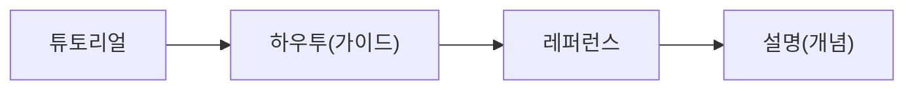

# 문서화

> Software Engineering 101 시리즈 (7/10)

<!-- a-grade-intro:begin -->

**핵심 질문**: 코드만 잘 짜면 문서는 필요 없는 것 아닌가요?

> 코드는 "어떻게"를 답합니다. 문서는 "왜"와 "언제"를 답합니다.

<!-- a-grade-intro:end -->

## 이 글에서 배울 것

- README의 최소 항목
- ADR로 결정 남기기
- docstring과 타입 힌트
- runbook과 onboarding 문서
- Diataxis 4분면(튜토리얼/가이드/레퍼런스/설명)

## 왜 중요한가

문서가 없으면 모든 질문이 사람을 거칩니다. 사람이 병목이 되는 순간 팀의 속도는 한 사람의 출근 시간에 종속됩니다.

> 문서는 비동기 협업의 인프라다.

## 개념 한눈에 보기



Diataxis는 독자의 의도로 문서를 분리합니다.

## 핵심 용어 정리

- **README**: 첫인상이자 진입점.
- **ADR**: 결정의 이유 기록.
- **Docstring**: 함수/클래스의 사용 약속.
- **Runbook**: 사고 시 따라하는 절차.
- **Diataxis**: 4분면 문서 분류 모델.

## Before/After

**Before — 한 페이지 위키**

```text
"위키에 다 있어요" -> 어디에 있는지는 아무도 모름
```

**After — 4분면 + 인덱스**

```text
docs/tutorials/  docs/how-to/  docs/reference/  docs/explanation/
```

읽는 사람의 의도로 폴더가 나뉩니다.

## 실습: 작은 문서 셋

### 1단계 — README 5블록

```markdown
# 1_readme.md
## What — 한 문장 설명
## Why — 왜 만들어졌나
## Quick start — 60초 안에 동작
## Configuration — 환경 변수 표
## Links — 더 알아보기
```

읽는 사람이 60초 안에 가치를 봅니다.

### 2단계 — ADR 한 페이지

```markdown
# 2_adr.md
# ADR 0012: 캐시 도입
- Context, Decision, Alternatives, Consequences
- Date, Owners
```

결정의 이유는 코드보다 오래 살아남습니다.

### 3단계 — docstring과 타입

```python
# 3_docstring.py
def compute_invoice(amount: int, tax_rate: float) -> int:
    """Return cents amount including tax.

    Raises:
        ValueError: when amount is negative.
    """
```

함수 시그니처가 절반의 문서입니다.

### 4단계 — runbook

```markdown
# 4_runbook.md
## 증상
- 5xx error rate > 2% for 5 min
## 진단
1. Grafana 대시보드 X 확인
2. 최근 배포 로그 확인
## 조치
- 즉시 rollback (`kubectl rollout undo ...`)
```

새벽 3시에 따라할 수 있어야 합니다.

### 5단계 — onboarding 체크리스트

```markdown
# 5_onboarding.md
- [ ] 저장소 clone + dev 환경 띄우기
- [ ] 첫 PR 머지(타이포 수정)
- [ ] 1주일 내 첫 incident shadow
```

신규 입사자의 첫 30일을 설계합니다.

## 이 코드에서 주목할 점

- 의도별 문서 분리가 검색 가능성을 만듭니다.
- ADR이 의사결정의 회수 가능성을 보장합니다.
- Runbook이 새벽의 사고 비용을 줄입니다.
- README는 첫인상이자 채용 도구입니다.

## 자주 하는 실수 5가지

1. **모든 것을 한 위키 페이지에.** 아무도 못 찾습니다.
2. **자동 생성 문서만.** 의도가 빠집니다.
3. **현재형/과거형 혼재.** 신뢰 누수.
4. **runbook 미리허설.** 실제 사고가 첫 사용.
5. **문서 owner 없음.** 곧 거짓이 됩니다.

## 실무에서는 이렇게 쓰입니다

규모 있는 팀은 docs-as-code(저장소에 마크다운으로 보관, PR로 변경, CI에서 빌드). 새 기능은 RFC -> 코드 -> docs 업데이트가 한 PR 안에.

## 시니어 엔지니어는 이렇게 생각합니다

- 문서는 비동기 협업의 인프라다.
- 코드는 "어떻게", 문서는 "왜"와 "언제"이다.
- README가 부실한 저장소는 미래의 부채다.
- 모든 문서에 owner와 last_reviewed가 있어야 한다.
- 문서도 코드처럼 리뷰한다.

## 체크리스트

- [ ] README 5블록이 있는가?
- [ ] 주요 결정에 ADR이 있는가?
- [ ] docstring이 사용 약속을 말하는가?
- [ ] 운영 사고 runbook이 있는가?
- [ ] 모든 문서에 owner가 있는가?

## 연습 문제

1. 본인 저장소 README를 5블록으로 다시 써 보세요.
2. 최근 결정 한 가지를 ADR로 옮겨 보세요.
3. 최근 incident에 대한 1페이지 runbook을 적어 보세요.

## 정리 및 다음 단계

문서는 사람을 풀어 줍니다. 다음 글에서는 사람들이 함께 일하는 방식 — 협업 프로세스 — 를 봅니다.

- [소프트웨어 엔지니어링이란 무엇인가?](./01-what-is-software-engineering.md)
- [요구사항 이해하기](./02-understanding-requirements.md)
- [설계와 구현의 차이](./03-design-vs-implementation.md)
- [코드 리뷰](./04-code-review.md)
- [테스트 전략](./05-testing-strategy.md)
- [버전 관리와 릴리스](./06-version-control-and-release.md)
- **문서화 (현재 글)**
- 협업 프로세스 (예정)
- 유지보수와 기술부채 (예정)
- 좋은 소프트웨어의 기준 (예정)
## 참고 자료

- [Diataxis Framework](https://diataxis.fr/)
- [The Documentation System — Daniele Procida](https://documentation.divio.com/)
- [Write the Docs — Documentation Guide](https://www.writethedocs.org/guide/)
- [Google — Documentation Best Practices](https://google.github.io/styleguide/docguide/best_practices.html)

Tags: Computer Science, SoftwareEngineering, Documentation, README, ADR, Knowledge

---

© 2026 영선북스. 이 글의 저작권은 저자에게 있습니다.
