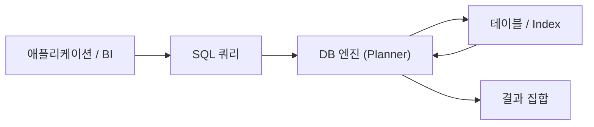

# SQL이란 무엇인가?

> SQL 101 시리즈 (1/10)

<!-- a-grade-intro:begin -->

**핵심 질문**: 데이터를 *손으로 한 줄씩 옮기는* 시대는 왜 끝났을까요? 우리는 *원하는 결과를 적기만 하면* 되는 언어를 어떻게 갖게 됐을까요?

> *SQL 은 *데이터를 어떻게 가져올지* 가 아니라 *무엇을 원하는지* 를 적는 언어입니다.*

<!-- a-grade-intro:end -->

## 이 글에서 배울 것

- *SQL* 의 정의와 *관계형 모델* 의 핵심
- *선언형* 언어가 무엇을 의미하는가
- *DDL / DML / DCL* 의 분류
- 첫 쿼리 5단계
- 흔한 함정 5가지

## 왜 중요한가

분석가, 백엔드, 데이터 엔지니어가 *공통으로 쓰는* 언어가 SQL 입니다. *엑셀로 못 푸는 데이터* 를 다루는 순간 *SQL 한 줄이 하루를 줄입니다*. 게다가 *40년 넘게* 살아남은 언어라 *내일도 쓸 수 있습니다*.

> *데이터의 양이 늘어날수록 SQL 은 *유일한 합리적 선택* 이 된다.*

## 개념 한눈에 보기



## 핵심 용어 정리

- **Table**: *행* 과 *열* 로 이루어진 데이터의 *기본 단위*.
- **Row / Column**: *한 건의 사실* 과 *하나의 속성*.
- **Schema**: 테이블과 관계의 *설계도*.
- **Query**: 우리가 DB 에게 *묻는 문장*.
- **Result set**: 쿼리에 대한 *행들의 집합*.

## Before/After

**Before**: 엑셀로 *VLOOKUP* 을 *세 번* 걸쳐 *조각낸 시트* 에서 답을 찾는다.

**After**: SQL 한 문장이 *조인, 집계, 필터* 를 *한 번에* 끝낸다.

## 실습: 첫 쿼리 5단계

### 1단계 — 테이블 만들기

```sql
CREATE TABLE users (
    id INT PRIMARY KEY,
    name TEXT NOT NULL,
    signup_at DATE NOT NULL
);
```

### 2단계 — 데이터 넣기

```sql
INSERT INTO users (id, name, signup_at) VALUES
    (1, 'Ada', '2026-01-01'),
    (2, 'Linus', '2026-02-15'),
    (3, 'Grace', '2026-03-30');
```

### 3단계 — 전체 보기

```sql
SELECT * FROM users;
```

### 4단계 — 조건 걸기

```sql
SELECT name FROM users WHERE signup_at >= '2026-02-01';
```

### 5단계 — 개수 세기

```sql
SELECT COUNT(*) AS total FROM users;
```

## 이 코드에서 주목할 점

- *어떻게 가져올지* 적지 않았다. *무엇이 필요한지* 만 적었다.
- DB 엔진이 *index 사용 여부, 정렬 방식* 을 *알아서* 정한다.
- 같은 결과를 *여러 방식* 으로 표현할 수 있다.

## 자주 하는 실수 5가지

1. **`SELECT *` 를 *습관처럼* 쓴다.** 컬럼이 늘면 *네트워크와 메모리* 가 같이 는다.
2. **Schema 없이 *문자열* 로만 저장.** 나중에 *집계* 가 *지옥* 이 된다.
3. **NULL 을 *0* 처럼 다룬다.** NULL 은 *모름* 이라는 *별도 값* 이다.
4. **대소문자 *섞어서* 적는다.** 팀 컨벤션을 정해 *읽기 쉽게* 한다.
5. **결과를 *눈으로만* 검증.** *COUNT, SUM* 으로 *숫자로* 확인한다.

## 실무에서는 이렇게 쓰입니다

대시보드, 사용자 통계, A/B 테스트 결과, 매출 리포트 — *대부분의 분석* 은 *SQL 쿼리* 한두 개로 시작합니다. 백엔드는 *ORM* 뒤에서도 *SQL 을 읽고 튜닝* 합니다. ETL 파이프라인의 *대부분의 단계* 가 SQL 입니다.

## 시니어 엔지니어는 이렇게 생각합니다

- *SQL 은 *데이터에 가장 가까운* 언어다.*
- *읽는 시간이 *쓰는 시간보다 길다*.*
- *Plan 을 보지 않으면 *튜닝이 아니다*.*
- *NULL 을 *명시적으로* 다룬다.*
- *복잡한 쿼리는 *CTE* 로 *층을 나눈다*.*

## 체크리스트

- [ ] *SELECT, FROM, WHERE* 의 역할을 *말로* 설명할 수 있다.
- [ ] *Table, row, column* 의 차이를 안다.
- [ ] *NULL* 의 의미를 안다.
- [ ] *DDL/DML* 을 구분할 수 있다.

## 연습 문제

1. *주문(orders)* 테이블의 *전체 행 수* 를 구해 보세요.
2. *2026년 3월 이후* 가입한 사용자 *이름* 만 뽑아 보세요.
3. `SELECT *` 가 왜 *위험* 한지 *팀원에게 설명* 해 보세요.

## 정리 및 다음 단계

SQL 은 *결과를 묘사하는* 언어입니다. 다음 글에서는 가장 자주 쓰는 *SELECT* 의 구조를 정리합니다.

- **SQL이란 무엇인가? (현재 글)**
- SELECT 기본 (예정)
- WHERE와 조건 (예정)
- JOIN (예정)
- GROUP BY와 aggregate (예정)
- Subquery (예정)
- Window Function (예정)
- INSERT, UPDATE, DELETE (예정)
- Index와 Query Plan (예정)
- 실전 분석 SQL (예정)
## 참고 자료

- [PostgreSQL Tutorial — SQL](https://www.postgresql.org/docs/current/tutorial-sql.html)
- [SQLBolt — Interactive SQL Lessons](https://sqlbolt.com/)
- [Use The Index, Luke](https://use-the-index-luke.com/)
- [Mode — SQL Tutorial](https://mode.com/sql-tutorial/)

Tags: SQL, Database, RDBMS, Postgres, Analytics

---

© 2026 영선북스. 이 글의 저작권은 저자에게 있습니다.
