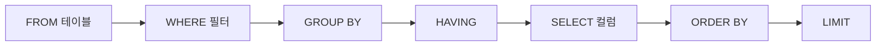

# SELECT 기본

> SQL 101 시리즈 (2/10)

<!-- a-grade-intro:begin -->

**핵심 질문**: `SELECT *` 는 *왜 위험* 하고, *컬럼을 명시* 하는 습관은 *어떤 차이* 를 만들까요?

> *SELECT 는 *읽는 명령* 이지만, 잘 쓰면 *팀 전체의 비용* 을 줄입니다.*

<!-- a-grade-intro:end -->

## 이 글에서 배울 것

- *SELECT* 의 절(clause) *논리 순서*
- 컬럼 선택과 *별칭(alias)*
- *ORDER BY* 와 *LIMIT*
- *DISTINCT* 의 의미와 비용
- 흔한 함정 5가지

## 왜 중요한가

분석가가 하루에 *수백 번* 치는 명령이 SELECT 입니다. *작성 습관 하나* 가 *읽기 속도, 비용, 신뢰* 를 바꿉니다. 특히 *컬럼 명시* 와 *명확한 별칭* 은 *6개월 뒤의 자기 자신* 을 도와줍니다.

> *SELECT 는 *말하기 쉬운 만큼 *오해받기 쉽다*.*

## 개념 한눈에 보기



## 핵심 용어 정리

- **Projection**: SELECT 가 고른 *컬럼 집합*.
- **Alias**: `AS new_name` 으로 *이름을 다시* 붙이기.
- **Sort key**: `ORDER BY` 가 정렬에 쓰는 *컬럼*.
- **Pagination**: `LIMIT` + `OFFSET` 으로 *조각내 보기*.
- **Distinct**: 중복 제거. *비용이 든다*.

## Before/After

**Before**: `SELECT * FROM orders ORDER BY id;` 로 *수십만 행* 을 *전부* 받아 본다.

**After**: 필요한 *3개 컬럼* 만 가져오고 `LIMIT 50` 으로 *화면에 맞춘다*.

## 실습: 자주 쓰는 5가지

### 1단계 — 컬럼을 *명시* 한다

```sql
SELECT id, name, signup_at FROM users;
```

### 2단계 — 별칭으로 *읽기 좋게*

```sql
SELECT name AS user_name, signup_at AS joined_on FROM users;
```

### 3단계 — 정렬

```sql
SELECT id, name FROM users ORDER BY signup_at DESC;
```

### 4단계 — 상위 N 개만

```sql
SELECT id, name FROM users ORDER BY id LIMIT 10;
```

### 5단계 — 중복 제거

```sql
SELECT DISTINCT country FROM users;
```

## 이 코드에서 주목할 점

- *작성 순서* 는 `SELECT ... FROM ... WHERE ...` 지만, *논리 평가 순서* 는 *FROM → WHERE → SELECT*.
- 별칭은 *WHERE* 에서는 못 쓰지만 *ORDER BY* 에서는 쓸 수 있다.
- `DISTINCT` 는 *정렬 또는 hash* 가 필요해 *비용이 든다*.

## 자주 하는 실수 5가지

1. **`SELECT *` 로 *모든 컬럼* 가져오기.** 인덱스가 *덜 활용* 되고 네트워크가 *팽창* 한다.
2. **`ORDER BY 1` 로 *컬럼 위치* 에 의존.** 컬럼 추가 시 *깨진다*.
3. **`LIMIT` 없이 *대용량 조회*.** UI 가 *얼어붙는다*.
4. **`DISTINCT` 로 *중복을 숨긴다*.** 원인이 되는 *조인 카디널리티* 를 *못 본다*.
5. **별칭에 *공백/한글* 을 넣고 quote 안 함.** *문법 오류*.

## 실무에서는 이렇게 쓰입니다

대시보드는 보통 `SELECT 필요컬럼 + ORDER BY + LIMIT` 패턴을 *수백 번* 반복합니다. 분석 노트북에서는 *상위 50행* 을 먼저 보고 패턴을 잡은 뒤 본 쿼리로 갑니다.

## 시니어 엔지니어는 이렇게 생각합니다

- *컬럼은 *언제나 명시*.*
- *정렬은 *결정적 순서* 가 필요할 때만.*
- *LIMIT 는 *기본값이 있다* 고 가정.*
- *DISTINCT 가 *문제를 가린다* 면 조인이 *수상하다*.*
- *별칭은 *팀 컨벤션* 으로.*

## 체크리스트

- [ ] `SELECT *` 없이 쿼리를 짤 수 있다.
- [ ] 별칭과 ORDER BY 관계를 안다.
- [ ] LIMIT 의 의미를 안다.
- [ ] DISTINCT 비용을 설명할 수 있다.

## 연습 문제

1. *users* 의 *최근 가입 5명* 의 *이름* 을 뽑아 보세요.
2. *signup_at* 으로 정렬해 *상위 10명* 을 *오름차순* 으로 보세요.
3. *country* 의 *고유값 개수* 를 구해 보세요.

## 정리 및 다음 단계

SELECT 는 *문장 구조* 를 익히는 일입니다. 다음 글은 *WHERE 와 조건* 입니다.

- [SQL이란 무엇인가?](./01-what-is-sql.md)
- **SELECT 기본 (현재 글)**
- WHERE와 조건 (예정)
- JOIN (예정)
- GROUP BY와 aggregate (예정)
- Subquery (예정)
- Window Function (예정)
- INSERT, UPDATE, DELETE (예정)
- Index와 Query Plan (예정)
- 실전 분석 SQL (예정)
## 참고 자료

- [PostgreSQL — SELECT](https://www.postgresql.org/docs/current/sql-select.html)
- [SQLBolt — SELECT queries](https://sqlbolt.com/lesson/select_queries_introduction)
- [Mode — SELECT statement](https://mode.com/sql-tutorial/sql-select-statement/)
- [SQL Style Guide](https://www.sqlstyle.guide/)

Tags: SQL, SELECT, Query, Database, Postgres

---

© 2026 영선북스. 이 글의 저작권은 저자에게 있습니다.
