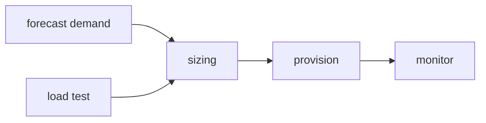

# Capacity Planning

> SRE 101 시리즈 (9/10)

<!-- a-grade-intro:begin -->

**핵심 질문**: *내년 트래픽* 을 *어떻게* *준비* 할까요?

> *Capacity planning* 은 *수요* 와 *공급* 을 *수치* 로 *맞추는* 일입니다.

<!-- a-grade-intro:end -->

## 이 글에서 배울 것

- *Capacity planning* 의 *정의*
- *수요 예측*
- *헤드룸* 산정
- *부하 테스트*
- *비용* 과의 *trade-off*

## 왜 중요한가

*예측* 없이 *돌발 트래픽* 을 만나면 *서비스* 가 *무너집니다*.

## 개념 한눈에 보기



## 핵심 용어 정리

- **demand forecast**: *미래 수요* 예측.
- **headroom**: *여유* 용량.
- **load test**: *부하 시험*.
- **scaling unit**: *증설 단위*.
- **lead time**: *조달 소요 시간*.

## Before/After

**Before**: *지난 분기* 트래픽 으로 *증설*.

**After**: *예측* + *부하 시험* 으로 *증설*.

## 실습: 용량 모델링

### 1단계 — 추세선

```python
def linear_forecast(history, weeks_ahead):
    base = history[-1]
    growth = (history[-1] - history[0]) / max(len(history) - 1, 1)
    return base + growth * weeks_ahead
```

### 2단계 — 헤드룸

```python
def headroom(target_util, current_util):
    return max(0, target_util - current_util)
```

### 3단계 — 부하 시험 결과

```python
def max_rps(samples):
    return max(samples)
```

### 4단계 — 노드 수

```python
def nodes(predicted_rps, rps_per_node):
    return -(-predicted_rps // rps_per_node)
```

### 5단계 — 비용

```python
def cost(nodes, monthly_per_node):
    return nodes * monthly_per_node
```

## 이 코드에서 주목할 점

- *예측* 은 *데이터* 기반.
- *헤드룸* 으로 *변동* 대응.
- *비용* 을 *함께* 본다.

## 자주 하는 실수 5가지

1. ***예측* 없이 *과거* 만 *복제*.**
2. ***헤드룸* 0 으로 *위험* 노출.**
3. ***부하 시험* 누락.**
4. ***리드 타임* 무시.**
5. ***비용* 과 *분리*.**

## 실무에서는 이렇게 쓰입니다

*블랙 프라이데이* 같은 *피크* 는 *수개월* 전부터 *모델링* 합니다.

## 시니어 엔지니어는 이렇게 생각합니다

- *예측* 은 *반복* 이 *정확도*.
- *헤드룸* 은 *보험*.
- *부하 시험* 은 *정기* 로.
- *리드 타임* 이 *전략* 을 *결정*.
- *비용* 도 *capacity* 의 *일부*.

## 체크리스트

- [ ] *예측 모델*.
- [ ] *헤드룸 정책*.
- [ ] *부하 시험* 일정.
- [ ] *비용 분석*.

## 연습 문제

1. *headroom* 의 의미 한 줄로.
2. *load test* 의 의미 한 줄로.
3. *lead time* 의 의미 한 줄로.

## 정리 및 다음 단계

마지막 글은 *운영 가능한 시스템 만들기* 입니다.

- [SRE란 무엇인가?](./01-what-is-sre.md)
- [Reliability](./02-reliability.md)
- [SLI, SLO, SLA](./03-sli-slo-sla.md)
- [Error Budget](./04-error-budget.md)
- [Monitoring](./05-monitoring.md)
- [Incident Response](./06-incident-response.md)
- [Postmortem](./07-postmortem.md)
- [Toil 줄이기](./08-reducing-toil.md)
- **Capacity Planning (현재 글)**
- 운영 가능한 시스템 만들기 (예정)
## 참고 자료

- [Software Engineering in SRE - Google SRE Book](https://sre.google/sre-book/software-engineering-in-sre/)
- [Capacity Planning - High Scalability](http://highscalability.com/blog/category/capacity-planning)
- [The Art of Capacity Planning - O'Reilly](https://www.oreilly.com/library/view/the-art-of/9780596518578/)
- [Load Testing - Grafana k6](https://grafana.com/docs/k6/latest/)

Tags: SRE, CapacityPlanning, Forecasting, Performance, Operations

---

© 2026 영선북스. 이 글의 저작권은 저자에게 있습니다.
