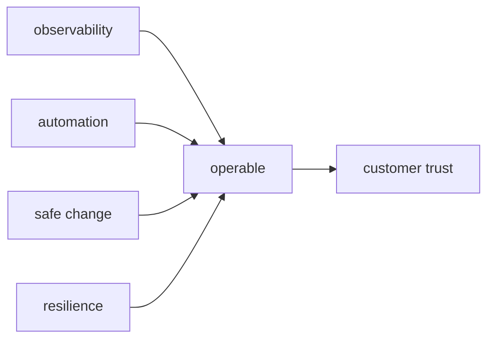

# 운영 가능한 시스템 만들기

> SRE 101 시리즈 (10/10)

<!-- a-grade-intro:begin -->

**핵심 질문**: *처음부터* *운영 가능* 한 시스템을 *어떻게* 만들까요?

> *운영성* 은 *기능* 처럼 *설계* 단계에서 *심어둡니다*.

<!-- a-grade-intro:end -->

## 이 글에서 배울 것

- *운영성* 의 *정의*
- *관측성*, *자동화*, *변경 안전성*
- *회복력* 패턴
- *통합 운영* 그림
- *시리즈 종합*

## 왜 중요한가

*운영성* 없는 *기능* 은 *부채* 로 돌아옵니다.

## 개념 한눈에 보기



## 핵심 용어 정리

- **operability**: *운영* 의 *난이도* 가 *낮은 정도*.
- **observability**: *내부 상태* 를 *외부* 에서 *추론* 가능.
- **safe change**: *카나리*, *롤백* 가능 변경.
- **resilience**: *부분 실패* 에서 *회복*.
- **runbook-as-code**: *코드* 화 된 *절차*.

## Before/After

**Before**: *기능* 만 만들고 *운영* 은 *나중*.

**After**: *기능* 과 *운영성* 을 *함께* 만든다.

## 실습: 운영성 점검

### 1단계 — 관측성 체크

```python
def has_obs(metrics, logs, traces):
    return all([metrics, logs, traces])
```

### 2단계 — 안전 배포

```python
def safe_deploy(canary_pct, rollback_ready):
    return canary_pct <= 5 and rollback_ready
```

### 3단계 — 회복 패턴

```python
def has_resilience(retry, timeout, breaker):
    return all([retry, timeout, breaker])
```

### 4단계 — 자동화 비율

```python
def auto_ratio(auto_min, total_min):
    return auto_min / total_min
```

### 5단계 — 운영성 점수

```python
def score(obs, deploy, resil, auto):
    return sum([obs, deploy, resil, auto >= 0.7]) / 4
```

## 이 코드에서 주목할 점

- *4개 차원* 으로 *체크*.
- *코드* 로 *증명*.
- *점수* 로 *우선순위*.

## 자주 하는 실수 5가지

1. ***운영성* 을 *나중* 에.**
2. ***관측성* 누락.**
3. ***카나리* 없이 *전면 배포*.**
4. ***회복 패턴* 미적용.**
5. ***자동화* 부족.**

## 실무에서는 이렇게 쓰입니다

*플랫폼팀* 이 *공통 운영성* 을 *템플릿* 으로 *제공* 하고, *제품팀* 이 *비즈니스* 에 집중합니다.

## 시니어 엔지니어는 이렇게 생각합니다

- *운영성* 은 *기능* 의 일부.
- *관측성* 은 *디버깅* 의 *기본기*.
- *변경* 은 *작게*, *되돌릴 수* 있게.
- *부분 실패* 가 *전체 실패* 가 되지 않게.
- *학습* 은 *운영* 에서 *증폭*.

## 체크리스트

- [ ] *4차원 점검표*.
- [ ] *카나리/롤백* 표준.
- [ ] *공통 라이브러리*.
- [ ] *운영성 KPI*.

## 연습 문제

1. *operability* 의 의미 한 줄로.
2. *safe change* 의 의미 한 줄로.
3. *resilience* 의 의미 한 줄로.

## 정리 및 다음 단계

10화 완주 축하합니다. 다음은 *Incident Response 101* 으로 *현장 운영* 을 *깊게* 익혀 보세요.

- [SRE란 무엇인가?](./01-what-is-sre.md)
- [Reliability](./02-reliability.md)
- [SLI, SLO, SLA](./03-sli-slo-sla.md)
- [Error Budget](./04-error-budget.md)
- [Monitoring](./05-monitoring.md)
- [Incident Response](./06-incident-response.md)
- [Postmortem](./07-postmortem.md)
- [Toil 줄이기](./08-reducing-toil.md)
- [Capacity Planning](./09-capacity-planning.md)
- **운영 가능한 시스템 만들기 (현재 글)**
## 참고 자료

- [Building Secure and Reliable Systems - Google](https://sre.google/books/building-secure-reliable-systems/)
- [Release It! - Michael Nygard](https://pragprog.com/titles/mnee2/release-it-second-edition/)
- [Resilience Engineering - Wikipedia](https://en.wikipedia.org/wiki/Resilience_engineering)
- [Observability Engineering - O'Reilly](https://www.oreilly.com/library/view/observability-engineering/9781492076438/)

Tags: SRE, Operability, Architecture, Reliability, Engineering

---

© 2026 영선북스. 이 글의 저작권은 저자에게 있습니다.
