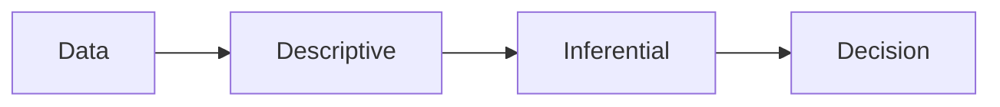

# 통계란 무엇인가?

> Statistics 101 시리즈 (1/10)

<!-- a-grade-intro:begin -->

**핵심 질문**: 통계는 *무엇* 을 다루며, *왜* 우리에게 필요할까요? 단순한 수식 모음을 *어떻게* 의사결정의 언어로 바꿀 수 있을까요?

> *통계는 *불확실성* 을 다루는 *공통 언어* 다.*

<!-- a-grade-intro:end -->

## 이 글에서 배울 것

- 통계의 *두 축* (기술 / 추론)
- *데이터 → 결정* 의 사고 흐름
- *통계가 답하는 4가지 질문*
- 5단계 통계 사고 실습
- 흔한 함정 5가지

## 왜 중요한가

데이터가 늘어날수록 *“정말 그런가?”* 라는 질문이 자주 등장합니다. 통계는 *가설* 과 *증거* 사이를 *수치로 잇는* 도구이며, *불확실한 결정* 을 *덜 불확실하게* 만듭니다.

> *좋은 통계 사고는 *숫자* 가 아니라 *결정* 을 만든다.*

## 개념 한눈에 보기



## 핵심 용어 정리

- **Descriptive Statistics**: 데이터를 *요약* 하는 통계 (평균, 분산 등).
- **Inferential Statistics**: *표본* 으로부터 *모집단* 을 *추정* 하는 통계.
- **Population vs Sample**: *전체* 대 *부분*.
- **Estimate**: 모집단 *진짜 값* 에 대한 *추정값*.
- **Uncertainty**: 추정에 *항상 따라오는* 오차.

## Before/After

**Before**: *“이번 달 매출이 늘었어요!”* — 얼마나? 통계적으로 의미 있나?

**After**: *“이번 달 매출 평균 +6.2% (95% CI ±1.5%, n=30일) — 지난달 대비 통계적으로 유의함.”*

## 실습: 5단계 통계 사고

### 1단계 — 질문 정의

```text
Q: "이번 달 마케팅 캠페인이 클릭률을 높였는가?"
```

### 2단계 — 데이터 모으기

```python
import pandas as pd
df = pd.read_csv("clicks.csv")
print(df.shape, df.columns.tolist())
```

### 3단계 — 요약 (기술)

```python
print(df.groupby("group")["ctr"].agg(["mean", "std", "count"]))
```

### 4단계 — 추론

```python
from scipy.stats import ttest_ind
a, b = df.loc[df.group == "control", "ctr"], df.loc[df.group == "test", "ctr"]
print(ttest_ind(a, b, equal_var=False))
```

### 5단계 — 결정

```text
Decision: p < 0.01 & lift +0.4pp → 캠페인 전체 사용자에 적용
```

## 이 코드에서 주목할 점

- *기술 → 추론 → 결정* 의 *3단 구조*.
- *그룹 비교* 는 *t-test* 로 시작.
- *결정 문장* 으로 분석을 *닫는다*.

## 자주 하는 실수 5가지

1. ***평균만* 본다.** *분산* 과 *분포* 를 함께 봐야 한다.
2. ***표본* 을 *모집단* 처럼 다룬다.** *불확실성* 을 잊는다.
3. ***p-value* 를 *효과 크기* 와 혼동.**
4. ***시각화 없이* 통계만 본다.** *왜곡* 된 분포를 놓친다.
5. ***결정 없이* 보고서가 끝난다.** 통계의 의미가 사라진다.

## 실무에서는 이렇게 쓰입니다

A/B 테스트, 매출 예측, 이상치 탐지, 품질 관리 등 *모든 데이터 의사결정* 의 기반에 통계가 있습니다. *대시보드 한 칸의 숫자* 도 *추정값* 이며 *불확실성* 을 함께 보고할 때 *신뢰* 가 생깁니다.

## 시니어 엔지니어는 이렇게 생각합니다

- *분포* 를 *평균* 보다 먼저 본다.
- *추정값* 에 *불확실성* 을 *항상* 붙인다.
- *질문 → 데이터 → 결정* 의 *흐름* 을 단축한다.
- *시각화* 와 *통계* 를 *함께* 쓴다.
- 통계는 *결정의 언어* 라는 점을 잊지 않는다.

## 체크리스트

- [ ] *질문* 을 한 줄로 적는다.
- [ ] *기술 통계* 로 데이터를 *요약* 한다.
- [ ] *추론* 으로 *불확실성* 을 본다.
- [ ] *결정 문장* 으로 닫는다.

## 연습 문제

1. *주변 데이터* (예: 일일 학습 시간) 의 평균과 분산을 구해 보세요.
2. *모집단* 과 *표본* 의 차이를 *한 문장* 으로 설명하세요.
3. *결정으로 닫힌 통계 보고서* 한 가지를 떠올려 적어 보세요.

## 정리 및 다음 단계

통계는 *불확실성* 을 *결정* 으로 옮기는 도구입니다. 다음 글에서는 데이터를 *요약* 하는 가장 기본 도구인 *평균, 중앙값, 분산* 을 자세히 살펴봅니다.

- **통계란 무엇인가? (현재 글)**
- 평균, 중앙값, 분산 (예정)
- 분포 (예정)
- 표본과 모집단 (예정)
- 추정 (예정)
- 신뢰구간 (예정)
- 가설검정 (예정)
- 상관과 회귀 (예정)
- p-value 이해하기 (예정)
- 통계적 사고방식 (예정)
## 참고 자료

- [Khan Academy — Statistics and Probability](https://www.khanacademy.org/math/statistics-probability)
- [OpenIntro Statistics](https://www.openintro.org/book/os/)
- [scipy.stats — Statistical Functions](https://docs.scipy.org/doc/scipy/reference/stats.html)
- [Seeing Theory — Visual Introduction](https://seeing-theory.brown.edu/)

Tags: Statistics, Fundamentals, DataAnalysis, Beginner, Concept

---

© 2026 영선북스. 이 글의 저작권은 저자에게 있습니다.
