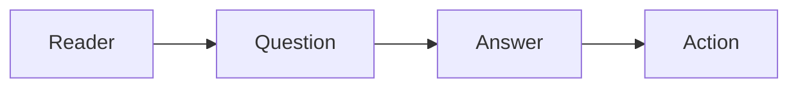

# 기술 글쓰기란 무엇인가

> 기술 글쓰기 101 시리즈 (1/10)

<!-- a-grade-intro:begin -->

**핵심 질문**: *기술 글* 은 *일반 글* 과 *무엇* 이 *다를까요*?

> *독자* 가 *행동* 할 수 있어야 합니다.

<!-- a-grade-intro:end -->

## 이 글에서 배울 것

- *기술 글* 의 정의
- *일반 글* 과의 차이
- *세 가지* 목적
- *독자* 의 행동
- *시리즈* 의 구성

## 왜 중요한가

*글* 이 *코드* 만큼 *오래* 살기 때문입니다.

## 개념 한눈에 보기



## 핵심 용어 정리

- **technical writing**: *기술 정보 전달 글*.
- **audience**: *독자*.
- **task**: *수행할 일*.
- **outcome**: *결과*.
- **scope**: *다룰 범위*.

## Before/After

**Before**: "*Python* 은 *좋은 언어* 입니다."

**After**: "*초보자* 가 *5분* 안에 *Hello World* 를 *실행* 합니다."

## 실습: 기술 글 한 단락

### 1단계 — 독자 정하기

```python
audience = "Python 초보자"
```

### 2단계 — 과제 정하기

```python
task = "가상환경을 만들고 활성화한다"
```

### 3단계 — 명령

```bash
python3 -m venv .venv
source .venv/bin/activate
```

### 4단계 — 결과

```python
result = "프롬프트 앞에 (.venv) 표시"
```

### 5단계 — 다음 행동

```python
next_step = "pip install requests"
```

## 이 코드에서 주목할 점

- *독자* 가 *먼저*.
- *명령* 이 *짧고*.
- *결과* 가 *눈에 보임*.

## 자주 하는 실수 5가지

1. ***독자* 가 *모호*.**
2. ***이론* 만 길다.**
3. ***명령* 이 *복사* 가 *안 됨*.**
4. ***결과* 가 *없다*.**
5. ***다음 행동* 이 *없다*.**

## 실무에서는 이렇게 쓰입니다

회사 내부 문서, 오픈소스 README, 컨퍼런스 발표 슬라이드가 모두 *기술 글* 입니다.

## 시니어 엔지니어는 이렇게 생각합니다

- *독자* 의 *시간* 을 *아낀다*.
- *명령* 은 *그대로 동작* 한다.
- *결과* 는 *눈에 보인다*.
- *오래된 정보* 는 *지운다*.
- *링크* 는 *살아 있다*.

## 체크리스트

- [ ] *독자* 가 *명시* 됨.
- [ ] *과제* 가 *한 줄*.
- [ ] *명령* 이 *동작*.
- [ ] *결과* 가 *명시*.

## 연습 문제

1. *기술 글* 의 정의 한 줄.
2. *audience* 의 의미 한 줄.
3. *outcome* 의 정의 한 줄.

## 정리 및 다음 단계

다음 글은 *독자 정의하기* 입니다.

- **기술 글쓰기란 무엇인가 (현재 글)**
- 독자 정의하기 (예정)
- 제목과 구조 잡기 (예정)
- 개념 설명하기 (예정)
- 예제 코드 설명하기 (예정)
- 그림과 표 사용하기 (예정)
- README 작성하기 (예정)
- 튜토리얼 작성하기 (예정)
- 블로그와 문서 차이 (예정)
- 발행 전 체크리스트 (예정)
## 참고 자료

- [Docs for Developers - Bhatti et al.](https://docsfordevelopers.com/)
- [Google Developer Documentation Style Guide](https://developers.google.com/style)
- [Microsoft Writing Style Guide](https://learn.microsoft.com/en-us/style-guide/welcome/)
- [Write the Docs Community](https://www.writethedocs.org/)

Tags: TechnicalWriting, Writing, Documentation, Communication, Beginner

---

© 2026 영선북스. 이 글의 저작권은 저자에게 있습니다.
