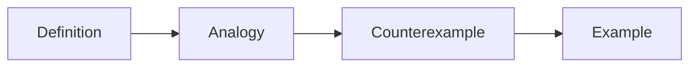

# 개념 설명하기

> 기술 글쓰기 101 시리즈 (4/10)

<!-- a-grade-intro:begin -->

**핵심 질문**: *처음 본 사람* 도 *개념* 을 *바로* *이해* 하게 *하려면*?

> *비유* 와 *반례* 가 *함께* 가야 합니다.

<!-- a-grade-intro:end -->

## 이 글에서 배울 것

- *한 줄 정의*
- *비유* 사용
- *반례* 사용
- *그림* 사용
- *Worked example*

## 왜 중요한가

*개념* 이 흐릿하면 *나머지* 는 *모래성* 입니다.

## 개념 한눈에 보기



## 핵심 용어 정리

- **definition**: *한 줄 정의*.
- **analogy**: *비유*.
- **counterexample**: *반례*.
- **worked example**: *풀이가 있는 예*.
- **misconception**: *흔한 오해*.

## Before/After

**Before**: "*비동기* 는 *동시 실행* 이다." (오해)

**After**: "*비동기* 는 *기다리는 동안* *다른 일* 을 하는 것이다."

## 실습: 한 개념 설명

### 1단계 — 정의

```python
definition = "캐시는 자주 쓰는 답을 미리 보관하는 곳"
```

### 2단계 — 비유

```python
analogy = "냉장고 앞에 놓는 자주 먹는 반찬"
```

### 3단계 — 반례

```python
counterexample = "한 번만 보는 자료는 캐시에 넣지 않는다"
```

### 4단계 — 코드 예

```python
cache = {}
cache["user:1"] = {"name": "Jimin"}
```

### 5단계 — 흔한 오해

```python
misconception = "캐시는 무한히 둬도 된다"
```

## 이 코드에서 주목할 점

- *정의* 가 *한 줄*.
- *비유* 가 *일상*.
- *반례* 가 *경계* 를 *그린다*.

## 자주 하는 실수 5가지

1. ***정의* 가 *길다*.**
2. ***비유* 가 *과한 비유*.**
3. ***반례* 가 *없다*.**
4. ***코드 예* 가 *너무 길다*.**
5. ***흔한 오해* 를 *언급* 안 한다.**

## 실무에서는 이렇게 쓰입니다

좋은 사내 위키 페이지는 항상 *정의*, *비유*, *반례*, *예시* 순서로 시작합니다.

## 시니어 엔지니어는 이렇게 생각합니다

- *정의* 는 *한 줄*.
- *비유* 는 *익숙한 영역*.
- *반례* 는 *경계*.
- *예* 는 *실행 가능*.
- *오해* 는 *먼저* 깬다.

## 체크리스트

- [ ] *정의* 1줄.
- [ ] *비유* 1개.
- [ ] *반례* 1개.
- [ ] *예제 코드* 5줄 이내.

## 연습 문제

1. *definition* 의 길이 한 줄.
2. *counterexample* 의 의미 한 줄.
3. *worked example* 의 정의 한 줄.

## 정리 및 다음 단계

다음 글은 *예제 코드 설명하기* 입니다.

- [기술 글쓰기란 무엇인가](./01-what-is-technical-writing.md)
- [독자 정의하기](./02-defining-the-reader.md)
- [제목과 구조 잡기](./03-title-and-structure.md)
- **개념 설명하기 (현재 글)**
- 예제 코드 설명하기 (예정)
- 그림과 표 사용하기 (예정)
- README 작성하기 (예정)
- 튜토리얼 작성하기 (예정)
- 블로그와 문서 차이 (예정)
- 발행 전 체크리스트 (예정)
## 참고 자료

- [Made to Stick - Heath Brothers](https://heathbrothers.com/books/made-to-stick/)
- [Explain Like I am Five - Reddit](https://www.reddit.com/r/explainlikeimfive/)
- [Refactoring UI - Adam Wathan](https://www.refactoringui.com/)
- [Mental Models - Farnam Street](https://fs.blog/mental-models/)

Tags: TechnicalWriting, Concept, Explanation, Analogy, Beginner

---

© 2026 영선북스. 이 글의 저작권은 저자에게 있습니다.
