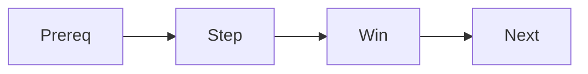

# 튜토리얼 작성하기

> 기술 글쓰기 101 시리즈 (8/10)

<!-- a-grade-intro:begin -->

**핵심 질문**: *튜토리얼* 이 *따라하기* 만 해도 *동작* 하려면?

> *모든 단계* 가 *검증* 되어야 합니다.

<!-- a-grade-intro:end -->

## 이 글에서 배울 것

- *Diátaxis* 의 튜토리얼 위치
- *전제 조건* 명시
- *작은 승리*
- *오류 복구*
- *마무리* 와 *다음 단계*

## 왜 중요한가

*첫 성공* 이 *학습 의지* 를 만듭니다.

## 개념 한눈에 보기



## 핵심 용어 정리

- **tutorial**: *학습 중심* 글.
- **prerequisite**: *전제 조건*.
- **small win**: *작은 성공*.
- **recovery**: *오류 복구*.
- **next step**: *다음 학습*.

## Before/After

**Before**: "*FastAPI* 에 대해 알아봅시다." (강의)

**After**: "*5분 안에* *Hello World* 를 *띄웁니다*." (튜토리얼)

## 실습: 5분 튜토리얼

### 1단계 — 전제

```bash
python3 --version  # 3.11 이상
```

### 2단계 — 설치

```bash
pip install "fastapi[standard]"
```

### 3단계 — 코드

```python
from fastapi import FastAPI
app = FastAPI()

@app.get("/")
def root():
    return {"hello": "world"}
```

### 4단계 — 실행

```bash
fastapi dev main.py
```

### 5단계 — 확인

```text
{"hello":"world"}
```

## 이 코드에서 주목할 점

- *전제* 가 *맨 앞*.
- *명령* 이 *순서*.
- *결과* 가 *명시*.

## 자주 하는 실수 5가지

1. ***전제* 가 *없다*.**
2. ***명령* 이 *순서* 가 *없다*.**
3. ***작은 승리* 가 *없다*.**
4. ***오류 복구* 안내가 *없다*.**
5. ***다음 단계* 가 *없다*.**

## 실무에서는 이렇게 쓰입니다

좋은 라이브러리는 *공식 튜토리얼* 을 *5분 이내* 로 끝냅니다.

## 시니어 엔지니어는 이렇게 생각합니다

- *전제* 는 *명시*.
- *작은 승리* 는 *3분 이내*.
- *오류* 마다 *복구* 가 있다.
- *다음 단계* 는 *작은 도약*.
- *튜토리얼* 은 *학습* 이지 *참고* 가 아니다.

## 체크리스트

- [ ] *전제* 명시.
- [ ] *5단계 이하*.
- [ ] *작은 승리* 1회.
- [ ] *다음 단계* 표시.

## 연습 문제

1. *tutorial* 의 정의 한 줄.
2. *small win* 의 의미 한 줄.
3. *recovery* 의 예 한 줄.

## 정리 및 다음 단계

다음 글은 *블로그와 문서 차이* 입니다.

- [기술 글쓰기란 무엇인가](./01-what-is-technical-writing.md)
- [독자 정의하기](./02-defining-the-reader.md)
- [제목과 구조 잡기](./03-title-and-structure.md)
- [개념 설명하기](./04-explaining-concepts.md)
- [예제 코드 설명하기](./05-explaining-example-code.md)
- [그림과 표 사용하기](./06-using-figures-and-tables.md)
- [README 작성하기](./07-writing-the-readme.md)
- **튜토리얼 작성하기 (현재 글)**
- 블로그와 문서 차이 (예정)
- 발행 전 체크리스트 (예정)
## 참고 자료

- [Diátaxis Framework](https://diataxis.fr/)
- [Django Tutorial Style](https://docs.djangoproject.com/en/stable/intro/tutorial01/)
- [FastAPI Tutorial](https://fastapi.tiangolo.com/tutorial/)
- [Teach Tech with Tutorials - Write the Docs](https://www.writethedocs.org/guide/writing/beginners-guide-to-docs/)

Tags: TechnicalWriting, Tutorial, Learning, HandsOn, Beginner

---

© 2026 영선북스. 이 글의 저작권은 저자에게 있습니다.
