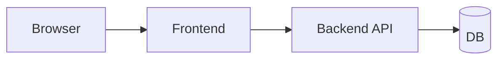

# E2E 테스트

> Testing 101 시리즈 (4/10)

<!-- a-grade-intro:begin -->

**핵심 질문**: *진짜 사용자가 보는 화면* 에서 회원가입이 실제로 동작하는지 어떻게 자동으로 확인할까요?

> E2E 테스트는 *브라우저를 띄우고* 사용자처럼 *클릭하고 입력* 합니다. 가장 비싸지만 가장 *현실에 가까운* 검증입니다.

<!-- a-grade-intro:end -->

## 이 글에서 배울 것

- *E2E* 의 정의와 다른 테스트와의 관계
- Playwright로 *첫 시나리오* 작성
- *플레이키* 한 테스트의 원인과 대처
- E2E 테스트의 *적정 개수*
- 자주 만나는 함정 5가지

## 왜 중요한가

E2E 테스트가 통과한다는 것은 *프론트, 백엔드, DB가 함께 동작* 함을 뜻합니다. 가장 *현실에 가까운* 신호이고, 가장 *비싸기도* 합니다. 그래서 *적게, 핵심에만* 둡니다.

> E2E는 *사용자의 시선* 입니다.

## 개념 한눈에 보기



## 핵심 용어 정리

- **E2E (end-to-end)**: *사용자 시작 → 결과 확인* 까지의 전 흐름.
- **Headless browser**: 화면 없이 실행되는 브라우저 (CI에서 사용).
- **Selector**: 요소를 *지정* 하는 표현 (text, role, data-testid 등).
- **Flaky test**: *간헐적으로 깨지는* 테스트.
- **Page object**: 화면별 *동작을 캡슐화* 한 객체.

## Before/After

**Before (수동 회귀 테스트)**

```text
- 매 배포 전 *5명이 1시간씩* 클릭
- 그래도 *결제 화면 버그* 가 운영에서 처음 발견
```

**After (E2E 5개)**

```text
- 회원가입, 로그인, 결제, 검색, 로그아웃 시나리오 자동화
- CI에서 *5분 안에* 결과
```

## 실습: Playwright 5단계

### 1단계 — 설치

```bash
pip install pytest-playwright
playwright install
```

### 2단계 — 첫 시나리오

```python
# tests/e2e/test_login.py
def test_login_flow(page):
    page.goto("https://example.com/login")
    page.get_by_label("Email").fill("a@b.com")
    page.get_by_label("Password").fill("secret")
    page.get_by_role("button", name="Sign in").click()
    page.wait_for_url("**/dashboard")
    assert page.get_by_text("Welcome").is_visible()
```

### 3단계 — 안정적인 selector

```python
# 권장: role + name
page.get_by_role("button", name="Sign in")
# 또는 data-testid
page.get_by_test_id("submit-login")
# 비권장: 자주 바뀌는 CSS 클래스
page.locator(".btn-primary-3xl")
```

### 4단계 — 대기 (sleep 금지)

```python
# 나쁜 예
import time; time.sleep(3)
# 좋은 예
page.wait_for_url("**/dashboard")
page.wait_for_selector("text=Welcome")
```

### 5단계 — Page object

```python
class LoginPage:
    def __init__(self, page):
        self.page = page
    def open(self):
        self.page.goto("https://example.com/login")
    def login(self, email, pw):
        self.page.get_by_label("Email").fill(email)
        self.page.get_by_label("Password").fill(pw)
        self.page.get_by_role("button", name="Sign in").click()

def test_login_with_page_object(page):
    LoginPage(page).open(); LoginPage(page).login("a@b.com", "secret")
    assert page.get_by_text("Welcome").is_visible()
```

## 이 코드에서 주목할 점

- *role/text* 기반 selector는 *디자인 변경에 강합니다*.
- `wait_for_url` 같은 *조건 대기* 가 *sleep을 대체* 합니다.
- Page object로 *시나리오를 재사용* 합니다.

## 자주 하는 실수 5가지

1. ***모든 화면* 을 E2E로 덮으려 한다.** 5분짜리 테스트가 *1시간* 이 됩니다.
2. **`time.sleep` 으로 대기한다.** *플레이키* 의 1번 원인입니다.
3. **운영 환경에서 *진짜 결제* 를 호출한다.** 반드시 *스테이징/샌드박스* 를 씁니다.
4. **selector가 *CSS 클래스* 다.** UI 변경에 *항상 깨집니다*.
5. **시나리오가 *서로 의존* 한다.** 격리되어야 *재실행* 이 가능합니다.

## 실무에서는 이렇게 쓰입니다

대부분의 팀은 *5\~20개의 핵심 시나리오만* E2E로 둡니다. *Playwright/Cypress* 가 표준이고, *시각 회귀* (visual regression) 테스트를 추가하기도 합니다.

## 시니어 엔지니어는 이렇게 생각합니다

- E2E는 *적게, 비싸게, 안정적으로* 가져간다.
- *role 기반 selector* 를 기본으로 한다.
- 플레이키 테스트는 *즉시 격리* 한다.
- *시나리오 단위* 로 PR을 작게 보낸다.
- E2E의 가치는 *"사용자가 못 쓰는 일"* 을 막는 것이다.

## 체크리스트

- [ ] Playwright로 *한 시나리오* 를 작성했다.
- [ ] selector는 *role/text/test-id* 를 썼다.
- [ ] `sleep` 대신 *조건 대기* 를 사용했다.
- [ ] 시나리오가 *독립적으로* 돈다.

## 연습 문제

1. 위 로그인 시나리오를 *실패 케이스* (잘못된 비밀번호)로도 작성하세요.
2. *3개 이상의 selector* 종류를 비교하고 어느 것이 안정적인지 적으세요.
3. 의도적으로 `sleep` 으로 만들고 *왜 깨지는지* 관찰하세요.

## 정리 및 다음 단계

E2E는 *현실에 가장 가까운* 신호입니다. 다음 글부터는 외부 의존을 다루는 *테스트 더블* 을 배웁니다.

- [테스트란 무엇인가?](./01-what-is-testing.md)
- [단위 테스트](./02-unit-test.md)
- [통합 테스트](./03-integration-test.md)
- **E2E 테스트 (현재 글)**
- 테스트 더블 (예정)
- Mock과 Stub (예정)
- 테스트 커버리지 (예정)
- 회귀 테스트 (예정)
- CI에서 테스트 실행하기 (예정)
- 테스트 전략 세우기 (예정)
## 참고 자료

- [Playwright docs](https://playwright.dev/python/)
- [Cypress docs](https://docs.cypress.io/)
- [Martin Fowler — End to End Tests](https://martinfowler.com/bliki/TestPyramid.html)
- [Google Testing Blog — Flaky Tests](https://testing.googleblog.com/2016/05/flaky-tests-at-google-and-how-we.html)

Tags: Testing, E2E, Playwright, Browser, Automation

---

© 2026 영선북스. 이 글의 저작권은 저자에게 있습니다.
