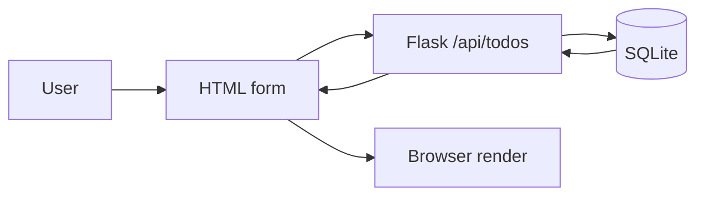

# 작은 웹앱 만들기

> Web Development 101 시리즈 (10/10)

<!-- a-grade-intro:begin -->

**핵심 질문**: 지금까지 배운 9가지 조각을 *어떻게 한 앱* 으로 묶나요?

> 가장 작은 *Todo 앱* — HTML + Flask + SQLite + 배포까지 한 흐름으로 따라가 봅니다.

<!-- a-grade-intro:end -->

## 이 글에서 배울 것

- 9개 글의 개념을 *한 앱* 에서 동시에 보기
- 작은 풀스택 앱의 폴더 구조
- 빌드와 배포 흐름을 끝까지 따라가기
- 다음에 무엇을 배울지에 대한 지도
- 시리즈 전체 회고

## 왜 중요한가

지식은 *작게 만드는 경험* 안에서 굳어집니다. 작은 풀스택 한 번이 책 다섯 권보다 깊습니다. 지금 만드는 이 Todo 앱이 *다음 모든 프로젝트* 의 뼈대가 됩니다.

> *작게* 만들어 *처음부터 끝까지* 가 보세요.

## 개념 한눈에 보기



9개 글의 모든 단계가 *한 그림* 에 들어옵니다.

## 핵심 용어 정리

- **Capstone**: 시리즈를 마무리하는 *통합 과제* .
- **Full-stack**: FE + BE + DB + 배포까지.
- **MVP**: 가장 작게 *동작하는* 한 덩어리.
- **Folder layout**: 협업 가능한 폴더 구조.
- **Smoke test**: 핵심 흐름이 *돌아가는지* 확인하는 최소 테스트.

## Before/After

**Before (스크립트 한 파일)**

```python
print("hello")
```

**After (한 앱)**

```text
todo-app/
├── app.py
├── templates/index.html
├── static/style.css
├── requirements.txt
└── Dockerfile
```

`hello` 한 줄에서 *공유 가능한 앱* 으로.

## 실습: Todo 앱 5단계

### 1단계 — 프로젝트 생성

```bash
mkdir todo-app && cd todo-app
python3 -m venv .venv && source .venv/bin/activate
pip install flask gunicorn
```

### 2단계 — 백엔드 (`app.py`)

```python
from flask import Flask, request, jsonify, render_template
import sqlite3, os

DB = os.environ.get("DB_PATH", "todo.db")
app = Flask(__name__)

def conn():
    c = sqlite3.connect(DB)
    c.row_factory = sqlite3.Row
    return c

with conn() as c:
    c.execute("CREATE TABLE IF NOT EXISTS todos(id INTEGER PRIMARY KEY, text TEXT, done INTEGER DEFAULT 0)")

@app.get("/")
def home(): return render_template("index.html")

@app.get("/api/todos")
def list_todos():
    rows = conn().execute("SELECT * FROM todos ORDER BY id DESC").fetchall()
    return jsonify([dict(r) for r in rows])

@app.post("/api/todos")
def add_todo():
    text = request.get_json()["text"]
    with conn() as c:
        c.execute("INSERT INTO todos(text) VALUES (?)", (text,))
    return jsonify(ok=True), 201

@app.get("/health")
def health(): return {"status": "ok"}
```

### 3단계 — 프론트엔드 (`templates/index.html`)

```html
<!doctype html>
<html lang="ko">
<head><meta charset="utf-8"><title>Todo</title>
  <link rel="stylesheet" href="/static/style.css"></head>
<body>
  <h1>Todo</h1>
  <form id="f"><input id="t" placeholder="할 일"><button>추가</button></form>
  <ul id="list"></ul>
<script>
async function load() {
  const items = await (await fetch("/api/todos")).json();
  document.getElementById("list").innerHTML = items.map(i => `<li>${i.text}</li>`).join("");
}
document.getElementById("f").addEventListener("submit", async e => {
  e.preventDefault();
  await fetch("/api/todos", {method: "POST", headers: {"Content-Type": "application/json"},
    body: JSON.stringify({text: document.getElementById("t").value})});
  document.getElementById("t").value = "";
  load();
});
load();
</script>
</body></html>
```

### 4단계 — 스모크 테스트

```bash
flask --app app run
# 다른 터미널
curl -X POST -H "Content-Type: application/json" -d '{"text":"첫 할일"}' http://localhost:5000/api/todos
curl http://localhost:5000/api/todos
```

### 5단계 — Docker + 배포

```dockerfile
FROM python:3.12-slim
WORKDIR /app
COPY . .
RUN pip install -r requirements.txt
ENV DB_PATH=/data/todo.db
CMD ["gunicorn", "-b", "0.0.0.0:8000", "app:app"]
```

```bash
docker build -t todo-app . && docker run -p 8000:8000 -v $PWD/data:/data todo-app
```

## 이 코드에서 주목할 점

- 같은 *환경변수* (DB_PATH)로 로컬과 컨테이너를 둘 다 다룬다.
- `/health` 가 배포 자동화의 *신호* 역할을 한다.
- 100줄 안에 *모든 9개 글의 개념* 이 들어 있다.

## 자주 하는 실수 5가지

1. **DB 경로를 코드에 박는다.** 환경변수로 빼라.
2. **첫 페이지에 모든 JS를 인라인.** 작아도 분리하는 습관.
3. **에러 응답을 200으로.** status code의 의미를 살려라.
4. **테스트 한 줄도 없이 배포.** 적어도 헬스체크 + curl 한 번.
5. **너무 일찍 *큰 프레임워크* 를 끌어온다.** 작게 시작해라.

## 실무에서는 이렇게 쓰입니다

이 작은 앱이 자라면 *블로그, 가계부, 노트, 챗봇* 무엇이든 됩니다. 큰 SaaS도 결국 *이 구조의 확장* 입니다 — 인증/캐시/큐/배치 등을 하나씩 더 붙이는 방식이지요.

## 시니어 엔지니어는 이렇게 생각합니다

- *가장 작게* 끝까지 간다 (vertical slice).
- 환경변수로 *환경의 차이* 만 빼낸다.
- 헬스체크 + 로그 + 모니터링은 *처음부터* .
- 기능이 자랄 때 *경계* 를 다시 그린다.
- 제품이 자라면 *팀의 약속* (코드 리뷰, CI)이 더 중요해진다.

## 체크리스트

- [ ] 한 앱에 FE/BE/DB가 모두 들어있다.
- [ ] 헬스체크 endpoint가 있다.
- [ ] 환경변수로 설정을 분리했다.
- [ ] curl로 endpoint를 호출해 봤다.
- [ ] 컨테이너로 한 번 띄워 봤다.

## 연습 문제

1. Todo에 *완료 토글* 과 *삭제* 를 추가하세요 (PUT/DELETE).
2. 사용자별 Todo가 되도록 *세션 로그인* 을 더하세요.
3. 정적 자산에 캐시 헤더를 달고 Lighthouse 점수를 측정하세요.

## 정리 및 다음 단계

여기까지가 *Web Development 101* 입니다. 다음 단계는 깊이입니다 — Frontend Development 101, Backend Development 101, 그리고 Database 101로 한 단계씩 들어가 보세요. 가장 좋은 다음 책은 *직접 만들 다음 앱* 입니다.

- [웹은 어떻게 동작하는가?](./01-how-the-web-works.md)
- [HTML, CSS, JavaScript](./02-html-css-javascript.md)
- [브라우저와 DOM](./03-browser-and-dom.md)
- [HTTP와 API](./04-http-and-api.md)
- [Frontend과 Backend](./05-frontend-and-backend.md)
- [인증과 세션](./06-auth-and-sessions.md)
- [데이터베이스 연결](./07-connecting-to-database.md)
- [배포](./08-deployment.md)
- [성능과 캐싱](./09-performance-and-caching.md)
- **작은 웹앱 만들기 (현재 글)**
## 참고 자료

- [Flask quickstart](https://flask.palletsprojects.com/quickstart/)
- [SQLite (Python docs)](https://docs.python.org/3/library/sqlite3.html)
- [Docker get started](https://docs.docker.com/get-started/)
- [The Twelve-Factor App](https://12factor.net/)

Tags: Computer Science, WebDevelopment, Capstone, Flask, FullStack, Project

---

© 2026 영선북스. 이 글의 저작권은 저자에게 있습니다.
