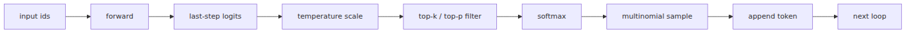

# 샘플링 — 학습된 모델에서 글 뽑아내기

> LLM from Scratch 101 시리즈 (7/9)

지난 글에서 `ckpt.pt`를 저장하고 나면 바로 말을 시켜 보고 싶어집니다. 그런데 `model.eval()`만으로는 문장이 나오지 않습니다.

한 글자를 뽑고, 뒤에 붙이고, 다시 넣습니다.

결과는 셰익스피어 풍의 헛소리에 가깝습니다.

오늘 멘탈 모델은 간단합니다. **생성은 다음 토큰 분포에서 하나를 고르고, 그 결과를 다시 입력으로 되먹이는 자기회귀 루프입니다.**

---

## 자기회귀 생성 — 한 토큰 뽑고 다시 입력

현재 문맥 `idx`를 넣고 마지막 logits만 꺼낸 뒤, 샘플링한 토큰을 다시 붙입니다.


## Greedy Decoding — argmax는 왜 지루한가

`argmax`만 쓰면 결과는 금방 굳습니다.

## Temperature — logits를 나누는 한 숫자

temperature는 logits를 나누는 스케일입니다. `T=0.5`면 날카로워지고 `T=1.5`면 평평해집니다.

## Top-k 샘플링 — 후보 풀 자르기

top-k는 상위 `k`개만 남깁니다.

## Top-p 샘플링 — 누적 확률로 자르기

top-p는 누적 확률 합이 `p`를 넘는 지점까지만 남깁니다.

## Context Window 슬라이딩 — block_size 넘어가면

입력 길이는 `idx[:, -self.config.block_size:]`로 자르면 됩니다.

## generate.py — 명령줄로 셰익스피어 흉내내기

코드는 아래처럼 정리하면 됩니다.

```python
# model.py
def generate(self, idx, max_new_tokens, temperature=1.0, top_k=None, top_p=None):
    for _ in range(max_new_tokens):
        idx_cond = idx[:, -self.config.block_size :]
        logits, _ = self(idx_cond)
        logits = logits[:, -1, :] / max(temperature, 1e-5)
        if top_k is not None:
            v, _ = torch.topk(logits, min(top_k, logits.size(-1)))
            logits[logits < v[:, [-1]]] = float("-inf")
        if top_p is not None:
            s_logits, s_idx = torch.sort(logits, descending=True)
            cutoff = F.softmax(s_logits, dim=-1).cumsum(dim=-1) > top_p
            cutoff[..., 1:] = cutoff[..., :-1].clone(); cutoff[..., 0] = False
            s_logits[cutoff] = float("-inf")
            logits = torch.full_like(logits, float("-inf")).scatter(1, s_idx, s_logits)
        probs = F.softmax(logits, dim=-1)
        idx_next = torch.multinomial(probs, num_samples=1)
        idx = torch.cat((idx, idx_next), dim=1)
    return idx
```

```python
# generate.py
import argparse, torch
from data import decode, encode
from model import GPT, GPTConfig

def main() -> None:
    parser = argparse.ArgumentParser()
    parser.add_argument("--prompt", type=str, default="ROMEO:")
    parser.add_argument("--max", type=int, default=200)
    parser.add_argument("--temp", type=float, default=0.8)
    parser.add_argument("--top_k", type=int, default=20)
    parser.add_argument("--top_p", type=float, default=0.9)
    args = parser.parse_args()
    device = "cuda" if torch.cuda.is_available() else "cpu"
    ckpt = torch.load("ckpt.pt", map_location=device)
    config = GPTConfig(**ckpt["config"])
    model = GPT(config).to(device)
    model.load_state_dict(ckpt["model"]); model.eval()
    idx = torch.tensor([encode(args.prompt)], dtype=torch.long, device=device)
    with torch.no_grad(): out = model.generate(idx, args.max, args.temp, args.top_k, args.top_p)
    print(decode(out[0].tolist()))

if __name__ == "__main__":
    main()
```

```bash
python generate.py --prompt "ROMEO:" --max 200 --temp 0.8 --top_k 20 --top_p 0.9
```

출력은 대략 이런 분위기입니다.

```text
ROMEO:
What thou me for the king,
And in thy lord I cry.
Thee no more of men.
```

뜻은 무너지지만 리듬은 남습니다.

## 다음 글 예고

다음 글에서는 여기에 작은 instruction 데이터셋을 얹어 SFT를 해보겠습니다. 질문과 답변 형식이 출력 습관을 얼마나 바꾸는지 보겠습니다.

<!-- toc:begin -->
## 시리즈 목차

- [글자를 숫자로 바꾸기](./01-tokenizer.md)
- [정수에서 벡터로, 그리고 위치](./02-embedding.md)
- [어떤 토큰을 얼마나 볼지 스스로 정하기](./03-attention.md)
- [블록 하나, 깊이의 단위](./04-transformer-block.md)
- [조립: GPT 모델 클래스 완성](./05-gpt-model.md)
- [기울기로 배우기](./06-training-loop.md)
- **샘플링 — 학습된 모델에서 글 뽑아내기 (현재 글)**
- 베이스 모델을 우리 작업에 맞추기 (예정)
- 직접 만든 LLM을 챗봇으로 — FastAPI + 스트리밍 (예정)

<!-- toc:end -->

## 참고 자료

- [The Curious Case of Neural Text Degeneration](https://arxiv.org/abs/1904.09751)
- [Hierarchical Neural Story Generation](https://arxiv.org/abs/1805.04833)
- [nanoGPT model.py generate](https://github.com/karpathy/nanoGPT/blob/master/model.py)
- [How to generate text: using different decoding methods for language generation with Transformers](https://huggingface.co/blog/how-to-generate)

Tags: LLM, PyTorch, Transformer, Tutorial
